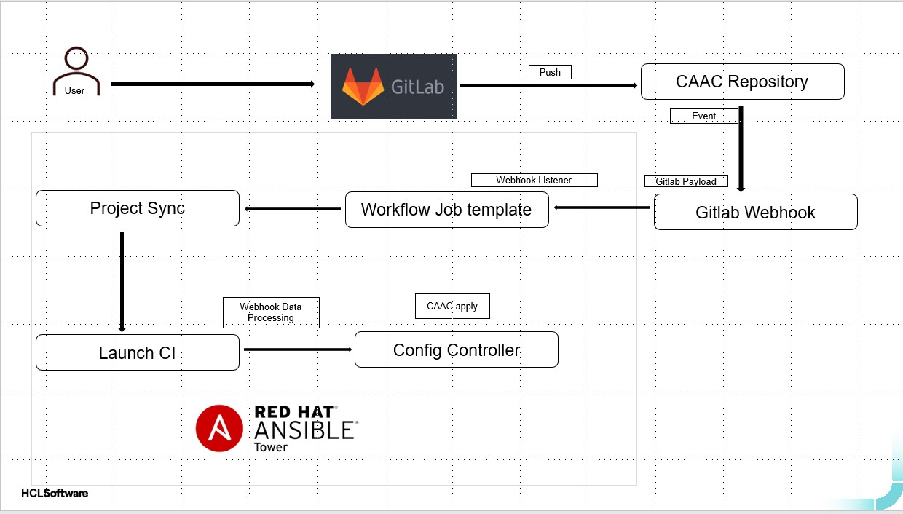
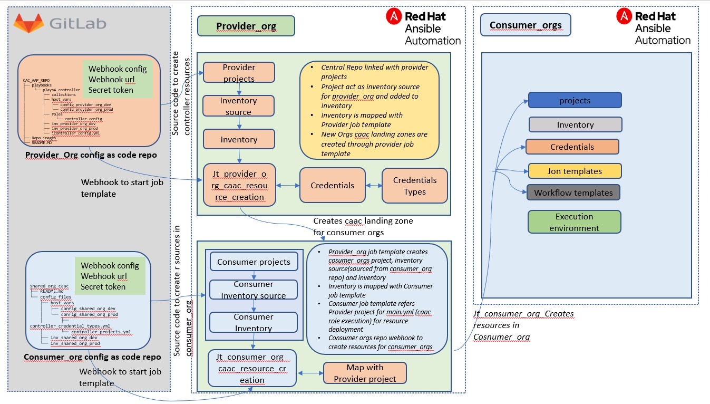
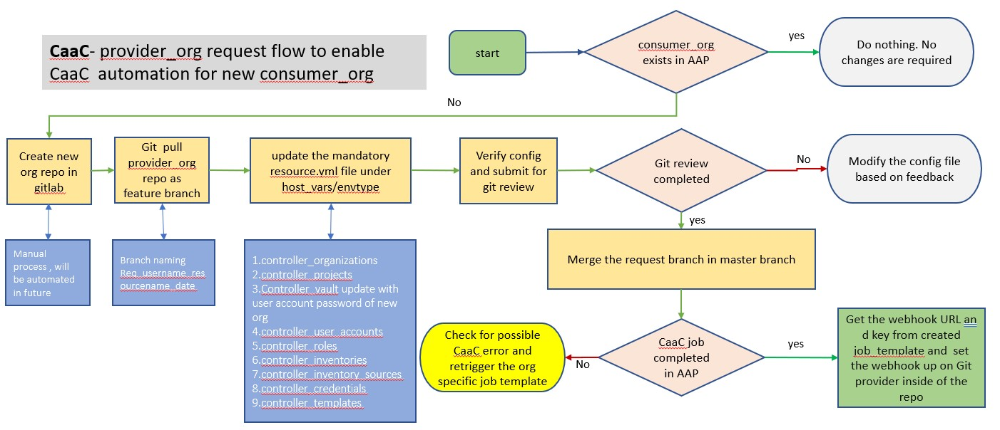
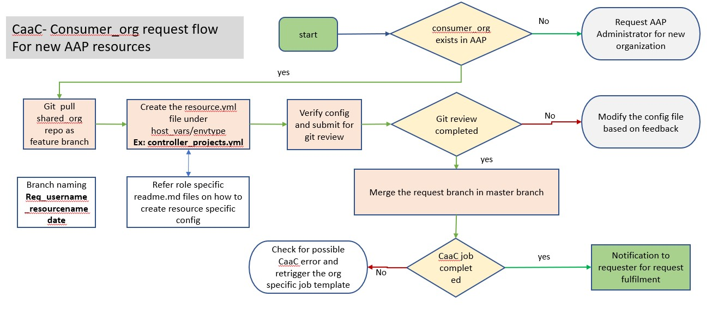

# Configuration as Code (CaaC) for Ansible Automation Platform

## Introduction

Configuration as Code (CaaC) is a practice of managing application configuration files in a repository. For the Ansible Automation Platform (AAP), these configuration files define the settings to be applied across environments. By combining CaaC with Git webhooks, organizations can automate and streamline the delivery of configurations to multiple AAP sites consistently and efficiently.

This blog explores the concept, implementation, and benefits of CaaC for AAP, along with a detailed explanation of the Provider-Consumer model and repository structures.

---

## What is Configuration as Code?

CaaC involves managing configuration files in a version-controlled repository. For AAP, this means defining settings that can be applied across environments. When paired with Git webhooks, CaaC enables automated updates to AAP sites whenever changes are made to the repository.

### How it Works

1. Admins or users update configuration details in a GitLab repository.
2. After approval via a merge request, a webhook triggers synchronization with AAP controllers.
3. AAP controllers apply the updated configurations across all platforms.



---

## Implementing CaaC with the Provider-Consumer Model

The Provider-Consumer model, similar to the Hub-Spoke architecture, centralizes core functionality in a Provider repository while allowing Consumers to manage their specific configurations. This separation of concerns ensures flexibility and scalability.

### Key Components

1. **Provider Repository**: Hosts the central playbook and configuration files.
2. **Consumer Repositories**: Store organization-specific configurations.
3. **Ansible CLI**: Used for initial setup and automation.



---

## Provider Repository Structure

The Provider repository centrally manages CaaC for AAP environments. Below is the directory structure:

```plaintext
CAC_AAP_REPO
├── playbooks
│   └── plays4_controller
│       ├── collections
│       ├── host_vars
│       │   ├── config_Provider_Org_dev
│       │   └── config_Provider_Org_prod
│       ├── roles
│       │   └── controller_config
│       ├── inv_Provider_Org_dev
│       ├── inv_Provider_Org_prod
│       └── controller_config.yml
├── Repo_images
└── README.md
```

### Key Elements

1. **Roles Directory**: Contains curated roles for AAP controller configuration.
2. **Inventory Files**: Define organization-specific variables for AAP controllers.
3. **Host Vars**: Store environment-specific configuration files.
4. **Controller Config**: The main playbook for centralized automation.

---

## Consumer Repository Structure

The Consumer repository abstracts the Provider repository, hosting only organization-specific variables and requirements. This ensures that Consumer organizations can request AAP resources without impacting the core functionality.

```plaintext
shared_org_cac_aap_repo
├── README.md
└── config_files
    ├── host_vars
    │   ├── config_shared_org_dev
    │   └── config_shared_org_prod
    ├── inv_shared_org_dev
    └── inv_shared_org_prod
```

---

## Request and Provisioning Flows

### Initial Setup for Provider Organization

To set up the Provider organization, use the following CLI command:

```bash
ansible-playbook controller_config.yml -i inv_provider_org_prod -e "controller_username='your_username' controller_password='your_password'" --ask-vault-pass --tags settings,organizations,projects,users,inventories,inventory_sources,credential_types,credentials,job_templates
```


### Enabling CaaC for Consumer Organizations

This flow provisions resources required for new Consumer organizations.



### Requesting AAP Resources Within Consumer Organizations

Consumer organizations can request resources using the CaaC automation.



---

## Branch Strategy

- **Master Branch**: Main branch for all environments.
- **Develop Branch**: Used for new resource requests or features.

**Note**: The master branch should be maintained by a designated administrator.

---

## Prerequisites

1. Root privileges to integrate the AAP controller with the GitLab repository.
2. The `awx.awx` Ansible collection for configuration.
3. A project, job template, and vault credential configured on the AAP controller.

---

Configuration as Code for Ansible Automation Platform simplifies and automates configuration management, ensuring consistency and scalability across environments. By leveraging the Provider-Consumer model, organizations can achieve a robust and flexible automation framework.

