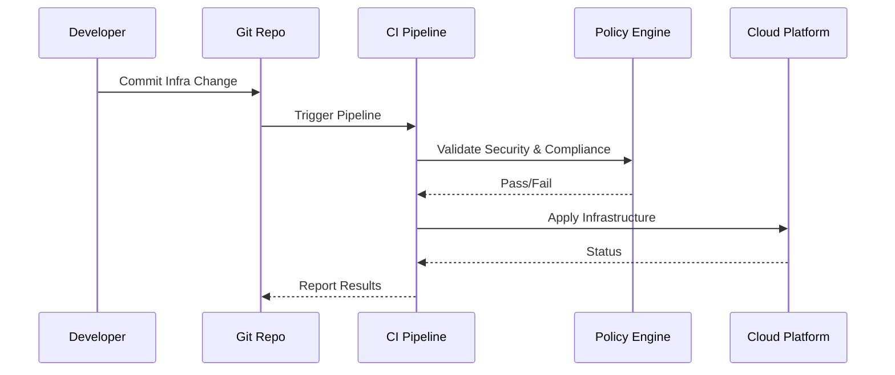

> 💡 **This series is written as a practitioner handbook — not theory.**  
> Everything here is based on real-world platform engineering work across AWS, Azure, VMware, Terraform Enterprise, and enterprise DevOps pipelines.

---

## What You’ll Learn
- Why traditional infrastructure delivery breaks at scale
- The real-world problems GitOps and IaC solve
- Core principles behind reliable infra automation
- How to frame your own modernization journey

---

## 1. Introduction — Why This Series Exists

> 🧭 **Personal context:**  
> Before working deeply with Infra as code(IAC), GitOps, and self-service cloud platforms, most of my automation efforts looked “successful” — pipelines ran, infra provisioned, tickets closed.  
>  
> But under the surface, things were fragile:
> - Teams were afraid to touch infra code
> - Rollbacks were painful
> - Audits required detective work
> - Every environment drifted differently  
>  
> This series exists because *working automation* is not the same as *operationally safe automation*.

In today’s cloud-native world, infrastructure provisioning is no longer a one-time activity — it’s a continuous lifecycle problem. Environments must be:
- Reproducible
- Auditable
- Secure by default
- Cost-aware
- Recoverable

Traditional ticket-driven and script-heavy approaches simply don’t scale to this reality.

>💬**Core belief:**  
> Infrastructure should behave like software — versioned, tested, reviewed, and deployed through pipelines
{: .prompt.info }

That belief is what drives GitOps, DevOps, and Infrastructure as Code (IaC).

---

## 1.1 What This Handbook Covers

This handbook walks through the **complete lifecycle** of modern infrastructure delivery — not just tooling, but operating model.

You’ll learn:
- **Why** traditional approaches fail
- **How** GitOps and IaC solve those failures
- **What** architecture patterns actually work at scale
- **Where** pipelines, policies, security, and cost controls fit
- **How to operate** this model across real enterprise teams

Unlike documentation that focuses on single tools, this guide focuses on **systems thinking** — pipelines, repos, controls, workflows, and humans.

---

## 1.2 How to Use This Series

> 📘 Think of this as a **field manual**, not a reference doc.
>
> - Platform engineers → Use it to design foundations
> - Cloud architects → Use it to validate governance models
> - DevOps engineers → Use it to structure pipelines
> - App teams → Use it to understand how infra delivery should work

Each chapter builds on the previous one:

---

## 2. The Real Problem — Why Traditional Infra Delivery Breaks

>⚠️ **Hard truth:**
>Most infrastructure failures are not tool failures — they are process failures.
{: .prompt-tip }

Let’s anchor this in a real-world scenario.

### 2.1 Use Case — Modernizing Application Infra Delivery

**Scenario:**
The Application team inside a Cloud Management Platform (CMP) organization manages the infrastructure for a business-critical application called `todo_demoapp`.

Over time, their delivery model evolved organically:
- Some infra created via scripts
- Some via tickets
- Some via manual console work
- Some via Terraform — inconsistently

Nothing was wrong individually — but together, the system became fragile.

>🚨 **Key Pain Points**
>These are patterns I’ve seen repeatedly across enterprises — not theoretical issues.

- **Fragmented collaboration**: Dev, Ops, Security operate in silos; infra decisions happen outside code review
- **Inconsistent provisioning**: Every environment looks slightly different; no reliable way to reproduce failures
- **Approval bottlenecks**: Manual approvals for every infra change; no automated policy enforcement
- **Security drift**: Secrets leak into repos; compliance checks happen after deployment
- **Low infra code confidence**: Teams hesitate to touch Terraform or scripts; infra changes become “specialist-only”
- **Lifecycle blind spots**: No consistent decommissioning; zombie resources inflate costs

🎯 **Objective**
The goal was to modernize infra delivery so that:
- Infra changes feel as safe as application changes
- Every change is reviewable, auditable, and reversible
- Environments remain consistent over time
- Security and compliance are enforced automatically
- Teams can self-serve infrastructure safely

And critically — the model must scale beyond just `todo_demoapp`.

### 2.2 Target Operating Model (GitOps)

Here’s the desired mental model:

💡 **Git becomes the control plane.**
No manual console work. No side scripts. No mystery state.

>Everything flows from Git → Pipeline → Policy → Cloud.
{: .prompt-tip }

---

## 3. Design & Implementation Principles

Before tooling, pipelines, or repositories — we need design principles. These principles act as guardrails for every architectural decision in the rest of this series.

### 3.1 Infrastructure as Code (IaC) Compliance
Infrastructure must be versioned, reviewable, and reproducible — or it’s not infrastructure, it’s configuration drift.

All infrastructure definitions must:
- Live in Git
- Support version history
- Be auditable
- Be deployable through pipelines
- Be immutable in design

No exceptions — including “temporary” resources.

### 3.2 Tool Standardization & Integration
Tool sprawl is a silent reliability killer. Standardizing on:
- Azure DevOps or similar (pipelines + repos)
- Terraform CLI
- Ansible
- CredScan / GitLeaks
- Infracost

…this allows:
- Consistent pipelines
- Predictable debugging
- Repeatable onboarding
- Organization-wide governance

>Tools matter — but integration matters more.
{: .prompt-info }

### 3.3 Modular & Scalable Repository Design
Infrastructure code must scale across:
- Teams
- Applications
- Environments
- Cloud providers

This requires:
- Reusable core/child modules
- Thin root modules
- Clear environment separation
- Predictable naming conventions

You’ll see the full repo architecture in **Part 2**.

### 3.4 Continuous Security & Compliance
Security that happens after deployment is incident response — not security engineering.

Security must be:
- Shifted left
- Automated
- Non-optional
- Version-controlled

This means:
- Credential scanning
- IaC linting
- Policy-as-code enforcement
- Compliance validation in pipelines

Not in audits. Not in tickets. In pipelines.

### 3.5 Cost Awareness by Design
Cloud cost is an architectural property — not a billing problem.

Every infra change should expose:
- Cost deltas
- Resource impact
- Optimization opportunities

This requires cost estimation tools baked into pipelines — not quarterly FinOps reviews.

### 3.6 GitOps Automation via Webhooks
Humans should never be the deployment trigger. Git should be.

All deployments should originate from:
- Git commits
- Pull requests
- Merges

Webhooks trigger pipelines automatically — eliminating:
- Manual execution
- Drift
- Environment mismatch

### 3.7 Policy Enforcement & Idempotency
If a pipeline can succeed twice with different results, it is broken.

All deployments must be:
- Idempotent
- Deterministic
- Policy-governed
- Rollback-safe

Terraform and Ansible already support this — but only if designed intentionally.

---

## 4. How This Connects to the Rest of the Series

You’ve just learned:
- Why traditional infra delivery fails
- What principles modern platforms require
- How GitOps reframes infra as software delivery

**Next:**

👉 **Part 2** — Implementation & Tooling
We’ll translate these principles into:
- Real repo structures
- Pipeline templates
- Toolchains
- Module patterns
- Naming conventions
- CI/CD flows

And finally:

👉 **Part 3** — Advanced Practices & Adoption
We’ll cover:
- Webhook architecture
- Execution flow
- Policy engines
- Team onboarding
- Scaling GitOps across organizations

🚀 **Call to Action**
Before moving to **Part 2** — ask yourself:
- Where does infra drift exist today?
- Which changes bypass Git?
- What approvals are manual but could be policy-driven?
- Which environments can’t be reliably rebuilt?

Write these down — you’ll map them directly to solutions in the next chapter.