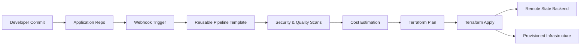

## What You'll Learn
- How to build a real IaC platform foundation, not just scripts
- How tools actually fit together in enterprise delivery
- Repo structures that scale across teams and clouds
- Naming conventions that enable automation
- Hard-earned lessons from real platform rollouts

---

## 1. From Principles to Practice
In **Part 1**, we talked about why DevOps and IaC matter. This part is where theory meets production.

**This is where:**
- Diagrams become repositories
- Patterns collide with permissions
- “Best practices” meet auditors, outages, and scale

Most IaC failures I’ve seen weren’t caused by bad tools — they were caused by weak foundations:
- No ownership boundaries
- No consistent structure
- No automation contract
- No governance model

**This chapter is about building something that survives:**
- Multiple teams
- Multiple clouds
- Multiple years

**By the end, you’ll be able to:**
- Design a real IaC platform structure
- Connect repos, pipelines, and automation
- Avoid the common traps: drift, fragility, tribal knowledge

---

## 2. Implementation Approach
This isn’t about building pipelines. It’s about building a platform.

**A platform that:**
- App teams can consume without understanding Terraform internals
- Security teams can govern without blocking delivery
- Platform teams can evolve without breaking workloads

Below is the real-world structure I’ve used in regulated, multi-cloud environments — including the tradeoffs, design reasoning, and failure patterns that shaped it.

### 2.1 IaC Repo Setup
**Goal:** Establish a single source of truth for infrastructure — with explicit promotion, auditability, and rollback safety.

- Create a dedicated Git repository for IaC
- Branching strategy:
  - `main` → production
  - `develop` → integration
  - `feature/*` → experiments

> In highly regulated orgs, we sometimes replaced branches with folders + approvals — the key is explicit promotion, not Git ideology.
{: .prompt-tip }

**Why this exists:**
Without a clear promotion model, teams deploy straight to prod — and the first rollback becomes tribal knowledge instead of version control.

**Takeaway:**
Your repo structure is your first governance control. Treat it like architecture, not hygiene.

---

### 2.2 DevOps Tool Integration
**Goal:** Build a reliable execution spine — without overengineering upfront.

- `Azure DevOps pipelines` → orchestration
- `Terraform CLI `→ provisioning
-` Ansible CLI` → configuration

> Terraform = what<br>Ansible = how<br>Pipelines = when
{: .prompt-info }

**Why this separation matters:**

Mixing provisioning and configuration in the same layer creates rollback ambiguity and state confusion. Keeping them separate gives you clearer failure domains.

**Takeaway:**
Start with a minimal, composable toolchain. Add complexity only when scale forces it.



### 2.3 Repo Structure
**Goal:** Make your repository structure enforce correctness — even before pipelines run.

- `Reusable logic` → modules/roles
- `Desired state `→ root modules/playbooks
- `Execution logic` → pipelines

> Structure is silent governance. When done right, teams do the right thing without realizing it.
{: .prompt-info }

**Why this matters:**
At scale, humans stop reading docs — they follow patterns. Your repo layout becomes your most powerful policy engine.

**Takeaway:**
A clean separation of concerns prevents platform collapse under growth.

---

### 2.4 Security & Compliance
**Goal:** Bake security into pipelines — don’t bolt it on after incidents.
{: .prompt-warning }

- Secret scanners: `CredScan`, `GitLeaks`
- Terraform linting and static analysis
- Pipeline failures on violations

**Why this works:**
Post-provisioning audits catch issues after damage. Pipeline-time enforcement prevents them from ever existing.

**Takeaway:**
Security should feel automatic, not bureaucratic.

---

### 2.5 Cost Optimization
**Goal:** Make cost visible before infrastructure exists.

- `Infracost` during PRs
- Cost comparison between design options
- Early signal on expensive patterns

> Cost feedback during design changes behavior more than finance governance ever will.
{: .prompt-tip }

**Why this works:**
Developers optimize what they see. If cost appears only in monthly reports, it’s already too late.

**Takeaway:**
Move cost signals left — into the developer workflow.

---

### 2.6 GitOps Automation
**Goal:** Make Git the single source of truth and trigger for everything.

- Git `webhooks` trigger pipelines
- Pipelines infer intent from repo structure
- Environments converge to declared state

> GitOps = Git as control plane, pipelines as actuators, infra as desired state.
{: .prompt_info }

We’ll go deep into execution in Part 3.

**Takeaway:**
GitOps isn’t a tool — it’s a contract between humans and automation.

---

### 2.7 Policy Enforcement
**Goal:** Scale governance without scaling friction.

- `Sentinel` / OPA policies
- Mandatory pipeline gates
- Guardrails: regions, SKUs, encryption, tags, networking

> Good policy guides teams. Bad policy blocks them.
{: .prompt-warning }

**Why this matters:**
Manual approvals don’t scale. Automated guardrails do — and they create faster delivery when designed well.

**Takeaway:**
The best governance systems are invisible until violated.

---

### 2.8 Docs & Training
**Goal:** Treat onboarding and documentation as first-class platform features.

- Clear onboarding paths
- Copy/paste starter examples
- Troubleshooting playbooks

> Docs are part of your product surface — not a support artifact.
{: .prompt_info }

**Why this matters:**
If engineers can’t self-serve, your platform becomes a bottleneck instead of an accelerator.

**Takeaway:**
Great platforms teach users how to succeed without meetings.

---

### 2.9 Iterate & Improve
**Goal:** Build learning loops into your platform lifecycle.

- Feedback from app teams
- Pipeline telemetry
- Backlog grooming

> Platform success = continuous convergence to simplicity.
{: .prompt_tip }

**Takeaway:**
The best platforms never stop evolving — they stabilize while improving.

---

## 3. Tool Choices
Skip trends. Build a small, composable toolchain where every tool has a single job and pipelines glue them together.

### Recommended Tools
1. **Azure DevOps Server:** Used for CI/CD pipelining.
2. **Azure DevOps Dedicated Build Agent Server:** For pipeline execution and installing dependent services such as Docker, Terraform CLI, and webhook listener service and scripts for GitOps.
3. **Azure Repo or equivalent:** Utilized for Version Control System (VCS).
4. **Terraform and Ansible CLI (Open Source):** This project uses the Azure DevOps extension for Terraform tasks for infrastructure automation. [Azure Pipelines Terraform Extension](https://marketplace.visualstudio.com/items?itemName=JasonBJohnson.azure-pipelines-tasks-terraform)
5. **CredScan:** For scanning and identifying leaks. [CredScan Extension](https://marketplace.visualstudio.com/items?itemName=Foxholenl.Gitleaks)
6. **Megalinter or equivalent SAST tool:** Used for Tfscan and Tflint to ensure Terraform code quality. [Megalinter Installation](https://megalinter.io/latest/install-azure/)
7. **Infracost:** For cost estimation of the infrastructure. [Infracost Extension](https://marketplace.visualstudio.com/items?itemName=Infracost.infracost-tasks)
8. **Azure Subscription Storage Blob or equivalent:** For state management.
9. **Azure Subscription or equivalent:** For deploying the application.


> Every tool solves exactly one problem. Pipelines coordinate them. That’s what keeps the system evolvable.
{: .prompt-info }

---

## 4. Foundation Setup Checklist
Don’t automate on shaky ground. Build the foundation first.


### 4.1 Azure DevOps Projects
You’ll need:

- **An Azure DevOps org** (private or public)
- **Three projects:**
  - `terraform-ansible-core-modules` → Terraform modules + Ansible roles
  - `ado-iac-run-pipelines` → Pipeline templates, orchestration logic, webhook processors
  - `tfcli-root-modules-workspace-repo` → App-specific Terraform root modules + Ansible configuration

This separation enforces:
- RBAC boundaries
- Ownership clarity
- Independent lifecycle evolution

<!--  -->


> This structure prevents platform teams and app teams from colliding — without slowing delivery.
{: .prompt-tip }

### 4.2 Unified Pipeline Templates
Early on, every team wrote its own pipelines. Result: drift, inconsistency, broken standards, and security gaps.

Templates fixed that.

#### 4.2.1 Objective
Establish a unified pipeline structure using Azure DevOps YAML templates.

**Outcomes:**
- Faster pipeline creation
- Centralized maintenance
- Stronger security
- Consistent deployments

> Templates turn CI/CD into a platform capability — not just scripting.
{: .prompt-info }


#### 4.2.2 Project Structure
**1. Variable Templates**
Org-wide variables that app teams don’t override.

```yaml
# azure-variables.yml
variables:
  azureSubscription: 'MyAzureSubscription'
  resourceGroup: 'MyResourceGroup'
  region: 'East US'
```

> Keep secrets out of templates — use secure variable groups or key vault integration.
{: .prompt-tip }

**2. Step Templates**
Each template = one atomic task.

Example — Terraform CLI installation:

```yaml
parameters:
  - name: terraformVersion
    type: string
    default: '1.5.0'

steps:
  - task: TerraformInstaller@1
    displayName: install terraform
    inputs:
      terraformVersion: ${{ parameters.terraformVersion }}
      allowTelemetryCollection: false
```

> This isolates tooling concerns from pipeline logic — critical for maintainability.
{: .prompt-info }

**3. Job Templates**
Cohesive units — validation, build, deploy.

Example — Terraform build and validation job:


```yaml
parameters:
  - name: buildSteps
    type: object
    default: []
  - name: applicationName
    type: string
    default: ''

jobs:
  - job: terraform_cli_build_env_job
    dependsOn: ${{ parameters.dependsOn }}
    displayName: Build-TFConfig DryRun
    variables:
      - template: ../variables/terraform_cli_env_config_variables.yml
    steps:
      - ${{ each step in parameters.buildSteps }}:
          - ${{ for key, value in step }}
              ${{ key }}: ${{ value }}
      - template: ../steps/terraform_cli/terraform_install_task.yml
        parameters:
          terraformVersion: ${{ parameters.terraformVersion }}
      - template: ../steps/terraform_cli/terraform_init_task.yml
        parameters:
          serviceName: ${{ parameters.serviceName }}
          environmentName: ${{ parameters.environmentName }}
      - template: ../steps/terraform_cli/terraform_validate_task.yml
        parameters:
          serviceName: ${{ parameters.serviceName }}
          terraformDirectory: ${{ parameters.terraformDirectory }}
```


> Avoid embedding business logic in job templates — keep them orchestration-only.
{: .prompt-warning }

**4. Stage Templates**
Orchestrate jobs into deployment phases.

Example — CI stage for Terraform validation:

```yaml
stages:
  - stage: ${{ parameters.applicationName }}_${{ parameters.serviceName }}_${{ parameters.environmentName }}_tfBuild
    displayName: ${{ parameters.applicationName }}_${{ parameters.serviceName }}_${{ parameters.environmentName }}_tfBuild
    jobs:
      # job to prepare the terraform files for linting and service build.
      # This job will copy the terraform files from core repo and service to a temporary directory on ado agent working
      # directory for linting and service build.
      - template: ../jobs/ado_agent_tf_temp_staging_dir_job.yml
        parameters:
          dependsOn: ''
          buildSteps: ${{ parameters.buildSteps }}
          tfFilesTempAdoFolder: $(tfFilesTempAdoFolder)
          tfcoreFilesToLint: $(Build.SourcesDirectory)/${{ parameters.centralIacTemplateRepoName }}/tf-modules/${{ parameters.tfCoreModuleName }}
          tfServiceFilesToLint: $(Build.SourcesDirectory)/${{ parameters.triggerRepoName }}/${{ parameters.tfFileDirPathTriggerRepo }}

      # job to run gitleak and credscan on the source repository
      - template: ../jobs/gitleak_credscan_job.yml
        parameters:
          dependsOn: ado_agent_tf_temp_staging_dir_job
          buildSteps: ${{ parameters.buildSteps }}
          gitleakScanFolder: $(tfFilesTempAdoFolder)
```

> Stages encode execution policy — business intent belongs in application repos.
{: .prompt-info }

gitleak_credscan_job.yml

#### 4.2.3 Pipeline Naming Convention
Format: `technology_verb_scope.yml`

**Examples:**
- terraform_cli_build_env_stage.yml
- gitleak_credscan_job.yml
- ado_tf_cli_publish_artifacts_job.yml

> Bad naming kills usability faster than bad docs.
{: .prompt-warning }


#### 4.2.4 How to Use Unified Templates
Teams should mostly write zero pipeline YAML — only config and references.

**Recommended workflow:**
- Understand template boundaries
- Extract repeated logic into templates
- Use job templates for all provisioning flows
- Customize via parameters, not code
- Follow naming conventions
- Reference from central pipeline repo
- Validate in non-prod first

> Pipelines should feel boring — and that’s a compliment.
{: .prompt-tip }

iac_configuration_code → Ansible config (group_vars, host_vars by service/env/host)
iac_provisioning_code → Terraform (terraform_templates by service/env)

### 4.3 IaC Repo Setup
Infra code must scale across:
- Services
- Environments
- Clouds
- Teams

Structure is what enables that scale.
- Core modules/roles → reusable platform building blocks
- Root modules/playbooks → application-specific desired state

#### 4.3.1 Core Modules / Roles
Reusable Terraform modules and Ansible roles — versioned, documented, and stable.

**Terraform core module structure:**
```text
tf-modules
└── cloudProviderPrefix-serviceName-type
    ├── readme.md
    ├── main.tf
    ├── provider.tf
    ├── output.tf
    ├── variable.tf
    └── datasource.tf
```

**Cloud provider prefixes:**

| Cloud Provider | Prefix |
| -------------- | ------ |
| Azure          | azr    |
| VMware         | vmw    |
| AWS            | aws    |
| Google Cloud   | gcp    |

**Service naming examples:**

| Cloud Service | Type       |
| ------------- | ---------- |
| RHEL          | vm         |
| AKS           | cluster    |
| Windows       | vm         |
| Database      | vm,cluster |

**Example module directory:**
```text
vmw-rhel-vm/
├── readme.md
├── main.tf
├── provider.tf
├── output.tf
├── variable.tf
└── datasource.tf
```

> Core modules are platform contracts — evolve them slowly.
{: .prompt-info }

**Ansible Core Role Structure**

Roles should behave like APIs — versioned, documented, backward-compatible.

```text
├── roles
│   └── rhel (serviceType)
│       ├── postgresql_db (roleName)
│       │   ├── tasks
│       │   ├── vars
│       │   ├── default
│       │   ├── templates
│       │   ├── test
│       │   └── handlers
│       ├── nginx_web
│       │   ├── default
│       │   ├── tasks
│       │   ├── templates
│       │   ├── vars
│       │   ├── test
│       │   └── handlers
│       └── flask_app
│           ├── default
│           ├── tasks
│           ├── templates
│           ├── vars
│           └── test
└── inventory (Dynamic Inventory scripts)
```

> Treat roles like APIs: version them, document them, and avoid breaking changes.
{: .prompt-tip }

#### 4.3.2 Root Modules / Application Repos
Application repositories declare desired state — not reusable logic. Pipelines translate intent into execution.

**Naming Patterns**
- Terraform: `ServiceName_resources_main.tf`
- Ansible: `hostname_or_ip-ansible_role_tag_name.yml`

These patterns allow webhook automation to infer:
- Which service
- Which host
- Which environment
- Which pipeline template to use

> Naming here isn’t cosmetic — automation depends on it.
{: .prompt-warning }

**Base Repository Layout**
Separate provisioning from configuration — loosely coupled but operationally aligned.

```text
applicationName
├── iac_configuration_code (to host config code)
│   ├── group_vars
│   └── host_vars
└── iac_provisioning_code (to host provisioning code)
    └── terraform_templates
```

**Recommended Terraform Directory Structure**
```text
application_name/
├── environment/
│   ├── production/
│   │   ├── service1-p/
│   │   │   ├── resources_main.tf
│   │   │   └── provider.tf
│   │   ├── service2-p/
│   │   │   ├── resources_main.tf
│   │   │   └── provider.tf
│   └── development/
│       ├── service1-d/
│       │   ├── resources_main.tf
│       │   └── provider.tf
│       ├── service2-d/
│       │   ├── resources_main.tf
│       │   └── provider.tf
│       └── service3/
```

**Example:**
```text
azure_demoapp/
├── environment/
│   ├── production/
│   │   ├── aks-p/
│   │   │   ├── aks_cluster_resources_main.tf
│   │   │   └── provider.tf
│   │   ├── rhel-p/
│   │   │   ├── rhel_resources_main.tf
│   │   │   └── provider.tf
│   └── development/
│       ├── aks-d/
│       │   ├── aks_cluster_resources_main.tf
│       │   └── provider.tf
│       ├── rhel-d/
│       │   ├── rhel_resources_main.tf
│       │   └── provider.tf
```

> This structure lets automation answer: which app, which service, which environment — just from paths.
{: .prompt-info }

**Recommended Ansible Directory Structure**
```text
vmw_todo_app (Application name)
├── iac_configuration_code (Ansible config dir)
│   ├── group_vars
│   └── host_vars (variable templates for config mgmt)
│       ├── config_rhel_dev
│       │   ├── 10.1.140.147
│       │   │   ├── 10.1.140.147-nginx_web_deploy.yml
│       │   │   ├── 10.1.140.147-postgresql_db_deploy.yml
│       │   │   └── 10.1.140.148-flask_app_deploy.yml
│       │   └── 10.1.140.148
│       │       └── 10.1.140.148-flask_app_deploy.yml
│       └── config_rhel_prod
│           ├── 10.1.140.180
│           │   └── 10.1.140.180-flask_app_deploy.yml
```

**Decoded Structure**
- vmw_tf_todo_app → Application repo root
- iac_configuration_code → Ansible config (group_vars, host_vars by service/env/host)
- iac_provisioning_code → Terraform (terraform_templates by service/env)

> This keeps provisioning and configuration loosely coupled — but operationally aligned.
{: .prompt-info }

**File Naming Rules**
- Terraform root modules → must end with `main.tf`
- Ansible vars → `hostName_or_ip-ansible_role_tag_name.yml`

> These conventions aren’t stylistic — webhook routing logic depends on them.
{: .prompt-warning }

**Required Variables (Terraform)**
Terraform root modules must define:
```hcl
source           = "./azr-rhel-vm"
application_name = "azr_demoapp"
environment      = "prod"
```
These allow automation to resolve:
- Module source
- Application identity
- Environment workspace

Ansible playbooks only need correct placement — no required variables.

**Example Terraform Module — RHEL VM**
```hcl
module "az_rhel_demoapp_crq123" {
  source                        = "./azr-rhel-vm"
  application_name              = "azr_demoapp"
  environment                   = "prod"
  service_name                  = "rhel"
  location                      = "eastus2"
  resource_group_name           = "demo-lab-ado-tfe-services"
  linux_virtual_machine_name    = "tfazrdemoapp-rhelVM21"
  linux_virtual_machine_size    = "Standard_B2s"
  os_version                    = "dryice-rhel8-8-image-eastus2"
  subnet_name                   = "PublicSubnet1"
  admin_username                = "adminuser"
  admin_password                = "adminpassword"
  diag_storage_account_name     = "tfedemodiagstoage"
  resource_group_storagediag    = "demo-lab-ado-tfe-services"
}
```
> This file expresses intent only — no pipeline logic, no security, no backend config. Those belong to the platform, not the application repo.
{: .prompt-tip }

**Example Ansible Host Vars — RHEL VM**
```yaml
# flask_app role vars
app_server_name: "10.1.1.147"
app_directory: "/home/ansible/flask_app"
app_name: "todo_app"
azure_pat: ""
organization: "iac-automation"
project: "tfcli-root-modules-workspace-repo"
build_id: "1689"
```
> These variables let pipelines trace infra → config → deployment → build lineage.
{: .prompt-info }

---

## Why These Conventions Matter
This structure:

- ✅ Enables webhook intent inference
- ✅ Keeps pipelines generic
- ✅ Hides platform complexity from app teams
- ✅ Allows platform teams to evolve tooling safely
- ✅ Minimizes drift
- ✅ Makes governance enforceable without meetings

It shifts the question from:
> “How do I deploy infrastructure?”
to:
> “What should my application look like?”

---

## What’s Next
In Part 3, we activate this foundation:
- GitOps execution flows
- End-to-end lifecycle automation
- PR vs push models
- Enterprise adoption patterns

👉 Continue to Part 3 — GitOps Execution & Platform Adoption
Read Part 3 →