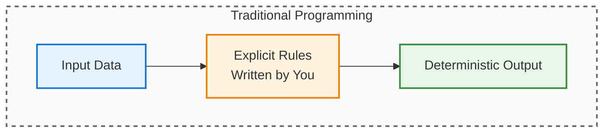
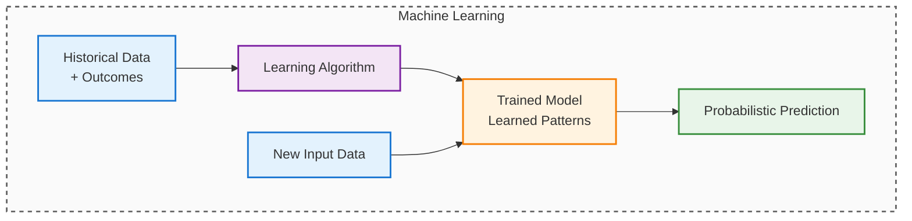
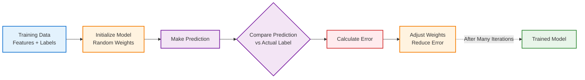

---

## The Core Mental Shift: Rules vs Patterns

---

We know what AI is and where it fits in the automation landscape.

Now the harder question: **What does "learning" actually mean for a machine?**

This is where most engineers struggle. Learning systems behave fundamentally differently from automation systems.

When I started exploring ML, I kept looking for the "rules" the model was following. There aren't any. That's the whole point.

---

## 1. Learning vs Programming (Core Mental Shift)

This is the concept that finally made ML click for me after months of confusion.

This is where many engineers struggle—because learning systems behave very differently from automation systems.

Understanding this difference is essential before:
- Designing AI-enabled platforms
- Integrating ML into CI/CD or CMPs
- Trusting AI-driven decisions in production

When I first started learning about AI, I kept trying to find the "rules" the model was following. Spoiler: there aren't any.

---

### Traditional Programming / Automation

```text
Rules + Input Data → Output
```

Example:

```text
IF change_type == "infra"
AND environment == "prod"
THEN require CAB approval
```

- Logic is explicit
- Behavior is predictable
- Changes require code updates

### Machine Learning

```text
Historical Data + Outcomes → Model
Model + New Input → Prediction
```

- Logic is implicit
- Behavior is learned
- Changes occur through retraining

> **Takeaway:** The core of ML is this inversion: models learn patterns from data, not rules.
{: .prompt-info }

Visually:





---

## 2. Introducing the Running Example for This Series

From this chapter onward, we will use a single real-world scenario to explain concepts consistently.

### Running Example

**Intelligent Change & Deployment Risk Assessment**

_Imagine a system that predicts the risk of a deployment request (like code or infrastructure changes) before it happens. By analyzing details such as change type, environment, resource count, timing, and team, an ML model can flag high-risk deployments and suggest actions—helping teams make safer, faster decisions. This scenario will be used throughout the series to illustrate key AI/ML concepts in a context familiar to DevOps and platform engineers._

This example is intentionally chosen because it is:

- Familiar to DevOps and platform engineers
- Rich enough to evolve across AI concepts
- Architecturally realistic

```mermaid
flowchart LR
    subgraph input["Input: Deployment Request"]
        I1[Change Type: IaC]
        I2[Environment: Prod]
        I3[Resources: 6]
        I4[Time: Peak Hours]
        I5[Team: Platform]
    end
    
    subgraph model["ML Model"]
        M[Risk Prediction<br/>Model]
    end
    
    subgraph output["Output: Risk Assessment"]
        O1[Risk Level: High]
        O2[Confidence: 87%]
        O3[Recommendation:<br/>Manual Review]
    end
    
    input --> model
    model --> output
    
    style input fill:#e3f2fd,stroke:#1976d2,stroke-width:2px
    style model fill:#fff3e0,stroke:#f57c00,stroke-width:2px
    style output fill:#e8f5e9,stroke:#388e3c,stroke-width:2px
    style I1 fill:#e3f2fd,stroke:#1976d2,stroke-width:1px
    style I2 fill:#e3f2fd,stroke:#1976d2,stroke-width:1px
    style I3 fill:#e3f2fd,stroke:#1976d2,stroke-width:1px
    style I4 fill:#e3f2fd,stroke:#1976d2,stroke-width:1px
    style I5 fill:#e3f2fd,stroke:#1976d2,stroke-width:1px
    style O1 fill:#e8f5e9,stroke:#388e3c,stroke-width:1px
    style O2 fill:#e8f5e9,stroke:#388e3c,stroke-width:1px
    style O3 fill:#e8f5e9,stroke:#388e3c,stroke-width:1px
```



---

## 3. Phase 0 – Pure Automation (Where We Start)

Most organizations today implement change governance like this:

```text
IF environment == PROD
AND change_type == Infrastructure
THEN manual approval required
```

### Characteristics

- Rule-based
- Deterministic
- Easy to audit
- Same treatment for all changes

### Problems

- Low-risk changes are slowed unnecessarily
- High-risk changes may still slip through
- Rules grow endlessly
- No learning from past outcomes


> **Warning:** Automation is powerful, but it can't handle complex or changing patterns—learning systems fill that gap.
{: .prompt-warning }


---

## 4. Why Rules Stop Scaling

As platforms mature, teams start adding exceptions:

```text
IF prod AND infra AND resource_count > 5 → approval
IF prod AND infra AND time == peak_hours → approval
IF prod AND app AND config_only → auto-approve
```

Over time:

```text
Simple Rules
     ↓
More Conditions
     ↓
Complex Decision Trees
     ↓
Hard-to-maintain Systems
```

At this point, the problem is no longer automation — it’s decision complexity.

---

## 5. How Learning Changes the Approach

Instead of asking:

> **"What rules should we write?"**

We ask:

> **"What can we learn from past changes?"**

Each historical change becomes a training example.

---

## 6. What Machines Learn From: Training Data

Here's the shift: machines don't learn from instructions. They learn from **examples**.

Each historical change becomes a training record:

```text
Change Type: Infrastructure
Environment: Production
Resources Modified: 6
Deployment Time: Peak Hours
Outcome: Failed
```

Thousands of these records = the training dataset.


> **Warning:** Garbage data in = garbage predictions out. The model can only be as good as your historical data.
{: .prompt-warning }

---

## 7. Features and Labels (Without Jargon)

To make learning possible, training data is split into two parts.

### Features (Inputs)

Features describe what the model can look at.

Examples in our running scenario:

- Change type (IaC / App / Config)
- Files modified
- Resource count
- Environment
- Deployment time
- Historical failure rate

Features answer:

> **\"What information is relevant for decision-making?\"**

### Labels (Outcomes)

Labels represent what we want the model to learn or predict.

Examples:

- Successful
- Rolled back
- Incident caused
- Risk category (Low / Medium / High)

Labels answer:

> **\"What is the expected outcome?\"**

> **Principle:** Learning happens by correlating features with labels.
{: .prompt-tip }

---

## 8. What "Learning" Actually Means

Learning does not mean the system understands intent.

It means:

- Finding statistical patterns
- Estimating likelihoods
- Generalizing from examples

Example output:

```text
Probability of failure: 72%
Risk category: High
```


> **Key Difference:** Learning outcome is probabilistic, not deterministic.
{: .prompt-info }

---

### 8.1 What Actually Changes When a Machine Learns

I spent weeks thinking models were building decision trees somewhere. Completely wrong.

What actually changes: **internal parameters** (think: adjustable weights).

```text
Predict → Compare with reality → Measure error → Adjust weights → Repeat
```

This happens thousands of times until:
- Good predictions get reinforced
- Bad predictions get penalized  
- The model learns relationships (not rules)

It's pattern matching, not rule storage.



### 8.2 Formal Definitions (For Reference)

While the explanations above focus on practical understanding, here are three foundational definitions from the field:

> **Practical Definition:**
> Machine Learning is the science (and art) of programming computers so they can learn from data.

> **Academic Definition** (Arthur Samuel, 1959):
> Machine Learning is the field of study that gives computers the ability to learn without being explicitly programmed.

> **Engineering Definition** (Tom Mitchell, 1997):
> A computer program is said to learn from experience E with respect to some task T and some performance measure P, if its performance on T, as measured by P, improves with experience E.

In our running example:
- **Experience (E):** Historical deployment records
- **Task (T):** Predict deployment risk
- **Performance (P):** Accuracy of risk predictions

These definitions complement the practical explanations—you don't need to memorize them, but they ground the concepts in formal terms.

---

## 9. Terraform Variables vs Training Data (Architect Analogy)

If you write Terraform, this comparison helped me a lot:

**Terraform:**
```text
Variables → Plan → Apply → Infrastructure
```
Logic is in your code. Output is deterministic.

**Machine Learning:**
```text
Training Data → Model → Prediction → Decision
```
Logic is learned from data. Output is probabilistic.

| Terraform     | Machine Learning |
| ------------- | ---------------- |
| Variables     | Features         |
| Desired state | Labels           |
| Plan          | Model            |
| Apply         | Prediction       |

Same mental model, different execution.

---

## 10. Automation vs Learning – Side-by-Side

**Automation:**
```text
Rules → Decision
```

**Machine Learning:**
```text
Past Data → Model → Prediction → Decision
```

| Aspect         | Automation     | Machine Learning |
| -------------- | -------------- | ---------------- |
| Logic          | Explicit rules | Learned patterns |
| Adaptation     | Manual         | Data-driven      |
| Output         | Yes / No       | Probabilities    |
| Explainability | High           | Varies           |
| Best for       | Known cases    | Complex patterns |

---

## 11. Occasional Example: Predictive Auto-Scaling

### Rule-Based Scaling

```text
IF CPU > 70% for 5 minutes
THEN scale out
```

### Learning-Based Scaling

Based on:

- Historical traffic
- Time-of-day patterns
- Deployment events

**Predict required capacity before load spikes**

> **Tip:** Past behavior informs future decisions
{: .prompt-tip }

---

## 12. What Machines Do NOT Learn

Let's be clear about limitations (because the AI hype skips this part):

**Machines do NOT:**
- Understand business intent or context
- Self-correct without feedback
- Replace human accountability


> **Warning:** ML do amplify whatever's in your data—including bias and bad patterns.
{: .prompt-warning }

---

## 13. Why This Matters for Architects

When you're designing platforms, this changes how you think about:
- Approval workflows (dynamic vs fixed)
- Risk assessment (patterns vs rules)
- Audit trails (probabilistic outputs need different governance)

> **Architect’s Question:** Which decisions need rules, and which need learning?
{: .prompt-info }

Best platforms? They use both strategically.

---

## 14. What I Wish I Knew Earlier

> **Summary Takeaways:**
> - Learning replaces rules with patterns
> - Training data drives model behavior
> - Features describe inputs, labels define outcomes
> - ML decisions are probabilistic
> - Automation and ML are complementary
{: .prompt-info }

---

## What's Next?

➡ **Series 1 – Chapter 1.3: Types of Machine Learning**

In the next chapter, we’ll explore:

- Supervised learning (labeled data)
- Unsupervised learning (finding patterns)
- Semi-supervised learning (hybrid approach)
- Reinforcement learning (trial and error)

> **Architectural Question:** How do you decide which type of machine learning is best for a given problem, and what are the risks of choosing the wrong approach?
{: .prompt-info }

_Now that you understand how machines learn from data, the next step is choosing the right learning approach for your use case._

---