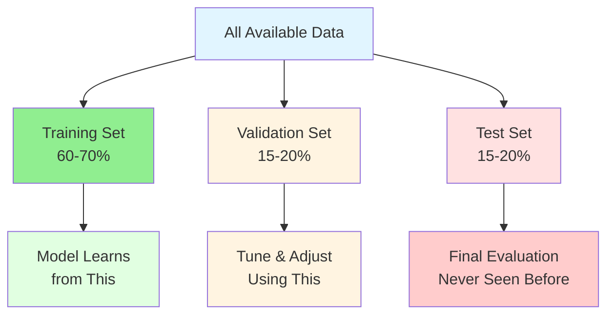

---

## When Bad Data Breaks Everything

---

After learning about ML types, I realized: **Bad data doesn't just break systems—it teaches models to make wrong predictions.**

> **What if the historical deployment data is incomplete or wrong?**

In automation, bad config or variables cause immediate failures. In ML, bad data can silently lead to confident, wrong predictions.

> **Warning:** Bad data = bad model. No matter how sophisticated the algorithm, if the training data is garbage, the predictions will be garbage.
{: .prompt-warning }

**What I'm documenting here:**

- My evolving understanding of data quality
- Why it matters more than I thought
- How to prepare data for ML (from an automation mindset)

---

## 1. What I Learned About Data Requirements


At first, I thought: "I have deployment logs, so I have data. Done." Not quite.

The real issues are:
- **Quality:** Does the data represent the problem?
- **Quantity:** Is there enough to learn patterns?
- **Balance:** Is it biased toward one outcome?
- **Relevance:** Do the features actually predict what matters?

> **My realization:** Having data ≠ having the right data.
{: .prompt-info }

In automation, wrong variables break infra. In ML, wrong data breaks predictions—often silently.

### What I Learned About Data vs Algorithms

One paper changed my thinking: In 2009, Google researchers (including Peter Norvig) showed that **for many complex problems, more data with simpler algorithms often beats less data with sophisticated algorithms.**

> **Key insight:**
> "Choose a representation that can use unsupervised learning on unlabeled data, which is so much more plentiful than labeled data."
{: .prompt-info }

Focus on quality and quantity of data before worrying about the perfect algorithm.

---

## 2. Data: The New Configuration File

### For Automation Engineers

When you write Terraform or Ansible, you work with:

<details markdown="1">
<summary><strong>See Example: Terraform Variables</strong></summary>

```hcl
# Terraform variables
variable "instance_type" {
  type    = string
  default = "t3.medium"
}

variable "environment" {
  type    = string
  validation {
    condition     = contains(["dev", "staging", "prod"], var.environment)
    error_message = "Invalid environment"
  }
}
```

</details>

These variables **define the inputs** to your automation logic.

### For Machine Learning

In ML, data serves the same purpose:

<details markdown="1">
<summary><strong>See Table: Automation vs ML Concepts</strong></summary>

| Automation Concept  | ML Equivalent       | Purpose                              |
| ------------------- | ------------------- | ------------------------------------ |
| Configuration file  | Training dataset    | Defines what the system should learn |
| Variable validation | Data quality checks | Ensures inputs are valid             |
| State file          | Model weights       | Captures learned patterns            |
| Outputs             | Predictions         | What the system produces             |

</details>

> **Tip:** Just as you validate Terraform variables, you must validate training data.
{: .prompt-tip }

---

## 3. The "Garbage In, Garbage Out" Principle I Learned

### Why ML Is Scarier Than Automation

In automation, if I run:

```bash
terraform apply -var="instance_type=invalid_type"
```

**Result:** Immediate failure with a clear error message.

I fix the variable and try again. Fast feedback loop.

---

### What I Learned About ML

Now imagine training an ML model with:

- Mislabeled data
- Missing values
- Biased samples
- Inconsistent formats

**Result:** Model succeeds in training (no errors)

But: Model fails in production (wrong predictions)

**This is what scared me:**

- Bad data doesn't cause training to fail
- It causes the model to confidently learn the wrong patterns

### Example That Made It Real

Thinking about deployment risk assessment:

**Goal:** Predict deployment risk (High/Medium/Low)

**What if the training data has problems?**

<details markdown="1">
<summary><strong>See Table: Data Issues and Model Impact</strong></summary>

| Data Issue                                           | What The Model Learns                                |
| ---------------------------------------------------- | ---------------------------------------------------- |
| All "High risk" deployments mislabeled as "Low risk" | Model learns backwards—predicts safe when dangerous  |
| Missing "time of day" for night deployments          | Model never learns that 3 AM deployments are riskier |
| Only includes successful deployments                 | Model can't recognize failure patterns               |
| Biased toward one team's deployments                 | Model performs poorly for other teams                |

</details>

Each issue creates a model that **appears to work in training** but makes **dangerous predictions in production.**

> **Warning:** The silent failure to watch for—bad data can make your model appear to work in training but make dangerous predictions in production.
{: .prompt-warning }

---

## 4. Data Quality Checklist I'm Using

Before training any model, I now ask:

### 1. **Completeness**

Is all required data present?

```python
# Automation mindset
required_vars = ["instance_type", "vpc_id", "subnet_id"]
missing = [v for v in required_vars if v not in config]

# ML mindset
required_features = ["deployment_size", "time_of_day", "change_count"]
missing = df[required_features].isnull().sum()
```

**For deployment risk:**

- Do all deployments have timestamp?
- Do all have team information?
- Do all have outcome (success/failure)?


### 2. **Accuracy**

Is the data correct?

- **Automation:** Instance type "t3.mediam" (typo) → deployment fails immediately
- **ML:** Deployment labeled "High risk" but actually succeeded → model learns wrong pattern

**For deployment risk:**
- Are risk labels verified?
- Are timestamps in correct timezone?
- Are failure reasons accurately recorded?

### 3. **Consistency**

Is the data formatted uniformly?

<details markdown="1">
<summary><strong>See Table: Data Consistency Issues</strong></summary>

| Inconsistent Data                         | Problem                           |
| ----------------------------------------- | --------------------------------- |
| Team names: "DevOps", "devops", "Dev-Ops" | Model treats as 3 different teams |
| Timestamps: UTC vs local time             | Time-based patterns break         |
| Risk levels: "HIGH" vs "high" vs "H"      | Labels don't match                |

</details>

> **Best Practice:** Normalize your data before training, just like normalizing Terraform variable names.
{: .prompt-tip }

### 4. **Relevance**

Does the data actually predict what you care about?

- **Automation:** Checking instance color doesn't tell you if deployment will succeed
- **ML:** Developer's favorite coffee ☕ doesn't predict deployment risk

**For deployment risk:**
- Include: deployment size, time, change count, environment
- Exclude: developer name, commit message length, office location

### 5. **Timeliness**

Is the data recent and representative?

- **Problem:** Training on 2-year-old deployment data
- **Reality:** Your infrastructure, processes, and teams have changed

> **Best Practice:** Use recent data and retrain periodically (we'll cover this in the MLOps series).
{: .prompt-tip }

### 6. **Representativeness**

Does the training data represent the real-world cases you'll encounter?

> **Key principle:** In order to generalize well, your training data must be representative of the new cases you want to predict.

**Automation example:**  
Testing deployments only during business hours  
**Reality:** Production deployments happen 24/7, including weekends

**ML example:**  
Training deployment risk model only on small deployments (< 50 files)  
**Reality:** Production includes large deployments (500+ files)

**For deployment risk:**

<details markdown="1">
<summary><strong>See Table: Representativeness Issues</strong></summary>

| Training Data               | Real World                 | Problem                                    |
| --------------------------- | -------------------------- | ------------------------------------------ |
| Only weekday deployments    | Weekend deployments happen | Model has never seen weekend patterns      |
| Only one cloud region       | Multi-region deployments   | Different regions have different behaviors |
| Only successful deployments | Need to predict failures   | Model can't recognize failure patterns     |
| Only Team A's deployments   | All teams deploy           | Model biased toward Team A's practices     |

</details>

**Solution:** Ensure training data covers:
- All time periods (weekday, weekend, day, night)
- All environments (dev, staging, prod)
- All teams and regions
- Both successes AND failures
- Full range of deployment sizes

> **Tip:** Representativeness is about coverage of real-world scenarios. Even unbiased data can be non-representative if it doesn't cover the variety of cases you'll see in production.
{: .prompt-tip }

---

## 5. Data Preparation: The Pipeline

Just as you have CI/CD pipelines for code, you need data pipelines for ML.


### Step 1: Cleaning

Remove or fix problematic data:

<details markdown="1">
<summary><strong>See Example: Data Cleaning (Python)</strong></summary>

```python
# Remove duplicates
df = df.drop_duplicates()

# Handle missing values
df['deployment_size'].fillna(df['deployment_size'].median(), inplace=True)

# Remove outliers (deployments > 10,000 files likely errors)
df = df[df['files_changed'] < 10000]
```

</details>

> **Automation Parallel:** Removing invalid configuration entries is like cleaning your ML data.
{: .prompt-info }

### Step 2: Validation

Ensure data meets quality standards:

<details markdown="1">
<summary><strong>See Example: Data Validation (Python)</strong></summary>

```python
# Check for required fields
assert df['timestamp'].notnull().all(), "Missing timestamps"

# Validate ranges
assert (df['risk_level'].isin(['High', 'Medium', 'Low'])).all()

# Check distribution (avoid extreme bias)
print(df['risk_level'].value_counts())
```

</details>

> **Automation Parallel:** `terraform validate` before apply is like validating your ML data before training.
{: .prompt-info }

### Step 3: Transformation

Convert data to usable formats:

<details markdown="1">
<summary><strong>See Example: Data Transformation (Python)</strong></summary>

```python
# Convert timestamps to features
df['hour'] = df['timestamp'].dt.hour
df['day_of_week'] = df['timestamp'].dt.dayofweek
df['is_weekend'] = df['day_of_week'].isin([5, 6])

# Encode categorical variables
df['environment_encoded'] = df['environment'].map({
  'dev': 0, 'staging': 1, 'prod': 2
})
```

</details>

> **Automation Parallel:** Converting YAML to JSON for API consumption is like transforming your ML data into usable formats.
{: .prompt-info }

### Step 4: Feature Engineering

Create new features from existing data (we'll dive deeper into this in a moment):

<details markdown="1">
<summary><strong>See Example: Feature Engineering (Python)</strong></summary>

```python
# Create composite features
df['deployment_velocity'] = df['files_changed'] / df['deployment_duration']
df['risk_score'] = df['files_changed'] * df['is_prod'] * df['is_weekend']
```

</details>

> **Automation Parallel:** Creating derived Terraform locals from variables is like feature engineering in ML.
{: .prompt-info }

---

## 6. Feature Engineering: Creating Better Inputs

**Feature engineering** is the process of transforming raw data into features (inputs) that better represent the problem.

### Why It Matters

Going back to our Terraform analogy:

<details markdown="1">
<summary><strong>See Example: Feature Engineering Analogy (Terraform)</strong></summary>

```hcl
# Raw inputs
variable "instance_count" { default = 5 }
variable "instance_type" { default = "t3.medium" }

# Derived values (locals)
locals {
  total_vcpus = var.instance_count * lookup(local.instance_vcpu_map, var.instance_type)
  estimated_cost = local.total_vcpus * var.hourly_rate
}
```

</details>

The `estimated_cost` is more useful for decision-making than raw inputs.

### ML Feature Engineering Example

**Raw features:**
- `files_changed`: 150
- `hour`: 14
- `day_of_week`: 2

**Engineered features:**
- `deployment_size_category`: "Large" (if > 100 files)
- `is_business_hours`: True (if 9 AM - 5 PM)
- `is_risky_time`: False (if weekend OR after-hours)

The engineered features make patterns easier for the model to learn.

### For Deployment Risk Assessment

<details markdown="1">
<summary><strong>See Table: Raw vs Engineered Features</strong></summary>

| Raw Data                          | Engineered Feature           | Why It Helps                   |
| --------------------------------- | ---------------------------- | ------------------------------ |
| `files_changed: 200`              | `is_large_deployment: True`  | Simplifies threshold learning  |
| `timestamp: 2026-01-07 03:00`     | `is_late_night: True`        | Captures risk pattern directly |
| `previous_failures: [3, 0, 1, 2]` | `failure_rate: 0.25`         | Aggregates history             |
| `team: "Platform"`                | `team_experience_score: 0.9` | Incorporates team reliability  |

</details>

> **Engineering Insight:** Help the model by giving it features that directly relate to the problem.
{: .prompt-info }

---

## 7. Data Splits: Training, Validation, and Test

When you develop automation code, you test in multiple environments:

> Dev → Staging → Production

In ML, you split your data into three sets:

> Training → Validation → Test

### The Three Splits Explained



### Training Set (60-70%)

**Purpose:** The data the model learns from

- **Automation analogy:** Your dev environment where you experiment and iterate
- **For deployment risk:** Use 70% of historical deployments to train the model on patterns


### Validation Set (15-20%)

**Purpose:** Tune the model and check performance during development

- **Automation analogy:** Staging environment where you verify before production
- **For deployment risk:** Use 15% of deployments to validate the model isn't overfitting (we'll cover this in Chapter 3.2)

**Important:** You can look at validation results and adjust your model based on them


### Test Set (15-20%)

**Purpose:** Final evaluation on completely unseen data

- **Automation analogy:** Production deployment—the real test
- **For deployment risk:** Use 15% of deployments as a final check before deploying the model


> **Best Practice:** Never look at test data during development. Only use it once at the very end.
{: .prompt-tip }

### Why This Matters

**Bad practice:**

```python
# Train on ALL data
model.fit(all_data)

# Test on same data
accuracy = model.score(all_data)  # 99% accurate! 🎉
```

> **Warning:** If you train and test on the same data, the model memorizes instead of learning patterns—leading to failure on new deployments.
{: .prompt-warning }

**Good practice:**

```python
# Split data
train, val, test = split_data(all_data, [0.7, 0.15, 0.15])

# Train on training set
model.fit(train)

# Tune using validation set
model.adjust_based_on(val)

# Final test on unseen data
final_accuracy = model.score(test)  # 85% (realistic)
```

---

## 8. Data Bias: The Hidden Danger

Bias in data is like bias in configuration—it leads to inconsistent and unfair outcomes.

### Types of Bias

#### 1. **Sample Bias**

**Definition:** Your training data doesn't represent reality

- **Automation:** Testing only on `t3.medium` instances, then deploying to `t3.large`—things break
- **ML:** Training deployment risk model only on Platform team's deployments
  - **Result:** Model performs poorly for other teams

#### 2. **Historical Bias**

**Definition:** Past decisions were biased, and model learns those biases

- **Example:**
  - Historical data: "All deployments by Team X flagged as High Risk"
  - Reason: Team X was new and had early failures
  - Model learns: "Team X = High Risk" even though team improved

> **Best Practice:** Use recent data and weight recent examples more heavily to avoid historical bias.
{: .prompt-tip }

#### 3. **Measurement Bias**

**Definition:** How you measure/label data introduces bias

- **Example:**
  - "High risk" defined by one person's judgment
  - Different people have different risk tolerance
  - Model learns inconsistent labels

> **Best Practice:** Standardize your labeling process and use objective criteria to avoid measurement bias.
{: .prompt-tip }

### Detecting Bias

Check your data distribution:

```python
# Check distribution across teams
print(df.groupby('team')['risk_level'].value_counts())

# Output might show:
# Team A: 80% Low Risk, 15% Medium, 5% High
# Team B: 30% Low Risk, 30% Medium, 40% High  ← Biased!
```

> **Tip:** If one group is disproportionately labeled as risky, investigate why—this may reveal hidden bias in your data.
{: .prompt-tip }

---

## 9. Practical Guidelines for Data Preparation

Based on automation engineering principles:


### 1. **Automate Data Validation**

Automate checks to ensure your data meets quality standards before training.

> **Best Practice:** Automate data validation to catch issues early, just like you would with infrastructure code.
{: .prompt-tip }

<details markdown="1">
<summary><strong>See Example: Automate Data Validation</strong></summary>

```python
def validate_deployment_data(df):
  """
  Validate deployment data quality
  Like 'terraform validate' but for ML data
  """
  checks = {
    'no_missing_timestamps': df['timestamp'].notnull().all(),
    'valid_risk_levels': df['risk_level'].isin(['High', 'Medium', 'Low']).all(),
    'reasonable_file_counts': (df['files_changed'] > 0).all() & (df['files_changed'] < 10000).all(),
    'recent_data': (df['timestamp'] > '2024-01-01').all()
  }
    
  failed = [k for k, v in checks.items() if not v]
  if failed:
    raise ValueError(f"Data validation failed: {failed}")
    
  return True
```

</details>

### 2. **Version Your Data**

Keep track of changes in your data just like you version your code or infrastructure.

<details markdown="1">
<summary><strong>See Example: Version Your Data</strong></summary>

```bash
data/
  ├── v1.0/
  │   └── deployment_history.csv
  ├── v1.1/
  │   └── deployment_history.csv  # Added new features
  └── v2.0/
      └── deployment_history.csv  # Changed labeling criteria
```

</details>

> **Best Practice:** Track what changed between data versions (we'll cover this more in the MLOps series).
{: .prompt-tip }

### 3. **Document Data Provenance**

Document where your data comes from and any known issues for future reference.

> **Best Practice:** Create a data README to document data provenance and known issues.
{: .prompt-tip }

<details markdown="1">
<summary><strong>See Example: Data README (Provenance)</strong></summary>

```markdown
# Deployment Risk Dataset v2.0

## Source
- Extracted from: JIRA, Jenkins, GitLab
- Date range: 2024-01-01 to 2026-01-07
- Total deployments: 5,432

## Features
- `deployment_id`: Unique identifier
- `timestamp`: Deployment start time (UTC)
- `files_changed`: Number of files modified
- `risk_level`: High/Medium/Low (labeled by SRE team)

## Known Issues
- Missing data for deployments before 2024-01-01
- Team names not standardized until v2.0

## Last Updated
2026-01-07
```

</details>


### 4. **Monitor Data Quality Over Time**

Regularly check if your new data still matches the patterns and quality of your training data.

> **Best Practice:** Continuously monitor for data drift to ensure your models remain reliable as new data arrives.
{: .prompt-tip }

<details markdown="1">
<summary><strong>See Example: Monitor Data Quality Over Time</strong></summary>

```python
def monitor_data_drift(current_data, reference_data):
  """
  Check if new data distribution matches training data
  Like monitoring drift in Terraform state
  """
  metrics = {
    'avg_files_changed': current_data['files_changed'].mean(),
    'risk_distribution': current_data['risk_level'].value_counts(),
    'deployment_frequency': len(current_data) / days_span
  }
    
  # Compare with reference
  # Alert if significant drift detected
```

</details>

---

## What I Wish I Knew Earlier

> **Practitioner’s Lessons:**
> - **Data is configuration for ML:** Bad data = bad model, just like bad variables = broken infrastructure.
> - **Quality matters more than quantity:** 1,000 high-quality labeled deployments > 10,000 messy ones.
> - **Data preparation is not optional:** It's the foundation—skip it and your model will fail.
> - **Use train/validation/test splits:** Like dev/staging/prod environments for code.
> - **Feature engineering amplifies signal:** Help your model by creating meaningful features.
> - **Watch for bias:** Biased data leads to biased models.
> - **Automate and version everything:** Treat data pipeline like infrastructure code.
{: .prompt-tip }

---

## What's Next?

➡ **Series 2 – Chapter 2.2: Features, Labels, and Models**

In the next chapter, we’ll explore:

- Features, labels, and models in detail
- How to choose the right features
- The relationship between inputs, logic, and outputs
- Building our first conceptual model for deployment risk

> **Architectural Question:** How do you decide which features and labels are most important for building a reliable machine learning model in automation scenarios?
{: .prompt-info }

_We've prepared the data—now we'll use it to build something that learns._

---
