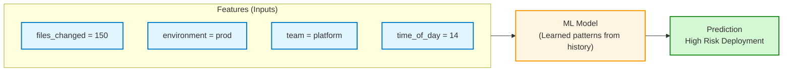
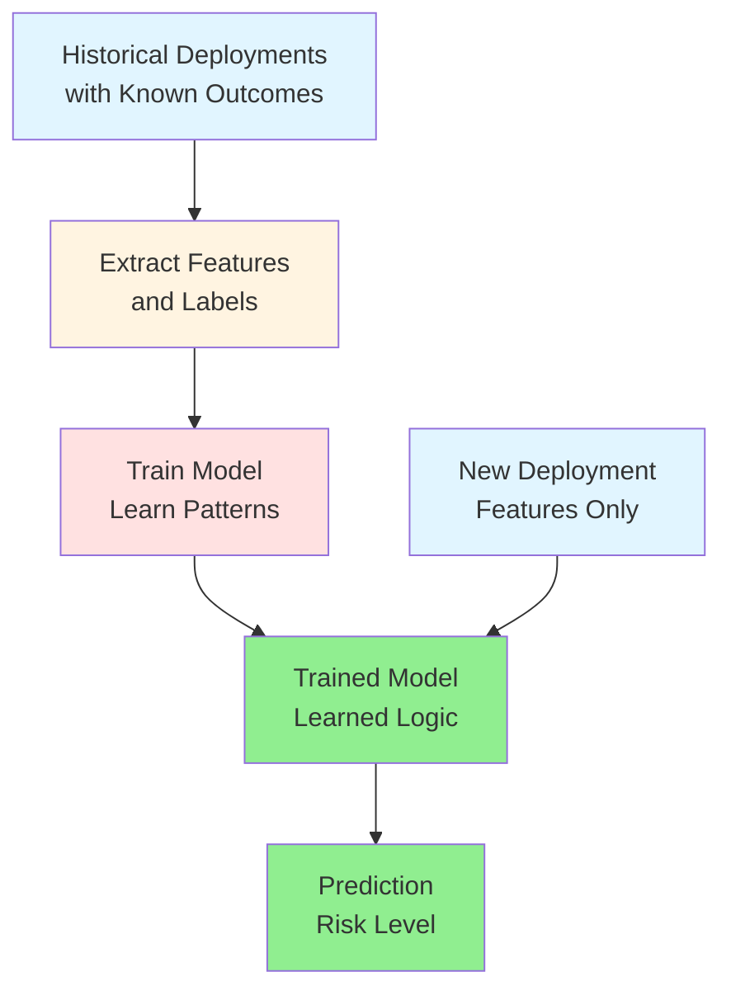

---

## Decoding the ML Language: Inputs, Logic, and Outputs

---

After learning about data quality, I wondered: **What does a model actually look at, and what is it trying to predict?**

Turns out, ML uses the same pattern as automation—**Inputs → Logic → Outputs**.

- **Features** = Inputs (data the model sees)
- **Model** = Logic (learned, not hand-coded)
- **Labels** = Outputs (what you want to predict)

> **Key insight:** These aren’t new concepts—just new names for a familiar pattern. In ML, the model learns the logic from examples, instead of you writing it.
{: .prompt-info }

---

## 1. Why Understanding This Helps

Every ML system—spam filter or ChatGPT—breaks down into:

- **Features:** What info does the system have?
- **Labels:** What is it trying to predict?
- **Model:** What logic connects them?

Once you see this, ML problems become easier:

- Start with “What am I predicting?” (labels)
- Then, “What inputs help predict it?” (features)
- Clear labels = clear success criteria

> **Automation analogy:** Like knowing variables, logic, and outputs in code. You can’t build good infrastructure without knowing what inputs drive what outputs.
{: .prompt-info }

---

## 2. The Fundamental Pattern: Inputs → Logic → Outputs

Here’s how the `Inputs → Logic → Outputs pattern` looks in both automation and machine learning:

### Automation (Terraform)

- **Inputs:** variables (`instance_type`, `environment`, `instance_count`)
- **Logic:** your code (resource definitions, rules)
- **Outputs:** what gets created (infrastructure, computed values)

<details markdown="1">
<summary><b>See Automation Example (Terraform)</b></summary>

```hcl
# Inputs (variables)
variable "instance_type" { default = "t3.medium" }
variable "environment" { default = "prod" }
variable "instance_count" { default = 3 }

# Logic (your code)
resource "aws_instance" "server" {
  count         = var.instance_count
  instance_type = var.instance_type
  tags = {
    Environment = var.environment
    CostCenter  = var.environment == "prod" ? "production" : "development"
  }
}

# Outputs (what gets created)
output "server_ips" {
  value = aws_instance.server[*].private_ip
}
```
</details>

### Machine Learning

- **Features:** inputs (`files_changed`, `environment`, `time_of_day`, `team`)
- **Model:** learned logic (patterns from data)
- **Label:** output (e.g., "High Risk")

<details markdown="1">
<summary><b>See Machine Learning Example</b></summary>

```python
# Features (inputs)
features = {
  'files_changed': 150,
  'environment': 'prod',
  'time_of_day': 14,
  'team': 'Platform'
}

# Model (learned logic)
model = trained_deployment_risk_model

# Label (predicted output)
prediction = model.predict(features)
# Output: **"High Risk"**
```
</details>

> **Engineering insight:** In automation, you write the logic. In ML, the model learns the logic from examples.
{: .prompt-info }


No matter the domain, the core pattern is the same: you start with inputs, apply logic (written or learned), and get outputs.

---

## 3. Features: The Inputs to Your Model

### What is a Feature?

A **feature** is a measurable property you feed into a model—think Terraform variables, but for ML.


#### Feature Types

- ***Numeric***: quantifiable values (e.g., file count, time)
- ***Categorical***: categories (e.g., environment, team)
- ***Boolean:*** true/false flags (e.g., is_weekend)

<details markdown="1">
<summary><b>See deployment risk feature examples</b></summary>

| Feature Name              | Type        | Example Value  | What It Represents  |
| ------------------------- | ----------- | -------------- | ------------------- |
| `files_changed`           | Numeric     | 150            | Size of deployment  |
| `environment`             | Categorical | "prod"         | Where deploying     |
| `time_of_day`             | Numeric     | 14 (2 PM)      | When deploying      |
| `day_of_week`             | Numeric     | 2 (Tuesday)    | Day of deployment   |
| `team`                    | Categorical | "Platform"     | Who is deploying    |
| `previous_failures`       | Numeric     | 3              | Historical failures |
| `deployment_duration_avg` | Numeric     | 12.5 (minutes) | Team's avg speed    |

</details>


Each feature is something the model can use to make predictions.


### Good Features vs Bad Features

The best features are measurable, available before prediction, and make logical sense for the outcome.

<details markdown="1">
<summary><b>See table: Good Features vs Bad Features</b></summary>

| Feature                 | Type        | Predictive Power | Why/Why Not?                       |
| ----------------------- | ----------- | ---------------- | ---------------------------------- |
| `files_changed`         | Numeric     | ✅ High           | Large deployments are riskier      |
| `environment`           | Categorical | ✅ High           | Prod deployments need more care    |
| `previous_failures`     | Numeric     | ✅ High           | History predicts future risk       |
| `developer_shirt_color` | Categorical | ❌ None           | No relationship to deployment risk |
| `commit_message_length` | Numeric     | ❌ Low            | Doesn't indicate actual risk       |

</details>

_Focus on features that are relevant, reliable, and available before prediction._

> **Automation Analogy:** Just as you only use variables in Terraform that actually affect your infrastructure, in ML you want features that truly impact the outcome—not just any data you can collect.
{: .prompt-info }


<details>
<summary><strong>See Quick Checklist: Picking the Right Features</strong></summary>

| Principle                     | Good Example                                    | Bad Example                                                 |
| ----------------------------- | ----------------------------------------------- | ----------------------------------------------------------- |
| Available at prediction time? | `files_changed` (known before deploying)        | `deployment_outcome` (this is what we're predicting!)       |
| Correlated with the outcome?  | `time_of_day` (night deployments are riskier)   | `developer_coffee_preference` (tempting, but no)            |
| Reliable and consistent?      | `environment` (always known)                    | `server_mood` (doesn't exist)                               |
| Avoids leakage?               | `historical_error_rate` (from past deployments) | `post_deployment_error_count` (only known after deployment) |

</details>

If your features pass these checks, you’re on the right track.

> **Warning:** Data leakage is when you accidentally include information that wouldn't be available in production. It's like using `terraform state` as an input to `terraform plan`—you're basically cheating by looking at the answer. Your model will look amazing in testing and fail miserably in production.
{: .prompt-warning }

---

## 4. Labels: The Outputs You're Predicting

Your model is only as good as your labels. Labels are the answers you want your model to predict.

### What is a Label?

- The value you want to predict (e.g., "High Risk").
- In automation, this is like a Terraform output.

<details markdown="1">
<summary><b>See real-world label examples</b></summary>

| Scenario                  | Features (Inputs)         | Label (Output)             |
| ------------------------- | ------------------------- | -------------------------- |
| Email spam detection      | Email text, sender, links | "Spam" / "Not Spam"        |
| Image classification      | Pixel values              | "Cat" / "Dog" / "Bird"     |
| Deployment risk           | Files changed, time, team | "High" / "Medium" / "Low"  |
| Server failure prediction | CPU, memory, disk usage   | "Will fail" / "Won't fail" |

</details>

### Label Types (Classification vs Regression)

This section and table compare the two main types of labels in machine learning: classification (categories) and regression (numeric values).

| Label Type     | What it Predicts | Example Label(s)        | Example Use Case    |
| -------------- | ---------------- | ----------------------- | ------------------- |
| Classification | Category/class   | "High Risk", "Low Risk" | Deployment risk     |
| Regression     | Numeric value    | 23.5 (minutes)          | Deployment duration |

> **Automation Analogy:** Labels are like Terraform outputs—classification is like conditional outputs, regression is like numeric outputs.
{: .prompt-info }


<details>
<summary><strong>Good vs Bad Labels: Quick Checklist</strong></summary>

| Principle             | Good Example                                   | Bad Example                                    |
| --------------------- | ---------------------------------------------- | ---------------------------------------------- |
| Clear & Unambiguous   | deployment_succeeded: True/False               | deployment_quality: Good/Bad                   |
| Consistently Defined  | All "High Risk" deployments meet same criteria | Different people label "High Risk" differently |
| Verifiable            | deployment_failed: True (check the logs)       | deployment_felt_risky: True (opinion)          |
| Balanced Distribution | 40% Low, 35% Medium, 25% High                  | 95% Low, 4% Medium, 1% High                    |

</details>
<br>

> **Warning:** Bad labels = bad model, just like bad configuration = broken infrastructure.
{: .prompt-warning }

---


## 5. Models: The Learned Logic

### What Is a Model?

A **model** is the learned logic that connects features (inputs) to labels (outputs). Instead of you writing the rules, the model discovers patterns by analyzing examples.

> **Automation Analogy:** Like a Terraform config that transforms variables into outputs, but the logic is learned from data, not hand-coded.
{: .prompt-info }


### The Mental Model



The model learns rules like:

```text
IF files_changed > 100 AND environment == "prod" THEN risk = "High"
IF files_changed < 50 AND environment == "dev" THEN risk = "Low"
IF time_of_day BETWEEN 0 AND 6 THEN increase risk by one level
```

You don't write these rules—the model finds them from data.

### Models as Functions

Mathematically, a model is a function:

```python
# Automation: You write the function
def calculate_cost(instance_count, instance_type, hours):
    hourly_rate = get_rate(instance_type)
    return instance_count * hourly_rate * hours

# ML: The model IS the function (learned from data)
def predict_risk(features):
    # Complex learned logic inside
    return risk_level  # "High" / "Medium" / "Low"
```


**Terraform analogy:**

```hcl
# Your explicit logic
locals {
  is_production = var.environment == "prod"
  requires_approval = local.is_production && var.change_size > 100
}

# ML learned logic (conceptual)
model_logic {
  learned_pattern_1 = features.environment == "prod" && features.files_changed > 100
  learned_pattern_2 = features.previous_failures > 3
  learned_pattern_3 = features.time_of_day < 6 || features.time_of_day > 22
  risk = combine(learned_pattern_1, learned_pattern_2, learned_pattern_3)
}
```


### What's Inside a Model?

Every model type represents learned logic differently. Here’s how some common models work under the hood:


<details markdown="1">
<summary><b>See table: Common Model Types & Automation Analogies</b></summary>

| Model Type     | Internal Logic                 | Automation Analogy               |
| -------------- | ------------------------------ | -------------------------------- |
| Decision Tree  | Series of if-then rules        | Nested Terraform conditionals    |
| Linear Model   | Weighted sum of features       | Terraform locals with arithmetic |
| Neural Network | Layers of transformations      | Pipeline of processing steps     |
| Random Forest  | Multiple decision trees voting | Multiple validation checks       |

</details>

> **Tip:** For most use cases, treat the model as a black box that learned logic from data. You don't need to understand the internals to use it effectively.
{: .prompt-tip }

### Model Artifacts

After training, a model becomes a set of files you can deploy:

<details markdown="1">
<summary><b>See example: Model Artifacts</b></summary>

```bash
deployment-risk-model/
├── model.pkl                 # The learned weights/parameters
├── feature_names.json        # Which features it expects
├── label_mapping.json        # How it encodes outputs
└── metadata.json             # Version, training date, etc.
```

**Automation Analogy:** Like Terraform state files, models capture learned state:

```hcl
terraform.tfstate    # Current infrastructure state
model.pkl            # Current learned patterns
```

</details>

> **Best Practice:** Both models and Terraform state files need to be versioned, backed up, and managed carefully.
{: .prompt-tip }

---

## 6. Putting It All Together: The Complete Picture

Let's trace a full example with our deployment risk assessment:

### Step 1: Collect Training Data

Historical deployments with features AND labels:

| files_changed | environment | time_of_day | team     | previous_failures | **risk_level** (label) |
| ------------- | ----------- | ----------- | -------- | ----------------- | ---------------------- |
| 150           | prod        | 14          | Platform | 3                 | **High**               |
| 25            | dev         | 10          | Frontend | 0                 | **Low**                |
| 200           | prod        | 3           | Backend  | 1                 | **High**               |
| 50            | staging     | 16          | Platform | 1                 | **Medium**             |
| 5             | dev         | 11          | Frontend | 0                 | **Low**                |

### Step 2: Train the Model

```python
# Separate features from labels
features = data[['files_changed', 'environment', 'time_of_day', 'team', 'previous_failures']]
labels = data['risk_level']

# Train model (it learns patterns)
model = DecisionTreeClassifier()
model.fit(features, labels)
```


**What happens:** The model analyzes the training data and discovers patterns, e.g.:
- Large `files_changed` + `prod` environment → "High"
- Small `files_changed` + `dev` environment → "Low"
- `time_of_day` < 6 → increased risk
- High `previous_failures` → increased risk

### Step 3: Use the Model for Predictions

New deployment (no label yet):

```python
# Features for new deployment
new_deployment = {
    'files_changed': 175,
    'environment': 'prod',
    'time_of_day': 22,          # 10 PM
    'team': 'Backend',
    'previous_failures': 2
}

# Model predicts the label
prediction = model.predict(new_deployment)
print(prediction)  # Output: **"High Risk"**
```


**The model applied its learned logic:**
- Large deployment (175 files)
- Production environment
- Late evening (22:00)
- Some previous failures
→ Prediction: **High Risk**

### The Complete Flow

Here’s how the full ML workflow fits together:



---

## 7. Feature Engineering Revisited

Now that we understand features, labels, and models, let's circle back to **feature engineering** from Chapter 2.1. This is where you can really help your model out (or shoot yourself in the foot—I've done both).

### Raw Features vs Engineered Features

**Raw features** are direct measurements from your data—whatever you collect as-is:

```python
raw_features = {
    'timestamp': '2026-01-10 22:30:00',
    'files_changed': 175,
    'team_id': 42
}
```

**Engineered features:** Derived features that make patterns easier to learn

```python
engineered_features = {
    'hour': 22,                           # Extracted from timestamp
    'is_late_night': True,                # hour < 6 OR hour > 20
    'is_weekend': False,                  # Derived from timestamp
    'deployment_size': 'Large',           # files_changed > 100
    'team_experience_score': 0.85,        # Looked up from team history
    'files_changed_normalized': 0.7       # Scaled to 0-1 range
}
```

### Why Engineer Features?


> **Best Practice:** Help the model learn faster by making patterns obvious through feature engineering.
{: .prompt-tip }


Instead of the model learning:
> "When `hour` is less than 6 OR greater than 20, risk increases"

You explicitly create:
> `is_late_night: True` when `hour < 6 OR hour > 20`

**Automation Analogy:**

```hcl
# Raw inputs
variable "instance_count" { default = 10 }
variable "instance_vcpus" { default = 4 }

# Engineered values (locals)
locals {
  total_vcpus = var.instance_count * var.instance_vcpus
  needs_reserved_capacity = local.total_vcpus > 100
  estimated_monthly_cost = local.total_vcpus * 50  # $50 per vCPU
}
```


> **Automation Analogy:** You create derived values to make decisions easier—feature engineering in ML is like creating Terraform locals.
{: .prompt-info }

### Common Feature Engineering Techniques

| Technique       | Example                                  | Purpose                       |
| --------------- | ---------------------------------------- | ----------------------------- |
| **Binning**     | files_changed → "Small"/"Medium"/"Large" | Simplify continuous values    |
| **Encoding**    | environment → {dev:0, staging:1, prod:2} | Convert categories to numbers |
| **Scaling**     | Normalize files_changed to 0-1 range     | Ensure consistent scales      |
| **Interaction** | files_changed * is_prod                  | Combine related features      |
| **Aggregation** | Average of last 10 deployments           | Summarize history             |
| **Time-based**  | Extract hour, day, month from timestamp  | Capture temporal patterns     |

> **Want to go deeper?**
> See [Chapter 3.4 – Feature Engineering: The Real Work Behind ML](/series/journey-automation-to-ai/feature-engineering/) for hands-on techniques, practical checklists, and real-world examples.
{: .prompt-tip }


---

## 8. Common Pitfalls and How to Avoid Them


Let me save you some pain by sharing the mistakes I made (so you don't have to):

### 1. Using Labels as Features (Data Leakage)

This is embarrassingly easy to do, especially when your dataset has the label right next to the features.

<details markdown="1">
<summary><b>See Example: Data Leakage (Using Labels as Features)</b></summary>

```python
features = {
    'files_changed': 150,
    'deployment_succeeded': True   # ← This is the label! Don't use it as a feature!
}
```

**Automation equivalent:**
```hcl
# Wrong: Can't use output to compute the output
output "cost" {
  value = aws_instance.server.cost  # This doesn't exist yet
}
```
</details>

### 2. Including Irrelevant Features


<details markdown="1">
<summary><b>See Example: Irrelevant Features</b></summary>

```python
features = {
  'files_changed': 150,
  'developer_shoe_size': 10,      # ← Irrelevant
  'commit_hash_length': 40        # ← No predictive power
}
```
</details>


> **Warning:** Noise confuses the model, slows training, and reduces accuracy—avoid irrelevant features.
{: .prompt-warning }

**Automation equivalent:** Including unnecessary variables that don't affect infrastructure

### 3. Inconsistent Feature Formats


<details markdown="1">
<summary><b>See Example: Inconsistent Feature Formats</b></summary>

```python
# Training data
features_train = {'environment': 'prod'}

# Production data
features_prod = {'environment': 'PRODUCTION'}  # ← Different format!
```
</details>


> **Warning:** Model doesn't recognize the feature value—ensure consistent feature formats.
{: .prompt-warning }

**Automation equivalent:** Inconsistent variable naming breaks your configurations

### 4. Missing Feature Values


<details markdown="1">
<summary><b>See Example: Missing Feature Values</b></summary>

```python
features = {
  'files_changed': 150,
  'environment': None,    # ← Missing value
  'team': ''              # ← Empty string
}
```
</details>


> **Best Practice:** Handle missing values by using defaults, filling with median/mean, creating "is_missing" boolean features, or removing samples with missing critical features.
{: .prompt-tip }

---

## 9. Practical Guidelines

Based on automation engineering principles:

### 1. Document Your Features

Create a feature dictionary (like variable documentation):

<details markdown="1"><summary><b>See Example: Feature Dictionary</b></summary>

```markdown
# Deployment Risk Features

## files_changed
- Type: Numeric (integer)
- Range: 1 to 10,000
- Description: Number of files modified in deployment
- Source: Git diff

## environment
- Type: Categorical
- Values: dev, staging, prod
- Description: Target deployment environment
- Source: CI/CD pipeline variable

## risk_level (Label)
- Type: Categorical
- Values: High, Medium, Low
- Description: Deployment risk assessment
- Source: Post-deployment SRE review
```
</details>

### 2. Version Features with Models

<details markdown="1"><summary><b>See Example: Versioned Features</b></summary>

```bash
model-v1.0/
├── model.pkl
└── features.json       # What features this model expects

model-v2.0/
├── model.pkl
└── features.json       # Added new features, model retrained
```

```hcl
terraform {
  required_version = ">= 1.0"
}
```
</details>

### 3. Validate Features at Runtime

<details markdown="1"><summary><b>See Example: Feature Validation</b></summary>

```python
def validate_features(features, expected_schema):
  """
  Validate features before prediction
  Like validating Terraform variables
  """
  required_features = ['files_changed', 'environment', 'team']
  for feature in required_features:
    if feature not in features:
      raise ValueError(f"Missing required feature: {feature}")
  if features['files_changed'] < 0:
    raise ValueError("files_changed must be positive")
  if features['environment'] not in ['dev', 'staging', 'prod']:
    raise ValueError(f"Invalid environment: {features['environment']}")
  return True
```
</details>

### 4. Monitor Feature Distributions

<details markdown="1"><summary><b>See Example: Feature Drift Monitoring</b></summary>

```python
# Track feature distributions over time
# Alert if they drift significantly

current_avg_files_changed = 150
historical_avg_files_changed = 75

if current_avg_files_changed > historical_avg_files_changed * 2:
  alert("Feature distribution drift detected!")
```
</details>


> **Automation Analogy:** Monitoring infrastructure drift from desired state is like monitoring feature distribution drift in ML.
{: .prompt-info }

---

## What I Wish I Knew Earlier

> **Practitioner’s Lessons:**
> - **Features = Inputs:** The measurable stuff you feed into your model.
> - **Labels = Outputs:** What you're trying to predict.
> - **Models = Learned Logic:** Patterns discovered from examples, not hand-coded.
> - **Feature engineering matters:** Good features amplify signal and avoid leakage.
> - **Good features:** Available, relevant, reliable, and consistent.
> - **Good labels:** Clear, consistent, verifiable, and balanced.
> - **Models are artifacts:** Version, deploy, and monitor them like code.
{: .prompt-tip }

---

## What's Next?

➡ **Series 2 – Chapter 2.3: Training vs Inference**

In the next chapter, we’ll explore:

- The difference between training and inference (execution)
- How model training works (learning phase)
- How model inference works (prediction phase)
- Comparing to `terraform apply` vs runtime behavior
- When and why models need retraining

> **Architectural Question:** What are the practical differences between model training and inference, and how do they impact automation workflows?
{: .prompt-info }

_We understand the building blocks—now we'll see how they come to life._

---
