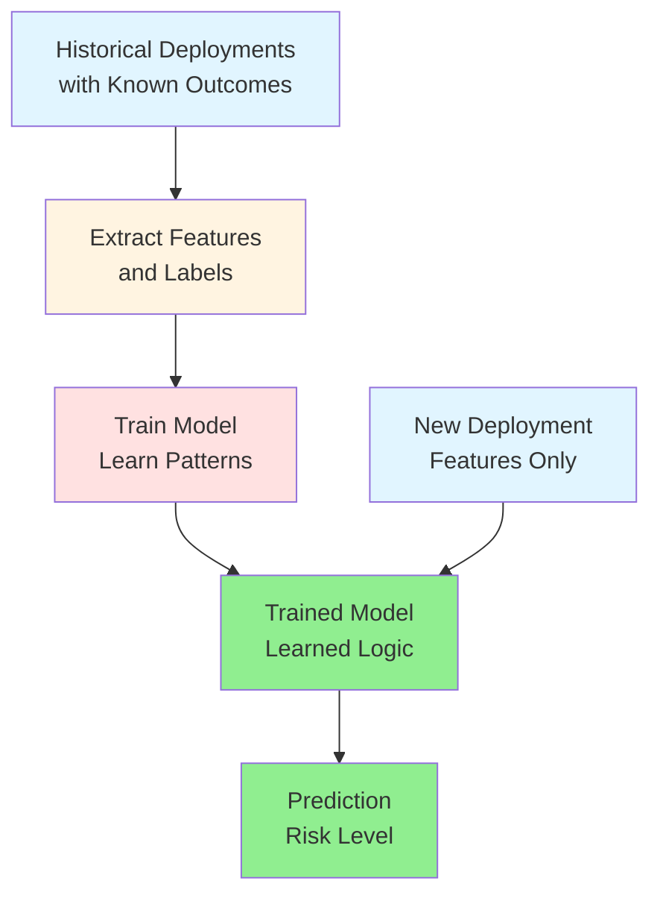

---

## Decoding the ML Language: Inputs, Logic, and Outputs

---

After learning about data quality, the next question I had: **What exactly does the model look at, and what is it trying to predict?**

This is where features, labels, and models come in. When I first saw these terms, they felt overcomplicated and academic.

Then I mapped them to automation patterns I already knew:

**Inputs → Logic → Outputs**

In ML terms:
- **Features** = Inputs (the data the model sees)
- **Model** = Logic (learned rules, not hand-coded)
- **Labels** = Outputs (what you're predicting)

**That's it.** Same pattern I use in Terraform or Ansible. The only difference? ML learns the logic from examples instead of me writing it explicitly.

**What clicked:** Understanding features/labels/models isn't about learning new concepts. It's about recognizing a familiar pattern with new terminology.

---

## 1. Why Understanding This Helps

Every ML system—from spam filters to ChatGPT—breaks down into these three pieces:

- **Features:** What information does the system have?
- **Labels:** What is it trying to predict?
- **Model:** What logic connects them?

Once I understood this breakdown, ML problems became easier to think about:
- Designing solutions: Start with "What am I predicting?" (labels), then "What inputs help predict it?" (features)
- Choosing relevant inputs: Focus on features that actually correlate with the outcome
- Defining success: Clear labels = clear success criteria

**Automation parallel:** Like understanding variables, logic, and outputs in code. Can't build good infrastructure without knowing what inputs drive what outputs.

---

## 2. The Fundamental Pattern: Inputs → Logic → Outputs

### In Terraform

```hcl
# Inputs (variables)
variable "instance_type" { default = "t3.medium" }
variable "environment" { default = "prod" }
variable "instance_count" { default = 3 }

# Logic (your code)
resource "aws_instance" "server" {
  count         = var.instance_count
  instance_type = var.instance_type
  
  tags = {
    Environment = var.environment
    CostCenter  = var.environment == "prod" ? "production" : "development"
  }
}

# Outputs (what gets created)
output "server_ips" {
  value = aws_instance.server[*].private_ip
}
```

**Pattern:**
- Inputs: `instance_type`, `environment`, `instance_count`
- Logic: Your explicit rules and resource definitions
- Outputs: Created infrastructure and computed values

### In Machine Learning

```python
# Features (inputs)
features = {
    'files_changed': 150,
    'environment': 'prod',
    'time_of_day': 14,
    'team': 'Platform'
}

# Model (learned logic)
model = trained_deployment_risk_model

# Label (predicted output)
prediction = model.predict(features)
# Output: "High Risk"
```

**Pattern:**
- Features: `files_changed`, `environment`, `time_of_day`, `team`
- Model: Learned patterns from training data
- Label: `High Risk` / `Medium Risk` / `Low Risk`

**Key difference:** In automation, you write the logic. In ML, the model learns the logic from examples.

---

## 3. Features: The Inputs to Your Model

### What Is a Feature?

A **feature** is just a measurable property or characteristic you feed into a model. That's it.

If you've ever declared Terraform variables, you already understand features. They're the inputs that drive your decisions. The only difference is that in ML, you're feeding these inputs to a model instead of your own if-statements.

### Examples of Features

For our **deployment risk assessment** example:

| Feature Name | Type | Example Value | What It Represents |
|-------------|------|---------------|-------------------|
| `files_changed` | Numeric | 150 | Size of deployment |
| `environment` | Categorical | "prod" | Where deploying |
| `time_of_day` | Numeric | 14 (2 PM) | When deploying |
| `day_of_week` | Numeric | 2 (Tuesday) | Day of deployment |
| `team` | Categorical | "Platform" | Who is deploying |
| `previous_failures` | Numeric | 3 | Historical failures |
| `deployment_duration_avg` | Numeric | 12.5 (minutes) | Team's avg speed |

Each feature represents something the model can use to make predictions.

### Feature Types

Just like Terraform variables have types, features have types:

```hcl
# Terraform variable types
variable "instance_count" { type = number }
variable "environment" { type = string }
variable "enable_monitoring" { type = bool }
variable "tags" { type = map(string) }
```

```python
# ML feature types
features = {
    'files_changed': 150,           # Numeric (continuous)
    'environment': 'prod',          # Categorical (discrete)
    'is_weekend': False,            # Boolean
    'time_of_day': 14               # Numeric (discrete)
}
```

**Numeric features:** Quantifiable values (file count, time, duration)  
**Categorical features:** Discrete categories (environment, team, risk level)  
**Boolean features:** True/False flags (is_weekend, is_prod, is_after_hours)

### Good Features vs Bad Features

Not all features are equally useful. This took me a while to figure out—I initially threw in every piece of data I had, thinking "more is better." Wrong.

Good features have **predictive power**. They actually correlate with what you're trying to predict:

| Feature | Predictive Power | Why |
|---------|-----------------|-----|
| `files_changed` | ✅ High | Large deployments are riskier |
| `environment` | ✅ High | Prod deployments require more care |
| `previous_failures` | ✅ High | History predicts future risk |
| `developer_shirt_color` | ❌ None | No relationship to deployment risk |
| `commit_message_length` | ❌ Low | Doesn't indicate actual risk |

(Yes, I've seen people include commit message length. It doesn't help.)

**Automation parallel:**

When writing Terraform, you include variables that affect infrastructure:
- ✅ `instance_type` (affects performance)
- ✅ `region` (affects latency, cost)
- ❌ `developer_name` (doesn't affect infrastructure behavior)

### Choosing Features: The Practitioner's Checklist

When selecting features, I run through these questions (usually after making mistakes first, but you can skip that part):

1. **Is it available at prediction time?**
   - ❌ "deployment_outcome" (this is literally what we're predicting!)
   - ✅ "files_changed" (we know this before deploying)

2. **Does it correlate with the outcome?**
   - ✅ "time_of_day" (night deployments are riskier)
   - ❌ "developer_coffee_preference" (tempting, but no)

3. **Is it reliable and consistent?**
   - ✅ "environment" (always known)
   - ❌ "server_mood" (doesn't exist, though sometimes it feels like it should)

4. **Does it avoid leakage?**
   - ❌ "post_deployment_error_count" (we won't know this until after deployment)
   - ✅ "historical_error_rate" (based on past deployments)

**Data leakage** is when you accidentally include information that wouldn't be available in production. It's like using `terraform state` as an input to `terraform plan`—you're basically cheating by looking at the answer. Your model will look amazing in testing and fail miserably in production. Ask me how I know.

---

## 4. Labels: The Outputs You're Predicting

### What Is a Label?

A **label** is the thing you're trying to predict. The output. The answer.

In automation terms, it's like your Terraform outputs—the desired result of your logic. Except here, the model is learning to produce that output based on the inputs (features) you give it.

### Examples of Labels

For **supervised learning** (remember from Chapter 1.3?), every training example needs a label. You're basically showing the model: "When you see these inputs, this is the right answer."

| Scenario | Features (Inputs) | Label (Output) |
|----------|------------------|----------------|
| Email spam detection | Email text, sender, links | "Spam" / "Not Spam" |
| Image classification | Pixel values | "Cat" / "Dog" / "Bird" |
| Deployment risk | Files changed, time, team | "High" / "Medium" / "Low" |
| Server failure prediction | CPU, memory, disk usage | "Will fail" / "Won't fail" |

The model learns patterns like:
- "If features look like X, then label is Y"
- "Emails with features A, B, C tend to be Spam"
- "Deployments with features P, Q, R tend to be High Risk"

### Label Types: Classification vs Regression

Just like Terraform outputs can be strings or numbers, labels come in types:

#### Classification Labels (Discrete Categories)

**Definition:** Predicting a category or class

```python
# Binary classification (2 options)
labels = ["Success", "Failure"]

# Multi-class classification (3+ options)
labels = ["High Risk", "Medium Risk", "Low Risk"]
```

**Examples:**
- Email: Spam / Not Spam
- Deployment: High / Medium / Low Risk
- Server: Healthy / Degraded / Failed

**Automation parallel:** Like Terraform conditional outputs:
```hcl
output "environment_tier" {
  value = var.environment == "prod" ? "critical" : "non-critical"
}
```

#### Regression Labels (Continuous Numbers)

**Definition:** Predicting a numeric value

```python
# Predicting exact numbers
predicted_deployment_time = 23.5  # minutes
predicted_cost = 1247.89          # dollars
predicted_cpu_usage = 67.3        # percent
```

**Examples:**
- Predict deployment duration in minutes
- Predict infrastructure cost in dollars
- Predict CPU usage percentage

**Automation parallel:** Like Terraform numeric outputs:
```hcl
output "total_instances" {
  value = length(aws_instance.server)
}
```

### Good Labels vs Bad Labels

Here's where a lot of ML projects fall apart (including my early attempts). Your labels need to be:

1. **Clear and unambiguous**
   - ✅ "deployment_succeeded: True/False" (objective, can't argue with it)
   - ❌ "deployment_quality: Good/Bad" (ask 5 people, get 5 definitions)

2. **Consistently defined**
   - ✅ All "High Risk" deployments meet the same criteria
   - ❌ Different people label "High Risk" differently (this killed my first model)

3. **Verifiable**
   - ✅ "deployment_failed: True" (check the logs, it's there)
   - ❌ "deployment_felt_risky: True" (that's an opinion, not data)

4. **Balanced in distribution**
   - ✅ 40% Low, 35% Medium, 25% High (reasonable spread)
   - ❌ 95% Low, 4% Medium, 1% High (your model will just predict "Low" for everything)

Remember from Chapter 2.1: Bad labels = bad model, just like bad configuration = broken infrastructure.

---

## 5. Models: The Learned Logic

### What Is a Model?

Okay, so you've got features (inputs) and labels (outputs). The **model** is the thing that connects them—the learned logic.

Think of it like a Terraform configuration file. Your config defines how inputs (variables) transform into outputs (resources). A model does the same thing, except instead of you writing the rules, the model figures them out by looking at examples.

This was the hardest part for me to wrap my head around initially. You're not coding the logic. You're providing examples, and the model discovers the patterns.

### The Mental Model

```text
┌─────────────────────────────────────────────────┐
│              Machine Learning Model              │
│                                                  │
│  Features (Inputs)         →      Label (Output) │
│                                                  │
│  files_changed: 150               "High Risk"   │
│  environment: "prod"                             │
│  time_of_day: 14           Model                │
│  team: "Platform"          (Learned Logic)       │
│  previous_failures: 3                            │
│                                                  │
└─────────────────────────────────────────────────┘
```

The model learns patterns like:

```
IF files_changed > 100 AND environment == "prod" AND previous_failures > 2
THEN risk = "High"

IF files_changed < 50 AND environment == "dev"
THEN risk = "Low"

IF time_of_day BETWEEN 0 AND 6 (late night)
THEN increase risk by one level
```

**Important:** You don't write these rules. The model discovers them by analyzing training data.

### Models as Functions

Mathematically, a model is a function:

```python
# Automation: You write the function
def calculate_cost(instance_count, instance_type, hours):
    hourly_rate = get_rate(instance_type)
    return instance_count * hourly_rate * hours

# Machine Learning: The model IS the function (learned from data)
def predict_risk(features):
    # Complex learned logic inside
    return risk_level  # "High" / "Medium" / "Low"
```

**Terraform analogy:**

```hcl
# Your explicit logic
locals {
  is_production = var.environment == "prod"
  requires_approval = local.is_production && var.change_size > 100
}

# ML learned logic (conceptually)
model_logic {
  learned_pattern_1 = features.environment == "prod" AND features.files_changed > 100
  learned_pattern_2 = features.previous_failures > 3
  learned_pattern_3 = features.time_of_day < 6 OR features.time_of_day > 22
  
  risk = combine(learned_pattern_1, learned_pattern_2, learned_pattern_3)
}
```

### What's Inside a Model?

Different ML algorithms create different internal representations. Don't worry too much about this right now—we'll dive into specific algorithms in Series 3. For now, here's the quick version:

| Model Type | Internal Logic | Automation Analogy |
|-----------|---------------|-------------------|
| Decision Tree | Series of if-then rules | Nested Terraform conditionals |
| Linear Model | Weighted sum of features | Terraform locals with arithmetic |
| Neural Network | Layers of transformations | Pipeline of processing steps |
| Random Forest | Multiple decision trees voting | Multiple validation checks |

For now, think of a model as a **black box that learned logic**. You don't need to understand the internals to use it effectively (just like you don't need to understand V8 internals to write JavaScript).

### Model Artifacts

After training, a model becomes a file you can deploy:

```bash
deployment-risk-model/
├── model.pkl                 # The learned weights/parameters
├── feature_names.json        # Which features it expects
├── label_mapping.json        # How it encodes outputs
└── metadata.json             # Version, training date, etc.
```

**Automation parallel:** Like Terraform state files, models capture learned state:

```hcl
terraform.tfstate    # Current infrastructure state
model.pkl            # Current learned patterns
```

Both need to be versioned, backed up, and managed carefully.

---

## Putting It All Together: The Complete Picture

Let's trace a full example with our deployment risk assessment:

### Step 1: Collect Training Data

Historical deployments with features AND labels:

| files_changed | environment | time_of_day | team | previous_failures | **risk_level** (label) |
|--------------|-------------|-------------|------|------------------|---------------------|
| 150 | prod | 14 | Platform | 3 | **High** |
| 25 | dev | 10 | Frontend | 0 | **Low** |
| 200 | prod | 3 | Backend | 1 | **High** |
| 50 | staging | 16 | Platform | 1 | **Medium** |
| 5 | dev | 11 | Frontend | 0 | **Low** |

### Step 2: Train the Model

```python
# Separate features from labels
features = data[['files_changed', 'environment', 'time_of_day', 'team', 'previous_failures']]
labels = data['risk_level']

# Train model (it learns patterns)
model = DecisionTreeClassifier()
model.fit(features, labels)
```

**What happens:** The model analyzes the training data and discovers patterns:
- Large `files_changed` + `prod` environment → often labeled "High"
- Small `files_changed` + `dev` environment → often labeled "Low"
- `time_of_day` < 6 → increased risk
- High `previous_failures` → increased risk

### Step 3: Use the Model for Predictions

New deployment (no label yet):

```python
# Features for new deployment
new_deployment = {
    'files_changed': 175,
    'environment': 'prod',
    'time_of_day': 22,          # 10 PM
    'team': 'Backend',
    'previous_failures': 2
}

# Model predicts the label
prediction = model.predict(new_deployment)
print(prediction)  # Output: "High Risk"
```

**The model applied its learned logic:**
- Large deployment (175 files) ✓
- Production environment ✓
- Late evening (22:00) ✓
- Some previous failures ✓
→ Prediction: **High Risk**

### The Complete Flow



---

## Feature Engineering Revisited

Now that we understand features, labels, and models, let's circle back to **feature engineering** from Chapter 2.1. This is where you can really help your model out (or shoot yourself in the foot—I've done both).

### Raw Features vs Engineered Features

**Raw features** are direct measurements from your data—whatever you collect as-is:

```python
raw_features = {
    'timestamp': '2026-01-10 22:30:00',
    'files_changed': 175,
    'team_id': 42
}
```

**Engineered features:** Derived features that make patterns easier to learn

```python
engineered_features = {
    'hour': 22,                           # Extracted from timestamp
    'is_late_night': True,                # hour < 6 OR hour > 20
    'is_weekend': False,                  # Derived from timestamp
    'deployment_size': 'Large',           # files_changed > 100
    'team_experience_score': 0.85,        # Looked up from team history
    'files_changed_normalized': 0.7       # Scaled to 0-1 range
}
```

### Why Engineer Features?

**Help the model learn faster** by making patterns obvious:

Instead of the model learning:
> "When `hour` is less than 6 OR greater than 20, risk increases"

You explicitly create:
> `is_late_night: True` when `hour < 6 OR hour > 20`

**Automation parallel:**

```hcl
# Raw inputs
variable "instance_count" { default = 10 }
variable "instance_vcpus" { default = 4 }

# Engineered values (locals)
locals {
  total_vcpus = var.instance_count * var.instance_vcpus
  needs_reserved_capacity = local.total_vcpus > 100
  estimated_monthly_cost = local.total_vcpus * 50  # $50 per vCPU
}
```

You create derived values to make decisions easier.

### Common Feature Engineering Techniques

| Technique | Example | Purpose |
|-----------|---------|---------|
| **Binning** | files_changed → "Small"/"Medium"/"Large" | Simplify continuous values |
| **Encoding** | environment → {dev:0, staging:1, prod:2} | Convert categories to numbers |
| **Scaling** | Normalize files_changed to 0-1 range | Ensure consistent scales |
| **Interaction** | files_changed * is_prod | Combine related features |
| **Aggregation** | Average of last 10 deployments | Summarize history |
| **Time-based** | Extract hour, day, month from timestamp | Capture temporal patterns |

---

## The Inputs → Logic → Outputs Mapping

Let's formalize the complete mapping:

### Automation (Terraform)

```hcl
# Inputs
variable "instance_type" {}
variable "environment" {}

# Logic (you write this)
resource "aws_instance" "server" {
  instance_type = var.instance_type
  
  monitoring = var.environment == "prod" ? true : false
  
  tags = {
    CostCenter = var.environment == "prod" ? "production" : "dev"
  }
}

# Outputs
output "server_id" {
  value = aws_instance.server.id
}
```

**Pattern:**
1. You define inputs (variables)
2. You write explicit logic (resource configuration)
3. You get outputs (resource attributes)

### Machine Learning

```python
# Inputs (features)
features = {
    'files_changed': 150,
    'environment': 'prod'
}

# Logic (model learned this)
model = trained_risk_model
# Internally: Learned that files_changed > 100 + prod → High Risk

# Outputs (labels/predictions)
prediction = model.predict(features)
# Output: "High Risk"
```

**Pattern:**
1. You define inputs (features)
2. Model contains learned logic (training discovered patterns)
3. You get outputs (predicted labels)

**Key insight:** Same pattern, different source of logic.

---

## Common Pitfalls and How to Avoid Them

Let me save you some pain by sharing the mistakes I made (so you don't have to):

### 1. Using Labels as Features (Data Leakage)

This is embarrassingly easy to do, especially when your dataset has the label right next to the features.

**Wrong:**
```python
features = {
    'files_changed': 150,
    'deployment_succeeded': True   # ← This is the label! Don't use it as a feature!
}
```

**Automation equivalent:** Using Terraform output as an input
```hcl
# Wrong: Can't use output to compute the output
output "cost" {
  value = aws_instance.server.cost  # This doesn't exist yet
}
```

### 2. Including Irrelevant Features

**Wrong:**
```python
features = {
    'files_changed': 150,
    'developer_shoe_size': 10,      # ← Irrelevant
    'commit_hash_length': 40        # ← No predictive power
}
```

**Impact:** Noise confuses the model, slows training, reduces accuracy

**Automation equivalent:** Including unnecessary variables that don't affect infrastructure

### 3. Inconsistent Feature Formats

**Wrong:**
```python
# Training data
features_train = {'environment': 'prod'}

# Production data
features_prod = {'environment': 'PRODUCTION'}  # ← Different format!
```

**Result:** Model doesn't recognize the feature value

**Automation equivalent:** Inconsistent variable naming breaks your configurations

### 4. Missing Feature Values

**Wrong:**
```python
features = {
    'files_changed': 150,
    'environment': None,    # ← Missing value
    'team': ''              # ← Empty string
}
```

**Solution:** Handle missing values (from Chapter 2.1):
- Use defaults
- Fill with median/mean
- Create "is_missing" boolean feature
- Remove samples with missing critical features

---

## Practical Guidelines

Based on automation engineering principles:

### 1. Document Your Features

Create a feature dictionary (like variable documentation):

```markdown
# Deployment Risk Features

## files_changed
- Type: Numeric (integer)
- Range: 1 to 10,000
- Description: Number of files modified in deployment
- Source: Git diff

## environment
- Type: Categorical
- Values: dev, staging, prod
- Description: Target deployment environment
- Source: CI/CD pipeline variable

## risk_level (Label)
- Type: Categorical
- Values: High, Medium, Low
- Description: Deployment risk assessment
- Source: Post-deployment SRE review
```

### 2. Version Features with Models

```bash
model-v1.0/
├── model.pkl
└── features.json       # What features this model expects

model-v2.0/
├── model.pkl
└── features.json       # Added new features, model retrained
```

Just like Terraform version constraints:
```hcl
terraform {
  required_version = ">= 1.0"
}
```

### 3. Validate Features at Runtime

```python
def validate_features(features, expected_schema):
    """
    Validate features before prediction
    Like validating Terraform variables
    """
    required_features = ['files_changed', 'environment', 'team']
    
    for feature in required_features:
        if feature not in features:
            raise ValueError(f"Missing required feature: {feature}")
    
    if features['files_changed'] < 0:
        raise ValueError("files_changed must be positive")
    
    if features['environment'] not in ['dev', 'staging', 'prod']:
        raise ValueError(f"Invalid environment: {features['environment']}")
    
    return True
```

### 4. Monitor Feature Distributions

```python
# Track feature distributions over time
# Alert if they drift significantly

current_avg_files_changed = 150
historical_avg_files_changed = 75

if current_avg_files_changed > historical_avg_files_changed * 2:
    alert("Feature distribution drift detected!")
```

**Automation parallel:** Monitoring infrastructure drift from desired state

---

## Key Takeaways

If you remember nothing else from this chapter, remember this:

1. **Features = Inputs**  
   The measurable stuff you feed into your model  
   (Like Terraform variables driving infrastructure decisions)

2. **Labels = Outputs**  
   What you're trying to predict  
   (Like Terraform outputs, but predicted instead of computed)

3. **Models = Learned Logic**  
   The patterns the model discovered during training  
   (Like your Terraform config, except you didn't write it—the model figured it out from examples)

4. **Feature engineering amplifies signal**  
   Creating meaningful features helps models learn better  
   Like creating Terraform locals to simplify complex logic

5. **Good features are:**
   - Available at prediction time
   - Correlated with the outcome
   - Reliable and consistent
   - Free from data leakage

6. **Good labels are:**
   - Clear and unambiguous
   - Consistently defined
   - Verifiable
   - Reasonably balanced

7. **Models are artifacts**  
   Trained models are files that need versioning, deployment, and monitoring  
   Like Terraform state or Docker images

---

## Connecting to Automation

| Automation Concept | ML Equivalent | Example |
|-------------------|---------------|---------|
| Variables | Features | `instance_type`, `files_changed` |
| Outputs | Labels | `server_id`, `risk_level` |
| Configuration logic | Model | Resource definitions, learned patterns |
| Terraform locals | Engineered features | Derived values, composite features |
| Variable validation | Feature validation | Type checks, range checks |
| State file | Model artifact | `terraform.tfstate`, `model.pkl` |
| Conditional logic | Model decision boundaries | `var.env == "prod" ? ...` |

---

## What's Next

In **Chapter 2.3**, we'll explore:
- The difference between training and inference (execution)
- How model training works (learning phase)
- How model inference works (prediction phase)
- Comparing to `terraform apply` vs runtime behavior
- When and why models need retraining

We understand the building blocks—now we'll see how they come to life.

---
