---

## Model Training vs Inference: Build Time vs Runtime

In automation, I'm used to thinking about "build time" vs "runtime":

> The Two Phases of Machine Learning

- **Build time:** When I write, test, and deploy Terraform configs, Ansible playbooks, or CI/CD pipelines
- **Runtime:** When those configs actually execute and provision infrastructure

ML has a similar split, but the terminology threw me off initially:

- **Training:** When the model learns patterns from data (build time)
- **Inference:** When the trained model makes predictions on new data (runtime)

> **Engineer Insight:** I kept reading about ML projects that "worked in training but failed in production." That confused me until I realized: **these are two completely different activities** with different inputs, outputs, and resource requirements.
{: .prompt-tip }

Once I mapped training/inference to build/runtime, it clicked.

```mermaid
flowchart LR
    subgraph Training["🔨 TRAINING PHASE (Build Time)"]
        direction TB
        T1["Historical Data<br/>(Features + Labels)"]
        T2["Learn Patterns"]
        T3["Trained Model<br/>(Artifact)"]
        T1 --> T2 --> T3
    end
    
    subgraph Inference["⚡ INFERENCE PHASE (Runtime)"]
        direction TB
        I1["New Data<br/>(Features Only)"]
        I2["Apply Patterns"]
        I3["Prediction<br/>(Label)"]
        I1 --> I2 --> I3
    end
    
    Training --> |"Deploy Model"| Inference
    
    style Training fill:#e1f5ff,stroke:#0066cc,stroke-width:2px
    style Inference fill:#ffe1f5,stroke:#cc0066,stroke-width:2px
```



---

## 1. Training: The Build Phase

### Model Training: How Machines Learn

Model training is the process where an ML model learns patterns from historical data by adjusting internal parameters to reduce prediction errors. This is the **build phase**—like writing and refining automation until it behaves correctly across environments.


> **Automation Analogy:** Training a model is like iteratively improving your Terraform config. Your first draft is rough, but with feedback and testing, you refine it until it works for all environments.
{: .prompt-info }


<details markdown="1">
<summary><strong>Example: Iterative Automation (Terraform)</strong></summary>

```hcl
# First draft (untrained model)
resource "aws_instance" "web" {
        instance_type = "t2.micro"  # Too small for prod
}
# After feedback (trained model)
resource "aws_instance" "web" {
        instance_type = var.environment == "prod" ? "t3.large" : "t3.small"
        root_block_device {
                volume_size = var.environment == "prod" ? 100 : 20
        }
}
```
</details>

### How Training Works: The Learning Loop

Now that we know what training is, let’s see how it actually happens:


> **Key Insight:** Training is a feedback loop — predict → measure error → improve → repeat.
{: .prompt-info }


### What Goes Into Training (Inputs)

- **Training data:** Features + labels (historical examples)
- **Validation data:** Held-out data to check generalization
- **Hyperparameters:** Learning controls (learning rate, depth, layers)
- **Model choice:** Algorithm family (tree, regression, neural net)

> **Automation Analogy:**
> Data = input variables
> Hyperparameters = pipeline knobs
> Algorithm = tool choice (Terraform vs Ansible vs Helm)
{: .prompt-info }

### What Comes Out of Training (Outputs)

- **Trained model artifact:** (model.pkl, model.h5)
- **Training metrics:** (loss, accuracy, validation score)
- **Metadata:** (version, dataset, hyperparameters)

> **Automation Analogy:** Like a compiled Terraform plan + state + commit metadata.
{: .prompt-info }

---

### Hyperparameter Tuning & Model Selection (How Models Improve)

Now the question becomes: How do we make the model better?

Two options we have: 

1. Change the model type (Decision Tree → Random Forest → Neural Net)

2. Tune hyperparameters (depth, learning rate, number of trees)

> **Key insight:**
> You don’t tune weights directly — training does that.
> You tune the learning process itself using hyperparameters.
{: .prompt-info }

If you skip tuning and selection, you don’t get a “bad” model — you get a **model that looked good during training but fails in production**.

---

### What Goes Wrong Without Validation (The False Confidence Trap)

Most teams start like this:

```text
 data → Train model → Evaluate on same data → Accuracy = 96% → Ship it
```

This works in demos. It fails in reality.

> **Failure mode:**
> The model memorizes quirks of historical data instead of learning deployable patterns — classic **overfitting**.
{: .prompt-warning }

> **Automation Analogy:**
> That’s like testing Terraform only in dev and assuming prod will behave identically.
{: .prompt-info }

#### The Correct Data Separation Model (Training ≠ Validation ≠ Test)

So, to overcome `overfitting/underfiting` we split data into three sets:

- **Training** = learning patterns
- **Validation** = Tune hyperparameters and compare models
- **Test** = Final verification before production

> **Automation Analogy**
>Training set   = Development environment (build & iterate)
>Validation set = Staging environment (evaluate candidates)
>Test set       = Production smoke test (touch once)
{: .prompt-info }

#### Why Two Sets Are Not Enough (And How Teams Break This)

A common mistake:

Train → Test → Pick best → Ship

If you evaluate 12 models on the test set and pick the best one, you’ve leaked information from production into engineering decisions.

> **Failure mode:**
> Your test set becomes a hidden validation set — and your production performance collapses.
{: .prompt-warning }

> **Automation Analogy:**
> That’s like running experiments directly in prod and picking the config that didn’t break — not engineering, just luck.
{: .prompt-warning }


#### Real Workflow: Hyperparameter Tuning in Practice

Let’s walk through a realistic workflow for model selection and validation:

```mermaid
graph TB
        subgraph DATA["Deployment History Dataset"]
                All["All Records(10,000 Records)"]
                Train["Training Set<br/>70% (7,000)<br/>🔨 Learn Patterns"]
                Val["Validation Set<br/>15% (1,500)<br/>🧪 Tune & Compare"]
                Test["Test Set<br/>15% (1,500)<br/>🚦 Final Verification"]
        end

        All --> Train
        All --> Val
        All --> Test

        Train --> M1["Model A"]
        Train --> M2["Model B"]
        Train --> M3["Model C"]

        M1 --> Val
        M2 --> Val
        M3 --> Val

        Val --> Winner["Best Candidate"]
        Winner --> Test
```



**Workflow Steps:**
- Split data into training, validation, and test sets
- Train multiple candidate models
- Evaluate on validation set and select the best
- Retrain winner and test once on the test set

<span style="font-size: 0.95em; color: #888;">(For a full end-to-end deployment risk example, <a href="#6-running-example-deployment-risk-assessment">see Section 6</a>.)</span>

> **Key Insight:**
> Validation chooses the model. Test verifies generalization. Mixing these destroys trust in metrics.
{: .prompt-info }

### Cross-Validation (When Validation Data Is Too Small)

Sometimes you get into situation where you don’t have enough validation data to trust one split — especially with small datasets.

Cross-validation solves this by rotating validation folds.

```mermaid
flowchart TD
        Data["Training Data (2,000 Samples)<br/>Split into 5 Folds"]

        subgraph I1["Iteration 1"]
                T1["Train: Folds 2–5"]
                V1["Validate: Fold 1<br/>Score: 87%"]
                T1 --> V1
        end

        subgraph I2["Iteration 2"]
                T2["Train: Folds 1,3–5"]
                V2["Validate: Fold 2<br/>Score: 89%"]
                T2 --> V2
        end

        subgraph I3["Iteration 3"]
                T3["Train: Folds 1,2,4,5"]
                V3["Validate: Fold 3<br/>Score: 85%"]
                T3 --> V3
        end

        subgraph I4["Iteration 4"]
                T4["Train: Folds 1–3,5"]
                V4["Validate: Fold 4<br/>Score: 88%"]
                T4 --> V4
        end

        subgraph I5["Iteration 5"]
                T5["Train: Folds 1–4"]
                V5["Validate: Fold 5<br/>Score: 86%"]
                T5 --> V5
        end

        Data --> I1 & I2 & I3 & I4 & I5
        V1 & V2 & V3 & V4 & V5 --> Avg["Average Score: 87%"]
```



Instead of trusting one validation split, you average performance across 5 independent tests.

> **Automation Analogy:**
> Instead of testing in one staging environment choose multiple:
> 
> staging-us-east, staging-us-west, staging-eu, staging-ap. If it passes everywhere, you trust it.
{: .prompt-info }

#### Tradeoffs of Cross-Validation

- **Benefit:** Much more reliable performance estimate
- **Cost:**    ~5× training time

**Use when:**

- Dataset is small
- Production risk is high
- Algorithm selection matters

**Avoid when:**

- Dataset is huge
- Training cost is extreme
- You already have stable validation splits

### There Is No Universal Best Model (And Why That Matters Operationally)

> **Warning:**
> There is no globally best ML algorithm. Some datasets favor trees, others neural networks, others linear models. You cannot know in advance — only empirical validation reveals the right choice.
{: .prompt-warning }

> **Automation Analogy:**
> Terraform ≠ best for everything
> Kubernetes ≠ best for everything
> Ansible ≠ best for everything
> Same truth for ML models.
{: .prompt-info }

> **Quick Summary**
> - **Training** is an iterative feedback loop: predict → measure → improve
> - **Hyperparameters** tune learning behavior, not learned weights
> - **Validation** is for model selection; test is for final verification
> - **Cross-validation** improves reliability when data is scarce
> - There is no universally best algorithm — empirical testing wins
{: .prompt-info }
---


## 2. Inference: The Execution Phase

### Model Inference: How Models Make Predictions

Inference is when you use the trained model to make predictions on new, unseen data. This is the **execution phase**—like running your automation in production with real inputs.


> **Automation Analogy:** Inference is like running `terraform apply` with new variables—same logic, different inputs, real-world impact.
{: .prompt-info }

**Example:**

```bash
# Training = Writing this config
resource "aws_instance" "web" {
  instance_type = var.instance_type
}

# Inference = Running it with new values
terraform apply -var="instance_type=t3.large"
terraform apply -var="instance_type=t3.small"
terraform apply -var="instance_type=t3.medium"
```

---

### How Inference Works (Step-by-Step)

1. **Load trained model from artifact**
        - Read model.pkl
        - Load learned weights into memory
2. **Receive new input (features only)**
        - files_changed: 150
        - environment: "prod"
        - team: "Platform"
        - No label (you're trying to predict it)
3. **Apply learned logic to features**
        - Model uses trained weights
        - Computes prediction
4. **Return prediction**
        - risk_level: "High"
        - confidence: 92%
        - Fast (milliseconds)

<span style="font-size: 0.95em; color: #888;">For a full end-to-end inference workflow in context, <a href="#6-running-example-deployment-risk-assessment">see Section 6: Running Example</a>.</span>

---

### What Goes Into Inference (Inputs)

- **Trained model:** The artifact from training
- **New data:** Features only (no labels)

> **Automation Analogy:**
> Trained model = compiled plan<br>New data = input variables at runtime
{: .prompt-info }

### What Comes Out of Inference (Outputs)

- **Prediction:** The predicted label ("High", "Medium", "Low")
- **Confidence score:** How confident the model is (optional)
- **Metadata:** Model version used, timestamp (for auditing)

> **Automation Analogy:**
> Prediction = output values<br>Confidence = test coverage or monitoring<br>Metadata = deployment logs
{: .prompt-info }

---

### Key Differences: Training vs Inference

- **Training:** Expensive, slow, happens offline, needs lots of data
- **Inference:** Fast, lightweight, happens in real time, uses trained model

> **Tip:** Optimize inference for speed and reliability—this is what runs in production!
{: .prompt-tip }

---

### Common Pitfalls in Inference

- Using outdated models (not retrained)
- Feeding in data with missing or unexpected features
- Not monitoring prediction quality in production

> **Warning:** Inference is only as good as the data and model you deploy. Always monitor and retrain as needed.
{: .prompt-warning }

---

## 3. One-Time vs Continuous Learning

### Batch Training: Learning from Historical Data Once

Most ML systems train once (or periodically) and then serve predictions continuously. This is like building your automation once and running it many times.

**Example Workflow:**

```text
Monday:     Train model on 6 months of historical data
            └─ Takes 2 hours, produces model_v1.pkl

Tuesday-Sunday: Use model_v1.pkl for all predictions
                └─ Each prediction takes 50ms

Next Monday: Retrain on updated data (new week added)
             └─ Produces model_v2.pkl
```

> **Automation Analogy:**
> You write your Terraform config once, then use it repeatedly for different environments.
{: .prompt-info }

```bash
# Write config once (training)
vim main.tf

# Apply many times (inference)
terraform apply -var="env=dev"
terraform apply -var="env=staging"
terraform apply -var="env=prod"
```

---

### Online Learning: Continuous Model Retraining in Production

Some systems retrain continuously as new data arrives. This is less common and more complex, but essential for fast-changing environments.

**Example Workflow:**

```text
Every hour:
├─ Collect new deployment data
├─ Add to training dataset
├─ Retrain model
└─ Deploy updated model
```

> **Automation Analogy:**
> Like GitOps where every commit triggers a new deployment:<br>Code change → CI/CD pipeline → Auto-deploy<br>New data → Retrain model → Auto-deploy new model
{: .prompt-info }

---

### When to Use Online Learning

**Best for:**
- Fraud detection (patterns change rapidly)
- Real-time recommendation engines
- Stock price prediction

**Usually not needed for:**
- Stable business processes
- Most enterprise automation

> **Tip:** Start with batch training. Move to online learning only if your data or requirements change rapidly.
{: .prompt-tip }

---


## 4.  When Should You Retrain Your Model?(Triggers & Schedules )

Your Terraform config doesn't change unless requirements change. Models are similar—but with a catch: **production data and requirements evolve!**

<details markdown="1">
<summary><strong>Visual: Retraining Decision Flow</strong> (click to expand)</summary>


</details>

### Why Retrain? Four Key Triggers

<details markdown="1">
<summary><strong>1️⃣ Data Drift: Has Your Data Changed?</strong></summary>

**What it is:** The real-world data distribution changes over time.

**Example:**

```text
Original training data (2024):
├─ Average files_changed: 50
├─ Most deployments: 9am-5pm
└─ Teams: Platform, App, Data

New reality (2026):
├─ Average files_changed: 200 (microservices explosion)
├─ Most deployments: 24/7 (automation increased)
└─ Teams: Platform, App, Data, ML, Security, Compliance
```

The model was trained on old patterns. It won't predict well on new patterns.

> **Automation Analogy:** Requirements changed, so you update your Terraform config.
{: .prompt-info }
</details>

<details markdown="1">
<summary><strong>2️⃣ Concept Drift: Has the Meaning Changed?</strong></summary>

**What it is:** The relationship between features and labels changes.

**Example:**

```text
2024: Deployments to prod at night = High risk
        (Only emergencies happened at night)

2026: Deployments to prod at night = Low risk
        (Automated deployments now happen at 2am during low traffic)
```

The meaning of "night deployment" changed. The model needs to relearn.

> **Automation Analogy:** Business logic changed, so you rewrite your validation rules.
{: .prompt-info }
</details>

<details markdown="1">
<summary><strong>3️⃣ New Features: Is New Data Available?</strong></summary>

**What it is:** You have new data sources that could improve predictions.

**Example:**

```text
Old features:
├─ files_changed
├─ environment
└─ team

New features available:
├─ code_review_approval_count
├─ test_coverage_percentage
├─ security_scan_results
└─ infrastructure_cost_impact
```

Retraining with these new features might improve accuracy.

> **Automation Analogy:** New monitoring tools available, so you add health checks to your config.
{: .prompt-info }
</details>

<details markdown="1">
<summary><strong>4️⃣ Poor Performance: Is Accuracy Dropping?</strong></summary>

**What it is:** Model accuracy degrades below acceptable thresholds.

**Monitoring metrics:**

```text
Week 1: Accuracy 95% ✅
Week 4: Accuracy 92% ✅
Week 8: Accuracy 85% ⚠️
Week 12: Accuracy 78% ❌ Time to retrain
```

> **Automation Analogy:** Your pipeline success rate drops, so you investigate and fix issues.
{: .prompt-info }
</details>

---

### Retraining Schedules: When Should You Trigger It?

| Approach              | When to Use                    | Example                             |
| --------------------- | ------------------------------ | ----------------------------------- |
| **Time-based**        | Regular cadence                | Retrain every Monday                |
| **Performance-based** | When metrics degrade           | Retrain if accuracy < 85%           |
| **Data-based**        | When enough new data collected | Retrain after 1000 new examples     |
| **Event-based**       | On significant changes         | Retrain after major platform update |

> **Engineer Insight:** Start with time-based (weekly or monthly) and add performance monitoring for production systems.
{: .prompt-tip }

---


## 5. ML vs Automation: Terraform, DevOps, and Ansible Equivalents


<details markdown="1">
<summary><strong>Show ML-to-Automation Table</strong></summary>

| ML Concept              | Description              | Terraform Equivalent                 | DevOps/CI/CD Equivalent        | Ansible Equivalent               |
| ----------------------- | ------------------------ | ------------------------------------ | ------------------------------ | -------------------------------- |
| **Training data**       | What you learn from      | Requirements docs + past incidents   | User stories, incident reports | Inventory, playbook vars         |
| **Training**            | Build phase              | Writing and testing config           | Building/test pipeline         | Writing and testing playbooks    |
| **Trained model**       | Artifact with logic      | `main.tf` (final config)             | Final pipeline YAML            | Final playbook                   |
| **Model artifact**      | Versioned file           | `terraform.tfstate`                  | Build artifact, release        | Facts cache, output vars         |
| **Inference**           | Execution phase          | `terraform apply`                    | Pipeline run/deploy            | `ansible-playbook` run           |
| **Features**            | What you provide         | Input variables                      | Pipeline parameters            | Extra vars, host vars            |
| **Prediction**          | What you get back        | Outputs                              | Pipeline output, deployment    | Playbook output, registered vars |
| **Retraining**          | Keeping logic current    | Updating config for new requirements | Pipeline refactor, new release | Playbook update for new logic    |
| **Data drift**          | Need to update config    | Requirements changed                 | New business rules, env change | Inventory/vars change            |
| **Batch inference**     | One prediction at a time | `terraform apply` once               | One pipeline run               | One playbook run                 |
| **Real-time inference** | Continuous predictions   | GitOps auto-apply on commit          | Auto-deploy on commit          | Ansible Tower/AWX auto-run       |

</details>

---


## 6. Running Example: Deployment Risk Assessment


<details markdown="1">
<summary><strong>Full Running Example: Deployment Risk Assessment</strong></summary>

**Training Phase (One-Time or Periodic)**

1. Collect historical deployment data (10,000 past deployments)
   - Features: files_changed, environment, team, time_of_day, previous_failures
   - Labels: actual_risk_level (Low/Medium/High)
2. Split data: 70% training, 15% validation, 15% test
3. Train model (e.g., Decision Tree)
   - Learns patterns like: “IF files_changed > 100 AND environment == 'prod' THEN High Risk”
4. Validate model: Accuracy 89% on validation set
5. Save trained model: deployment_risk_model_v1.pkl

**Inference Phase (Every Deployment)**

1. New deployment request arrives (e.g., files_changed: 200, environment: "prod")
2. Load trained model (deployment_risk_model_v1.pkl)
3. Make prediction (model applies learned patterns, takes 20ms)
4. Return prediction (risk_level: "High", confidence: 91%, recommendation: "Require approval from senior engineer")
5. Decision system uses prediction (deployment paused, approval required)

**Retraining Trigger (After 1 Month)**

- Monitoring detects accuracy drop, new data, or data drift
- Retrain model on updated dataset (e.g., 12,000 deployments)
- New accuracy: 90%, deploy new model version

</details>

<details markdown="1">
<summary><strong>Retraining Trigger (After 1 Month)</strong></summary>

**Monitoring detects:**
        - Accuracy dropped to 82% (was 89%)
        - 2,000 new deployments collected
        - Data drift detected (more microservices deployments now)

**Action:**
        - Retrain model on updated dataset (12,000 deployments now)
        - New accuracy: 90%
        - Deploy deployment_risk_model_v2.pkl

</details>


> **Engineer Insight:**
> This end-to-end flow shows how ML models are built, deployed, and kept current in real-world automation. Monitor, retrain, and always close the loop between predictions and outcomes!
{: .prompt-info }

---


## 7. Practical Implications for Production

Machine learning in production is not just about code—it’s about infrastructure, resource planning, and operational discipline. Here’s what you need to know to run ML reliably at scale.

<details markdown="1">
<summary><strong>Training Environment: What’s Needed?</strong></summary>

**Training:**
- Happens offline (doesn't block production)
- Resource-intensive (use dedicated compute)
- Versioned and tracked (like code releases)
- Requires validation before deployment

**Typical setup:**
```text
├─ High-end GPU/CPU instances (intermittent use)
├─ Large storage for training data
├─ Batch processing framework (Spark, Airflow)
└─ Experiment tracking (MLflow, Weights & Biases)
```
</details>

<details markdown="1">
<summary><strong>Inference Environment: What’s Needed?</strong></summary>

**Inference:**
- Happens in real-time (latency matters)
- Lightweight (optimized for speed)
- Uses production infrastructure
- Needs monitoring and fallback logic

**Typical setup:**
```text
├─ Lower-spec instances (always-on)
├─ Model registry for versioned artifacts
├─ API gateway for predictions
└─ Monitoring and alerting
```
</details>

> **Automation Analogy:**
> The difference between training and inference environments in ML is just like the distinction between CI/CD build agents and production servers in automation.
{: .prompt-info }

```text
Training = CI/CD build agents (bursty, powerful)
Inference = Production application servers (steady, efficient)
```

{: .prompt-tip }
**Practitioner’s Lesson:**
Plan for both training and inference as first-class citizens in your infrastructure. Don’t let your production ML fail because you only optimized for one phase!

---

## What I Wish I Knew Earlier

> **Practitioner’s Lessons:**
> - **Training ≠ Inference:** Training learns patterns from historical data. Inference applies learned patterns to new data.
> - **Training is build time, inference is runtime:** Like writing Terraform config vs running `terraform apply`.
> - **Training is expensive, inference is cheap:** Train once (or periodically), predict millions of times.
> - **Models are artifacts:** Trained models are files that need versioning, deployment, and monitoring.
> - **Retraining is necessary:** Data drift, concept drift, and new features require periodic retraining.
> - **Monitor model performance in production:** Track accuracy, latency, and prediction distribution to know when to retrain.
> - **Batch vs online learning:** Most systems use batch (periodic) training. Online learning is complex and rarely needed.
{: .prompt-info }

---

## What's Next?

➡ **Series 3 – Chapter 3.0: ML Project Workflow**

In the next chapter, we’ll explore:

- The complete ML project workflow from problem to production
- The seven phases of ML projects
- How all the concepts we've learned fit together
- End-to-end example mapping to automation workflows

> **Architectural Question:** How do the phases of an ML project map to automation workflows, and what are the key checkpoints for success?
{: .prompt-info }

_We've covered the fundamentals—data, features, labels, training, and inference. Now we'll see how to orchestrate these pieces into a real ML project._

---
