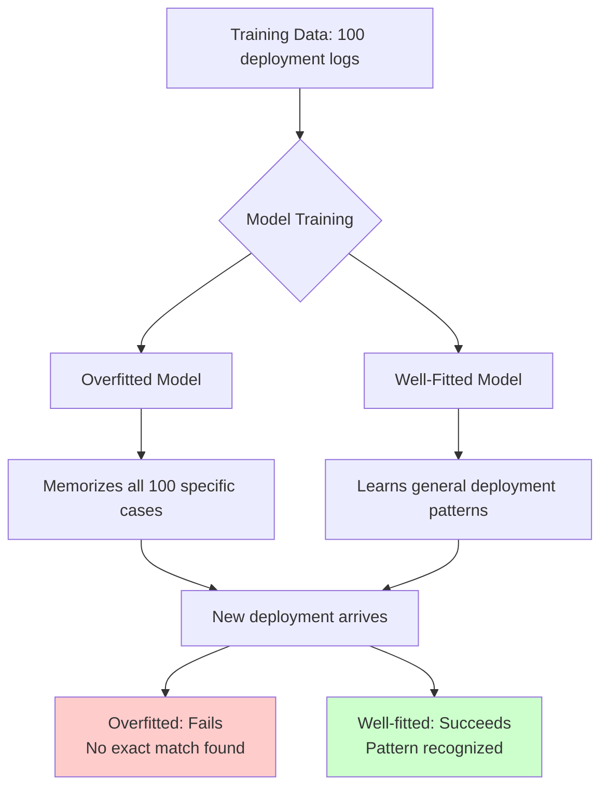
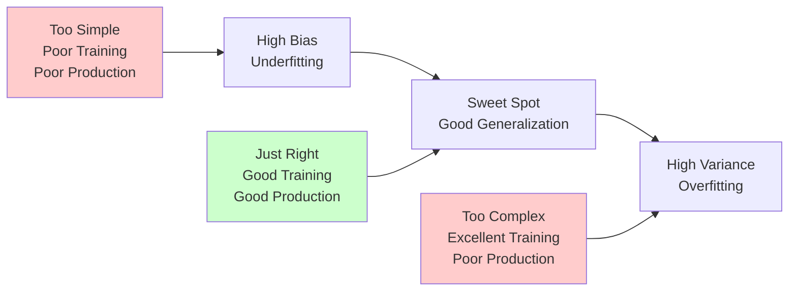
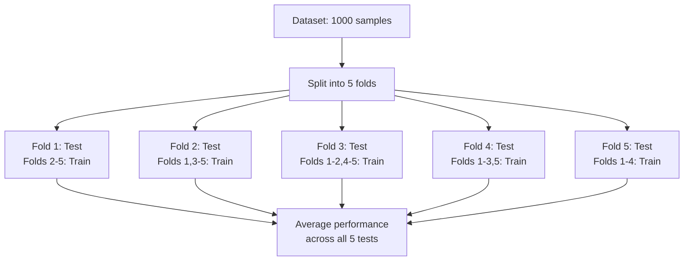
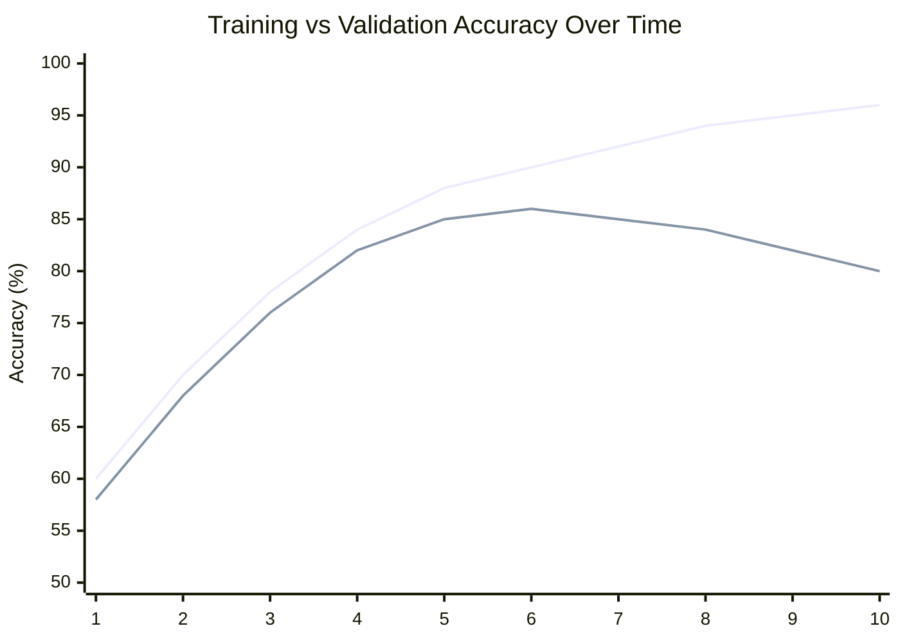

---

## The ML Version of "Works in Dev, Fails in Prod"

Every automation engineer has encountered this scenario: a script runs flawlessly in development, passes all tests in staging, then mysteriously fails in production. The logic is correct, the syntax is valid, but something about the real-world environment breaks your carefully crafted solution.

Machine learning has the exact same problem—and it's called **overfitting** and **underfitting**.

Understanding these concepts isn't about mathematics. It's about recognizing why models that perform brilliantly during training can fail spectacularly when they encounter real data. More importantly, it's about learning to balance model complexity—the same way we balance automation complexity in production systems.

---

## What Is Overfitting?

### The Intuition

Imagine writing a deployment script that handles these exact scenarios:
- Server name: `web-prod-01` → Deploy to port 8080
- Server name: `web-prod-02` → Deploy to port 8081
- Server name: `api-prod-01` → Deploy to port 9090

You could write it like this:

```python
if server == "web-prod-01":
    port = 8080
elif server == "web-prod-02":
    port = 8081
elif server == "api-prod-01":
    port = 9090
```

**This script is overfitted.** It perfectly handles your three test cases, but the moment you add `web-prod-03` or `api-prod-02`, it breaks. You've memorized the training data instead of learning the underlying pattern.

A better approach would be:

```python
if server.startswith("web-"):
    port = 8080 + int(server.split("-")[-1]) - 1
elif server.startswith("api-"):
    port = 9090
```

This generalizes the pattern rather than memorizing specific cases.

### In Machine Learning Terms

**Overfitting occurs when a model learns the training data too well**—including noise, outliers, and random fluctuations that won't appear in new data.

**The symptoms:**
- **Excellent training performance** (e.g., 99% accuracy on training data)
- **Poor performance on new data** (e.g., 65% accuracy on production data)
- **The model memorized rather than learned**

**Visual analogy:**



### Real Example: Server Failure Prediction

**Scenario:** You're building a model to predict server failures based on CPU usage, memory, disk I/O, and network traffic.

**Training data:** 1,000 servers, collected over one week

**Overfitted model behavior:**
- Learns that Server A fails when CPU hits exactly 87.3% at 3:47 PM on Thursdays
- Learns that Server B fails when memory reaches exactly 12.7GB at midnight
- Memorizes the specific noise patterns in the training week's data

**Result:**
- Training accuracy: 98%
- Production accuracy: 62%
- **The model can't generalize to new servers, new times, or new patterns**

---

## What Is Underfitting?

### The Intuition

Now imagine the opposite: a deployment script so generic that it does almost nothing:

```python
port = 8080  # Just use 8080 for everything
```

**This script is underfitted.** It's too simple to capture the real pattern. It might work for some web servers by chance, but it completely ignores the difference between web and API servers.

### In Machine Learning Terms

**Underfitting occurs when a model is too simple to capture the underlying patterns in the data.**

**The symptoms:**
- **Poor training performance** (e.g., 65% accuracy on training data)
- **Poor performance on new data** (e.g., 63% accuracy on production data)
- **The model is too basic to learn anything useful**

### Real Example: Server Failure Prediction

**Underfitted model behavior:**
- Uses only one feature: CPU usage
- Applies a simple rule: "If CPU > 80%, predict failure"
- Ignores memory, disk, network, time patterns, historical trends

**Result:**
- Training accuracy: 68%
- Production accuracy: 67%
- **The model is consistently mediocre—it's too simple to be useful**

---

## The Bias-Variance Trade-Off

In automation, we balance:
- **Simplicity:** Easy to maintain, but might miss edge cases
- **Complexity:** Handles more scenarios, but harder to debug and maintain

In machine learning, we balance:
- **Bias (Underfitting):** Model is too simple, misses patterns
- **Variance (Overfitting):** Model is too complex, memorizes noise



**The goal:** Find the sweet spot where the model is complex enough to learn patterns but simple enough to generalize to new data.

---

## How to Detect Overfitting and Underfitting

### The Train-Test Split Strategy

In automation, we test scripts in staging before production. In ML, we use a **train-test split**:

1. **Training Set (70-80%):** Used to train the model
2. **Test Set (20-30%):** Used to evaluate performance on unseen data

**The diagnostic pattern:**

| Scenario | Training Accuracy | Test Accuracy | Diagnosis |
|----------|-------------------|---------------|-----------|
| **Underfitting** | 65% | 63% | Model too simple—can't learn patterns |
| **Good Fit** | 88% | 85% | Model generalizes well |
| **Overfitting** | 98% | 67% | Model memorized training data |

### Automation Analogy

Think of it like testing an Ansible playbook:

**Underfitted playbook:**
```yaml
- name: Configure server
  command: echo "server configured"
```
- Works on test server: ✓ (but does nothing useful)
- Works in production: ✓ (but still does nothing useful)

**Well-fitted playbook:**
```yaml
- name: Install packages
  apt: name={{ item }} state=present
  loop: "{{ required_packages }}"
  
- name: Configure service
  template: src=config.j2 dest=/etc/service/config
```
- Works on test server: ✓
- Works in production: ✓

**Overfitted playbook:**
```yaml
- name: Configure exact server
  command: |
    if [ "$(hostname)" == "test-server-01" ]; then
      install_specific_version_for_test_server_01
    fi
```
- Works on test server: ✓
- Works in production: ✗ (hardcoded to test environment)

---

## How to Prevent Overfitting

### 1. Use More Training Data

**Automation analogy:** Test your scripts on more diverse environments.

**ML application:** More data makes it harder for the model to memorize—it has to learn general patterns instead.

**Example:** Instead of 1,000 server logs, use 50,000 logs covering multiple months, different workloads, and various server types.

---

### 2. Regularization (Penalize Complexity)

**Automation analogy:** Code review guidelines that discourage overly complex scripts.

**ML application:** Add a penalty for model complexity during training. Force the model to stay simpler unless the added complexity genuinely improves performance.

**Techniques:**
- **L1 Regularization (Lasso):** Removes unnecessary features entirely
- **L2 Regularization (Ridge):** Reduces the influence of less important features

**Think of it as:** Enforcing "keep it simple" rules on your model.

---

### 3. Cross-Validation

**Automation analogy:** Test your playbook on multiple staging environments, not just one.

**ML application:** Instead of one train-test split, use **k-fold cross-validation**:



**The benefit:** You get a more reliable estimate of how well your model generalizes, not just how well it performs on one specific test set.

---

### 4. Feature Selection

**Automation analogy:** Don't add every possible parameter to your script—keep only the ones that matter.

**ML application:** Remove irrelevant or redundant features that add noise without adding predictive power.

**Example:** For server failure prediction, you might discover that "server name length" doesn't correlate with failures—remove it.

---

### 5. Early Stopping

**Automation analogy:** Stop adding features to your script when additional complexity stops improving reliability.

**ML application:** Monitor model performance on a validation set during training. Stop training when test performance starts degrading (sign of overfitting).



**Best stopping point:** Around epoch 5-6, where validation accuracy peaks before declining.

---

## How to Fix Underfitting

### 1. Increase Model Complexity

**Automation analogy:** Add more logic to handle real-world edge cases.

**ML application:** Use a more sophisticated algorithm or add more parameters to your model.

**Example:**
- Switch from Linear Regression to Decision Trees
- Add more layers to a neural network
- Use polynomial features instead of linear features

---

### 2. Add More Features

**Automation analogy:** Collect more information about the environment before making decisions.

**ML application:** Include additional data that might contain useful patterns.

**Example:** For server failure prediction, add:
- Historical trends (not just current values)
- Time-based patterns (failures more common during peak hours?)
- Server age, hardware type, workload type

---

### 3. Train Longer

**Automation analogy:** Give your script more time to explore all scenarios.

**ML application:** Some models need more training iterations to learn patterns. If training stopped too early, the model might still be underfitted.

**Caution:** Monitor validation performance—training longer can eventually lead to overfitting.

---

## Practical Example: Deployment Success Prediction

**Goal:** Predict whether a deployment will succeed based on historical data.

### The Data

- **Features:** Code complexity, test coverage, number of changed files, deployment time, environment type
- **Target:** Success (1) or Failure (0)
- **Training samples:** 5,000 deployments

### Iteration 1: Underfitted Model

**Approach:** Simple logistic regression with one feature (test coverage)

**Results:**
- Training accuracy: 68%
- Test accuracy: 67%

**Diagnosis:** Too simple. Test coverage alone isn't enough to predict deployment success.

---

### Iteration 2: Well-Fitted Model

**Approach:** Random Forest with all five features

**Results:**
- Training accuracy: 87%
- Test accuracy: 84%

**Diagnosis:** Good balance. The model learned useful patterns and generalizes well.

---

### Iteration 3: Overfitted Model

**Approach:** Deep neural network with 10 layers and dropout disabled

**Results:**
- Training accuracy: 99%
- Test accuracy: 71%

**Diagnosis:** Overfitted. The model memorized the training data but can't generalize.

---

## Key Takeaways

**Overfitting:**
- Model is too complex
- Memorizes training data including noise
- High training performance, poor production performance
- **Fix:** More data, regularization, cross-validation, simpler model

**Underfitting:**
- Model is too simple
- Can't learn the underlying patterns
- Poor training and production performance
- **Fix:** More complex model, more features, longer training

**The Balance:**
- **Like automation:** Find the sweet spot between simplicity (maintainability) and complexity (capability)
- **Use train-test splits** to diagnose the problem
- **Use cross-validation** for reliable performance estimates
- **Monitor both training and test performance**—the gap between them tells the story

---

## What's Next?

Now that we understand why models fail (overfitting/underfitting), the next question is: **How do we measure if a model is actually good?**

Accuracy alone is misleading. In Chapter 3.3, we'll explore model evaluation metrics—precision, recall, F1-score—and learn when to use which metric based on the problem we're solving.

---