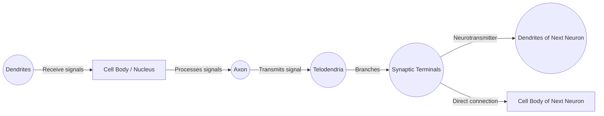
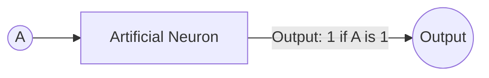
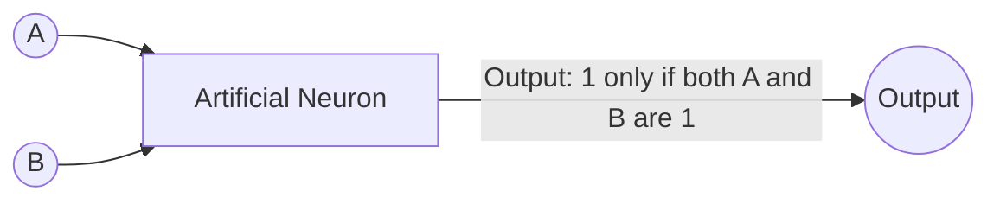
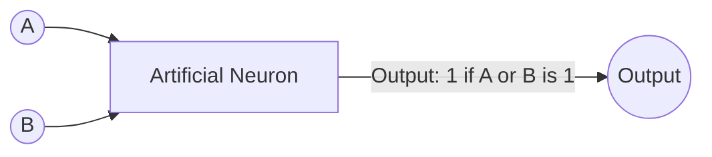
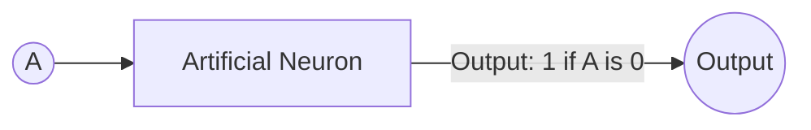
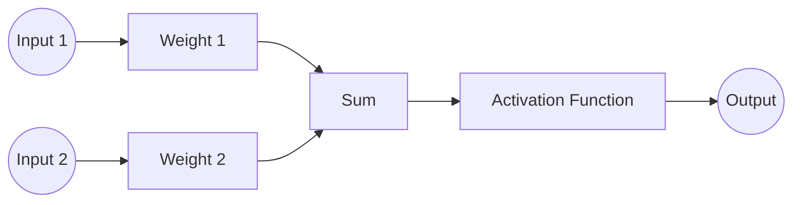
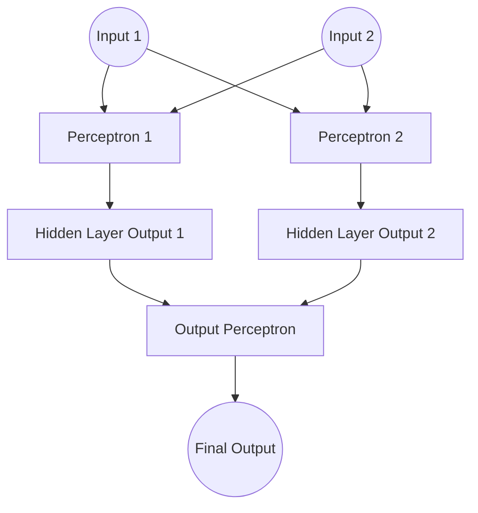
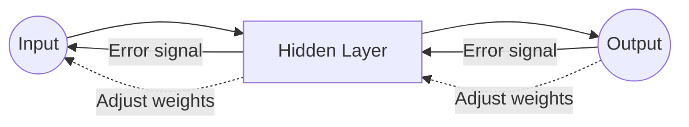
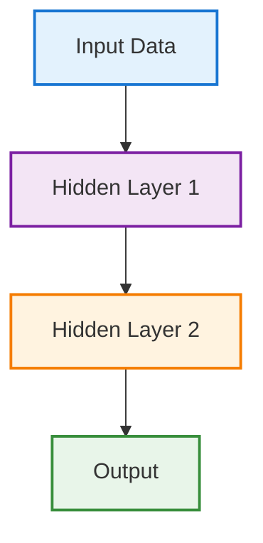

# What Makes Deep Learning Different?

## Introduction

Let’s quickly recap our journey so far:

- **Automation** → systems follow rules and scripts  
- **Machine Learning (ML)** → systems learn from data  
- **ML types** → supervised, unsupervised, reinforcement  
- **Data & models** → preparation, training, inference  

Now we’re stepping into **deep learning** — and this is where things shift fundamentally.

> Throughout history, engineers have learned from nature — flight from birds, sonar from bats, and now deep learning from the human brain.
{: .prompt-info }

Just as automation mimics decision logic and ML mimics learning from examples, deep learning mimics how biological neurons learn through layered signal processing.

So what exactly makes deep learning different — and when should engineers care?

---

## What Is Deep Learning?

Deep learning uses **neural networks with many layers** to learn complex patterns directly from raw data.

Instead of manually defining features (as in traditional ML), deep learning:
- Learns representations automatically
- Handles messy, unstructured data
- Improves as data scale increases

Think of it like an automation pipeline — but instead of rules, each stage learns transformations from data.

> **Engineer’s Insight:** Deep learning is like an automation pipeline that rewrites itself as it goes. When you’re drowning in messy logs or images, it’s the self-tuning script that finds patterns you’d never spot by hand.
{: .prompt-tip }

---

## How Is Deep Learning Different from Traditional ML?

| Traditional ML                        | Deep Learning                       |
| ------------------------------------- | ----------------------------------- |
| Manual feature engineering            | Automatic feature learning          |
| Works best on structured/tabular data | Excels at images, text, audio, logs |
| Shallow models                        | Deep layered models                 |
| Faster to train                       | Data & compute intensive            |

**Example:**
- Risk scoring from structured metrics → ML
- Risk scoring from logs, images, free text → DL

> **Automation Analogy:** Think of traditional ML as a well-oiled assembly line—fast and efficient for simple, repeatable tasks. Deep learning is the flexible robot arm that can handle any shape or size, especially when the parts keep changing.
{: .prompt-info }

---

## Biological Neurons and Logical Computations

To understand deep learning, I found it helpful to start with the basics of how our brains work. When I first learned about biological neurons, I pictured them as tiny messengers: each has a cell body (with a nucleus), lots of short branches called dendrites (which receive signals), and a long branch called an axon (which sends signals). At the end of the axon, the neuron connects to other neurons through tiny links called synapses.

**Biological Neuron (Detailed Structure):**

*Figure: Structure of a biological neuron showing dendrites, cell body (nucleus), axon, telodendria, and synaptic terminals connecting to the next neuron's dendrites or cell body.*

When a neuron gets enough signals from its neighbors, it "fires"—sending its own signal onward. What amazed me is how each neuron is simple, but when billions of them connect in a network, they can do incredible things—like help us see, move, or solve problems. These networks are often organized in layers, passing signals from one group to the next.

Drawing a parallel to computers, I realized that scientists created artificial neurons based on this idea. The first models were very simple: they took several on/off inputs and produced an on/off output. By connecting these artificial neurons, you can build networks that perform basic logic, like AND, OR, and NOT. For example:

## **Artificial Neuron and Logic Gates:**

***Identity Gate***

*If input A is on, output is on; if A is off, output is off.*  

***AND Gate***

*Output is on only if both A and B are on.*
  
***OR Gate***

*Output is on if either A or B is on.*

***NOT Gate***

*Output is on if A is on and B is off.*

> By combining these units, we move from simple decisions to complex reasoning — exactly how networks scale.
{: .prompt-info }

This is the foundation of both biological and artificial neural networks—and it’s how I connected the dots between nature and technology.

## Perceptrons: The First Learning Neurons

Once I understood logic gates, the next question was obvious:  
How do systems *learn* instead of just following fixed rules?

That’s where the **perceptron** comes in — the earliest practical model of a learning artificial neuron.

A perceptron takes multiple inputs, multiplies each by a weight, sums them, and passes the result through an activation function (often a threshold). If the result crosses the threshold, the neuron “fires”; otherwise, it stays silent.

> 🕰️ **Quick history check:**  
> In the late 1950s, psychologist Frank Rosenblatt built the first perceptron after being inspired by Hebb’s neuroscience principle — *“cells that fire together, wire together.”*  
> That simple biological insight became the foundation of how neural networks learn.
{: .prompt-info }

Unlike logic gates, which behave the same way forever, a perceptron **learns from experience**:

- It adjusts which inputs matter more
- It changes how strongly they influence decisions

This shift — from fixed rules to learned weights — was the first true step toward machine learning with neural networks.

> 💡 The perceptron didn’t just compute — it adapted.
{: .prompt-tip }
> **Engineer’s Insight:** The perceptron is like a self-tuning automation rule. Instead of hardcoding which signals matter, it learns from experience—just like a monitoring alert that gets smarter every time you tweak the thresholds.
{: .prompt-tip }

**Perceptron (Single Neuron Decision):**

*Figure: A perceptron combines weighted inputs, applies an activation function, and produces an output.*

But a single perceptron can only learn simple patterns. The real power emerges when we stack many perceptrons into layers, allowing each layer to learn progressively richer representations.

**Stacking Perceptrons (Multi-layer Network):**
> Stacking perceptrons into layers is what gives neural networks their power—each layer learns more abstract features, enabling the network to solve complex problems that a single neuron never could.
{: .prompt-tip }

*Figure: Multiple perceptrons stacked in layers form a simple neural network. Each layer learns more complex features from the previous one.*

But stacking perceptrons introduces a deeper challenge:

How does the network know which connections to adjust — and by how much — when it makes a mistake?

This is where **backpropagation** comes in — the learning engine behind deep networks.

## Backpropagation: How Neural Networks Actually Learn

Once perceptrons are stacked into layers, learning is no longer local to a single neuron. A mistake at the output might be caused by weights deep inside the network — but how do we know which ones to fix?

Backpropagation solves this by working backward from the error.

Instead of guessing blindly, the network follows a feedback loop:

1. It makes a prediction
2. Compares it with the correct answer
3. Measures the error
4. Sends that error backward through the network
5. Adjusts each weight slightly to reduce future mistakes

> Backpropagation applies calculus (the chain rule) to efficiently compute how much each connection contributed to the final error — allowing large networks to learn without brute-force guessing.
{: .prompt-info }

> **Engineer’s Insight:** Backpropagation is like a feedback loop in automation—after every run, the system traces back what went wrong and tunes each step. It’s the “blame assignment” in a failed deployment, but for neural networks.
{: .prompt-info }

This process feels very similar to how engineers debug systems:  
observe output → trace back the fault → adjust → retry.

> 💡 Backpropagation turns neural networks from static calculators into adaptive systems.
{: .prompt-tip }

**Backpropagation (Learning by Feedback):**

*Figure: Backpropagation sends error signals backward through the network, updating weights to improve learning.*

> Backpropagation is what lets deep learning models learn from their mistakes and get better over time.
{: .prompt-tip }

What makes this powerful is not just correction — it’s **directional learning.**
Each adjustment nudges the network toward better representations rather than random change.

Once I understood backpropagation, deep learning stopped feeling mysterious. It became clear that massive neural networks learn the same way humans do when practicing a skill:
try → fail → reflect → improve.

And with enough data and repetition, that feedback loop produces intelligence.

---

## Core Building Blocks of Deep Learning

Once you understand perceptrons and backpropagation, deep learning becomes much less mysterious. At its core, every deep learning model is built from just a few simple components:

- **Neurons:** Small computational units that transform inputs into signals.
- **Layers:** Groups of neurons stacked together to learn progressively richer patterns.
- **Weights:** Adjustable connections that control how strongly signals flow.
- **Activations:** Functions that decide whether a neuron fires and how strongly.

Individually, these parts are simple. But when stacked into deep networks and trained with feedback, they can recognize faces, translate languages, and detect anomalies in complex systems.

**Diagram:**

---

## Why Deep Learning Matters for Automation/DevOps

- In traditional automation, we encode rules.
- In machine learning, we encode patterns.
- In deep learning, we encode representations — letting systems discover signals humans can’t easily define.

This is especially powerful in operations environments, where data is:
  
**Why does this matter for ops?** In operations environments, data is often:

- **High-volume**
- **Noisy**
- **Unstructured**
- **Constantly changing**

That’s exactly where deep learning thrives.

---

**Real-world use cases include:**
- Anomaly detection
- Log analysis
- Predictive maintenance
- NLP for support tickets
- Image-based inspections

> Deep learning shines when signals are hidden inside noisy, unstructured data — exactly what ops teams deal with daily.
{: .prompt-tip }

> **Automation Analogy:** In ops, you’re always hunting for patterns in chaos—like finding the root cause in a sea of logs. Deep learning is your ultimate log parser: it learns to spot the signal in the noise, even when you can’t write the rules yourself.
{: .prompt-tip }

---
## When NOT to Use Deep Learning
> Avoid deep learning when:
{: .prompt-warning }

- Your data is small
- The problem is simple and structured
- Interpretability is more important than accuracy
- Latency/cost constraints are strict

> **Engineer’s Insight:** Sometimes, a good old cron job or a simple if-else rule beats a fancy neural net. Use the right tool for the job—don’t automate yourself into a corner.
{: .prompt-warning }

---

## Common Myths and Misconceptions

- ❌ “You always need massive datasets” → Transfer learning exists
- ❌ “It’s a black box” → Explainability tools are improving
- ❌ “It replaces engineering” → It demands better engineering

> Deep learning doesn’t remove complexity — it shifts it into data pipelines, training workflows, monitoring, and governance.
{: .prompt-info }

---

## Key Takeaways

- Deep learning learns representations, not just rules
- It excels at complex, unstructured data
- It requires data, compute, feedback loops, and discipline
- It’s powerful — but not magical

> If you remember one thing: deep learning is a tool, not a shortcut. Use it wisely.
{: .prompt-tip }
> **Engineer’s Insight:** Deep learning is the Swiss Army knife of 
> automation—versatile, powerful, but not always the fastest or simplest tool. Use it when you need it, but don’t expect it to solve every problem out of the box.
{: .prompt-tip }

---
## What’s Next

In the next chapters: deep learning architectures (CNNs, RNNs), practical examples, and common pitfalls.

If you’re an automation or platform engineer exploring AI, this chapter gives you the mental model you’ll need before touching frameworks.