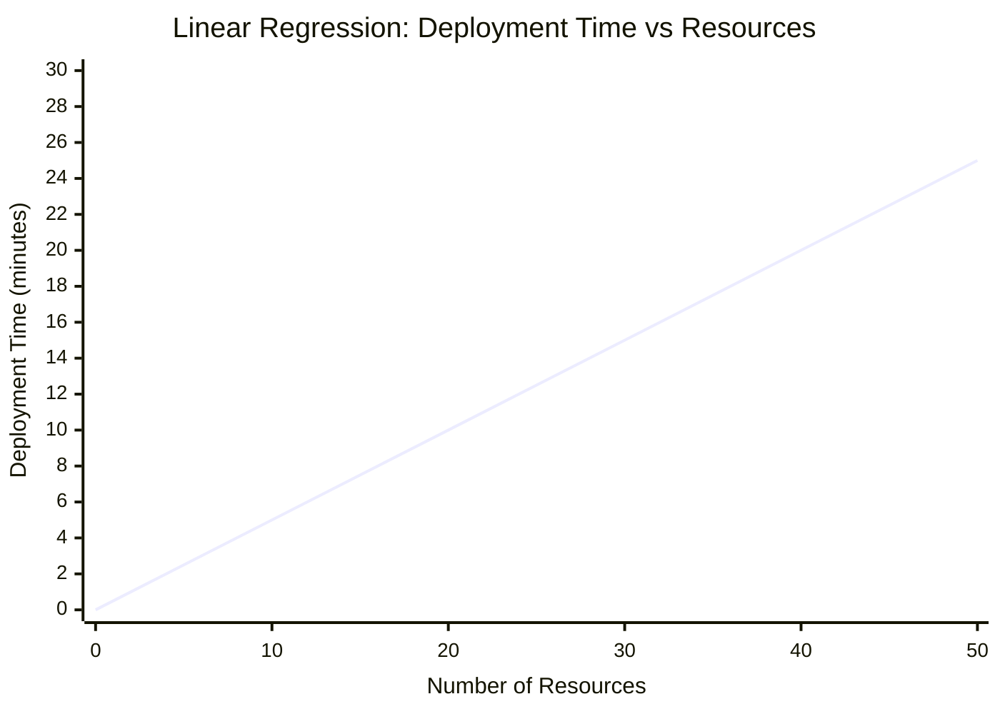
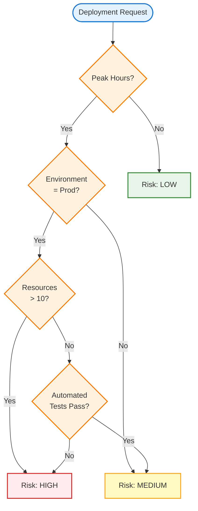
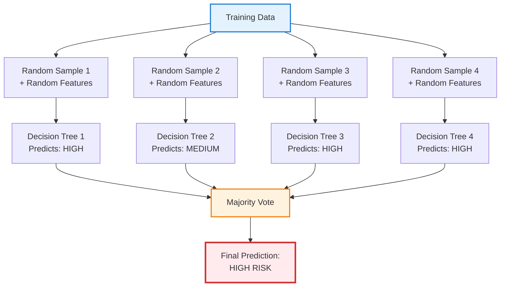
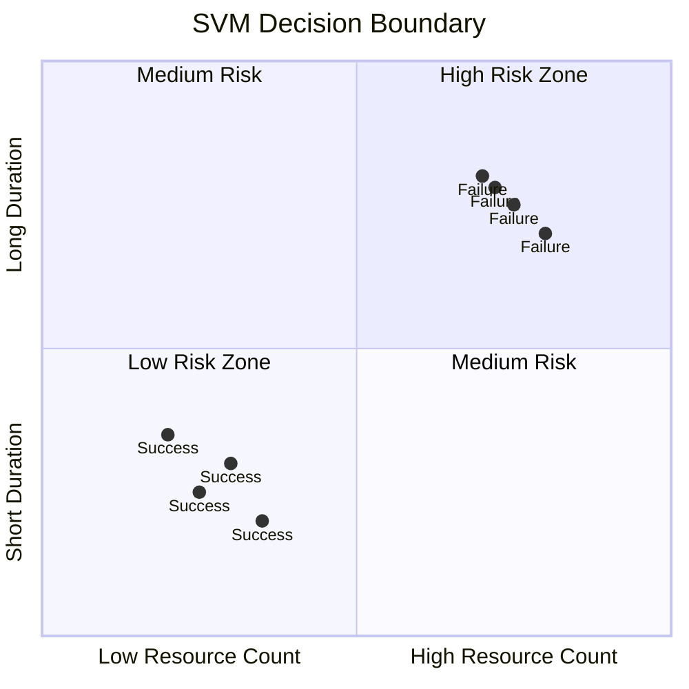
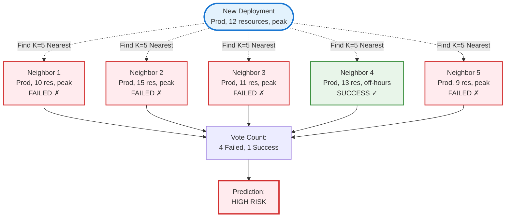
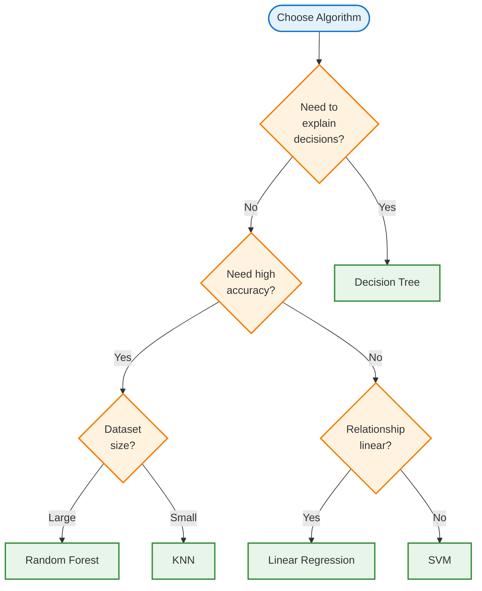

---
## Understanding the Tools in the Toolbox

Understanding the ML project workflow in Chapter 3.0 was one thing—actually choosing the right algorithm for a problem turned out to be another challenge entirely.

In automation, we learn to match tools to problems: Terraform for infrastructure state management, Ansible for configuration orchestration, Python for complex logic. The decision comes from understanding each tool's strengths and the problem's characteristics.

Machine learning follows the same principle. Linear Regression, Decision Trees, Random Forest, SVM, and KNN aren't just mathematical abstractions—they're **specialized tools, each designed to excel at specific types of pattern recognition**.

**The real skill** isn't memorizing equations. It's knowing:
- What each algorithm is fundamentally good at
- When to apply which approach
- What trade-offs you're accepting

This is my attempt to understand common ML algorithms **without getting lost in the math**.

---

## 1. The Mental Model That Helped Me

When I was learning automation tools, I learned to think:
- **Terraform:** Declarative, state-based, good for infrastructure
- **Ansible:** Procedural, agentless, good for configuration
- **Shell scripts:** Quick and dirty, good for simple tasks

**ML algorithms are similar:**
- **Linear Regression:** Simple, fast, assumes straight-line relationships
- **Decision Trees:** Easy to understand, works like if-then rules
- **Random Forest:** Multiple decision trees voting together
- **SVM:** Finds the best boundary between categories
- **KNN:** "You are like your neighbors" approach

**The key insight:** No single algorithm is "best." Each has strengths and weaknesses. The art is picking the right one for your problem.

---

## 2. Linear Regression: The Straight Line Approach

### How I Understood It

Linear regression is the simplest algorithm. It assumes a **straight-line relationship** between input and output.


> **Automation analogy:**
> Like predicting server CPU usage based on number of requests: 
> - more requests → higher CPU (straight-line relationship).
> - The algorithm finds the best-fit line through your data.
{: .prompt-info }

### Visual Representation



**What you see:** The algorithm finds the best-fit straight line through the data points. New predictions fall on this line.

### When It Works

```text
Example: Predicting deployment time
Input: Number of resources being deployed
Output: Expected deployment duration

Data points:
10 resources → 5 minutes
20 resources → 10 minutes
30 resources → 15 minutes

Linear regression finds: deployment_time = 0.5 × resources
```

### When It Fails

```text
Example: Predicting incident severity
Input: Number of failed services
Output: Severity (P1/P2/P3)

Problem: Severity doesn't increase linearly
- 1 failed service might be P3
- 2 failed services might still be P3
- 3 failed services might jump to P1

Linear regression would give weird answers like "P2.7"
```


> **Key Takeaways:**
> - Use linear regression for simple, numeric predictions with linear relationships.
> - Avoid for categories or complex, non-linear patterns.
> - Real-world use: cost estimation, capacity planning, simple forecasting.
{: .prompt-tip }

---

## 3. Decision Trees: The If-Then Flowchart

### How I Understood It

A decision tree is literally what it sounds like: **a tree of if-then decisions**.

This was the easiest algorithm for me to grasp because it works exactly like the logic I write in code:

```text
if deployment_time == "peak_hours":
    if environment == "production":
        if resource_count > 10:
            risk = "HIGH"
        else:
            risk = "MEDIUM"
    else:
        risk = "LOW"
else:
    risk = "LOW"
```


> **Automation analogy:** Like approval workflows — each decision point leads to another question until you reach a conclusion.
{: .prompt-info }

### How It Works




> **Strengths:**
> - Easy to understand (can draw it out)
> - Handles categories and numbers
> - Finds interactions (e.g., peak hours + production = high risk)
> - No assumptions about data shape
{: .prompt-tip }

> **Weaknesses:**
> - Can overfit (memorize training data)
> - Unstable (small data changes = different trees)
> - Greedy (makes decisions one node at a time)
{: .prompt-warning }

### When to Use

**Use decision trees when:**
- You need explainable decisions
- You have categorical data (like environment: dev/staging/prod)
- You want to see which features matter most

**Real-world use:** Deployment risk assessment, incident routing, approval workflows

---

## 4. Random Forest: The Wisdom of Crowds

### How I Understood It

If one decision tree can overfit or be unstable, what if we **create many trees and let them vote**?

That's Random Forest: Multiple decision trees, each trained on slightly different data, voting on the final answer.


> **Automation analogy:**
> Like having multiple engineers review a deployment: each has different experience, each makes a recommendation, final decision is by majority vote.
{: .prompt-info }

### How It Works



**Process breakdown:**

```text
1. Create Tree 1 (using random subset of data + random subset of features)
   → Prediction: HIGH RISK

2. Create Tree 2 (different random subset)
   → Prediction: MEDIUM RISK

3. Create Tree 3 (different random subset)
   → Prediction: HIGH RISK

4. Create Tree 4 (different random subset)
   → Prediction: HIGH RISK

Final Prediction: HIGH RISK (3 out of 4 trees voted for it)
```


> **Why It's Better Than Single Trees:**
> - More accurate (combines perspectives)
> - Less overfitting (mistakes get outvoted)
> - More stable (small data changes don't break everything)
> - Can show feature importance
{: .prompt-tip }

> **Trade-offs:**
> - Slower to train and predict
> - Less interpretable (hard to explain logic)
> - More complex to debug
{: .prompt-warning }

### When to Use

**Use Random Forest when:**
- You want high accuracy
- You can sacrifice some interpretability
- You have enough data (works well with medium-to-large datasets)

**Real-world use:** Production ML systems, when accuracy matters more than explainability

---

## 5. Support Vector Machine (SVM): Finding the Best Boundary

### How I Understood It

SVM tries to find the **best line (or boundary) that separates categories**.


> **Automation analogy:**
> Imagine plotting deployments on a graph: 
> - X-axis = resource count
> - Y-axis = deployment time
> - red dots = failed 
> - green dots = successful.
> 
>  SVM finds the line that separates red from green with the widest margin.
{: .prompt-info }

### Visual Representation



**What you see:** The algorithm finds a boundary (the diagonal line) that maximizes the distance (margin) between successful and failed deployments.


> **Key Idea:**
> - Good separation = wide margin between categories (confident predictions). 
> - Bad separation = narrow margin (less confident).
{: .prompt-info }


> **Strengths:**
> - Good with clear boundaries
> - Works in high dimensions
> - Memory efficient (stores only boundary points)
{: .prompt-tip }

> **Weaknesses:**
> - Slow with large datasets
> - Hard to interpret
> - Requires careful tuning
{: .prompt-warning }

### When to Use

**Use SVM when:**
- You have clear separation between categories
- You have many features but not too many data points
- You need good accuracy with smaller datasets

**Real-world use:** Text classification, image recognition (though deep learning is now more common)

---

## 6. K-Nearest Neighbors (KNN): You Are Your Neighbors

### How I Understood It

KNN is beautifully simple: **To predict something, look at the K nearest similar examples**.


> **Automation analogy:**
> Predicting deployment risk:
> - find the 5 most similar past deployments.
> - see how many.
> - succeeded vs failed. 
> - majority vote wins.
{: .prompt-info }

### Visual Representation



**Process breakdown:**

```text
New deployment:
- Environment: Production
- Resources: 12
- Time: Peak hours

Find 5 most similar past deployments:
1. Prod, 10 resources, peak → FAILED
2. Prod, 15 resources, peak → FAILED
3. Prod, 11 resources, peak → FAILED
4. Prod, 13 resources, off-hours → SUCCESS
5. Prod, 9 resources, peak → FAILED

Prediction: HIGH RISK (4 out of 5 failed)
```


> **Strengths:**
> - Simple (no training needed)
> - Flexible (classification and regression)
> - Adapts to new patterns
{: .prompt-tip }

> **Weaknesses:**
> - Slow at prediction time (must compare to all examples)
> - Sensitive to feature scale
> - Struggles with high-dimensional data
{: .prompt-warning }

### When to Use

**Use KNN when:**
- You have small-to-medium datasets
- You need simple, understandable predictions
- Similarity makes intuitive sense for your problem

**Real-world use:** Recommendation systems, anomaly detection

---

## 7. How to Choose? (Decision Framework)

Here's how I think about choosing algorithms now:




> **Quick reference table:**
{: .prompt-tip }

| Algorithm             | Best For                                         | Avoid When                                   |
| --------------------- | ------------------------------------------------ | -------------------------------------------- |
| **Linear Regression** | Simple numeric predictions, linear relationships | Predicting categories, complex patterns      |
| **Decision Trees**    | Explainability, mixed data types                 | Need high accuracy, prone to overfitting     |
| **Random Forest**     | High accuracy, production systems                | Need interpretability, real-time predictions |
| **SVM**               | Clear boundaries, high-dimensional data          | Very large datasets, need interpretability   |
| **KNN**               | Small datasets, similarity-based problems        | Large datasets, high-dimensional data        |

---

## 8. My Deployment Risk Example (Which Algorithm?)

For the deployment risk assessment problem I've been using:

**Problem:** Predict if a deployment will be high/medium/low risk

**Data:**
- Features: Environment, resource count, time, change type
- Label: Success/Failure (or Risk level)
- Size: ~10,000 historical deployments


> **My choice: Random Forest**
> - Handles mixed features (categorical + numeric)
> - Finds complex interactions (peak hours + production + many resources)
> - High accuracy (important for production use)
> - Can show feature importance (which factors matter most)
> - Less interpretable (but can use feature importance + SHAP for explanations)
{: .prompt-info }


> **Alternative: Decision Tree**
> - If I absolutely need explainability
> - If the model needs to be audited
> - Trade-off: Lower accuracy
{: .prompt-info }

> **Not Linear Regression**
> - Can't predict categories (high/medium/low risk)
> - Too simple for complex interactions
{: .prompt-warning }

---

## 9. What I Wish I Knew Earlier


> **Key Takeaways:**
> - Start simple: Try Linear Regression or Decision Trees first.
> - No "best" algorithm: It always depends on your data and problem.
> - Ensemble methods (Random Forest) often win.
> - Interpretability vs accuracy trade-off: Decision Trees = explainable, Random Forest = accurate.
> - Try multiple algorithms and compare.
> - Feature engineering matters more than algorithm choice.
{: .prompt-tip }

---


## What's Next?

➡ **Series 2 – Chapter 3.2: Overfitting & Underfitting**

In the next chapter, we’ll explore:

- Overfitting and underfitting (why models fail in production)
- The bias-variance trade-off
- How to detect and fix these issues
- Validation strategies for reliable ML

> **Architectural Question:** What steps can you take to ensure your chosen algorithm works reliably in production, and what are the most common pitfalls to avoid?
{: .prompt-info }

_We've learned which algorithms to use—next, we'll learn how to make sure they work reliably._

---
