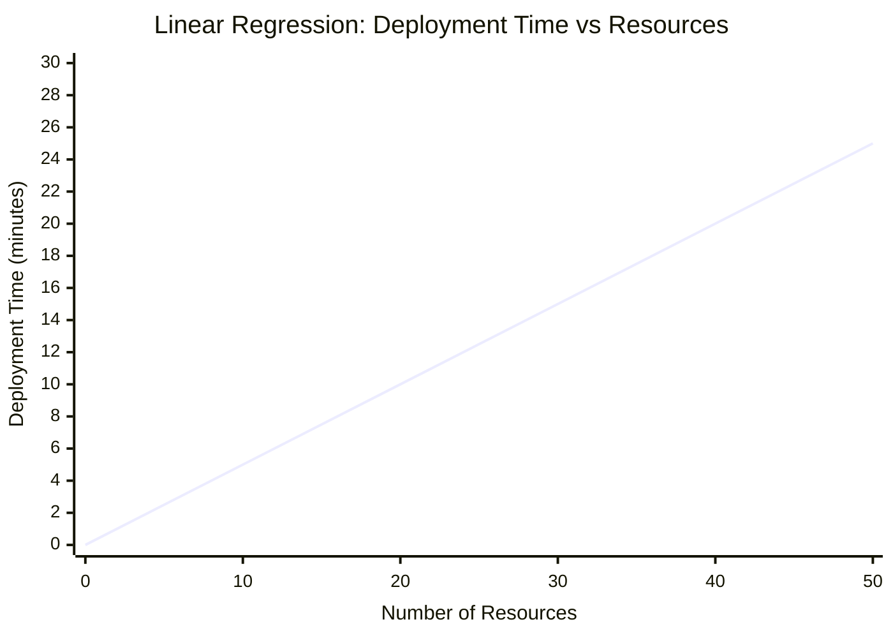
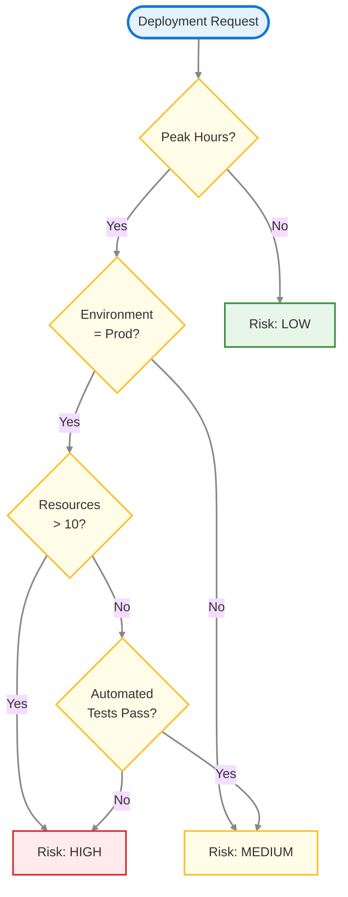
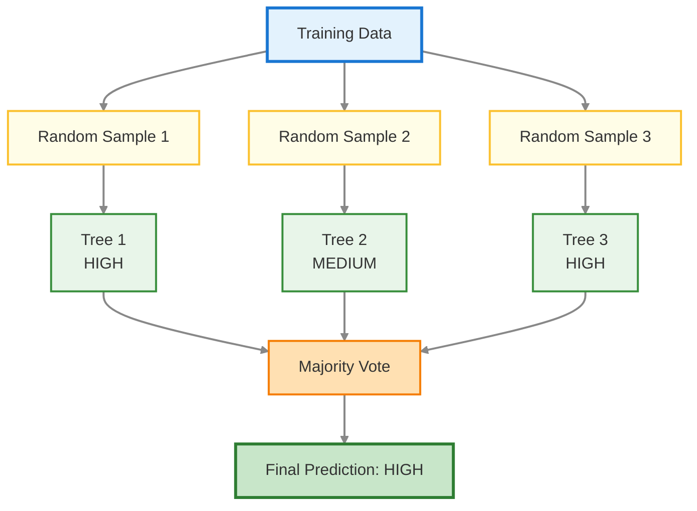
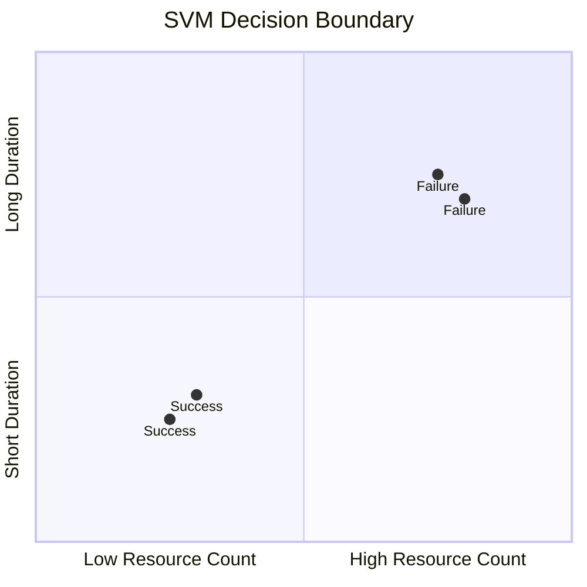
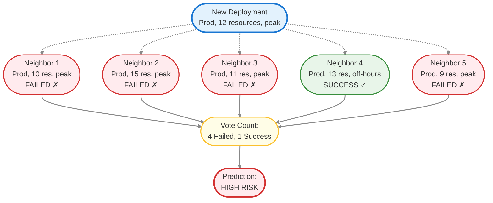
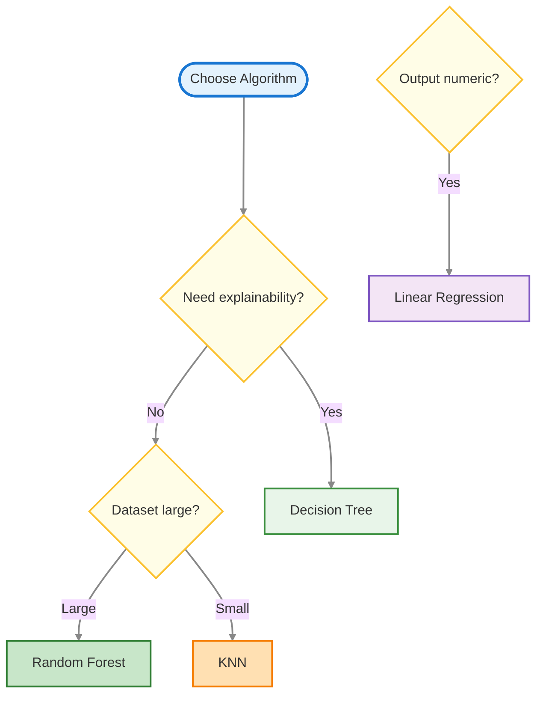

---
# Understanding the Tools in the Toolbox

---

## How I Started Thinking About Algorithms

When I was learning automation, I didn’t ask:
“Which tool is most advanced?”

I asked:
“What tool fits this problem best?”

> - Terraform → Infra state
> - Ansible → Config orchestration
> - Bash → Quick glue work

ML algorithms turned out to be the same. Each one is good at certain shapes of problems — and bad at others.

> **Key insight:** There is no “best” algorithm. There’s only *best fit for this situation*.
{: .prompt-tip }

That mindset saved me a lot of wasted time.

---

## 1. Linear Regression — The Straight-Line Estimator

### When I’d Reach for It

When I need to predict a **number** and the relationship feels roughly linear.

Example:

- “How long will this deployment take?”
- “What will this infrastructure cost?”

---

### Mental Model

Linear regression draws the best straight line through your data and uses it to predict future values.

> **Automation analogy:**
> Estimating deployment time from number of resources — more resources → more time, roughly in a straight line.
{: .prompt-info }

---



### Where It Works Well

- Capacity planning
- Cost estimation
- Simple forecasting
- Any situation where changes are smooth and proportional

**Example**
>- Predicting deployment time
    - Input: Number of resources being deployed
    - Output: Expected deployment duration
    - Data points:
        - 10 resources → 5 minutes
        - 20 resources → 10 minutes
        - 30 resources → 15 minutes

**Takeaway equation:**
deployment_time = 0.5 × resources

**Where It Breaks**
- Categories (high/medium/low risk)
- Sudden jumps or thresholds
- Complex interactions

**Example failure:**
> - Predicting incident severity
    - Input: Number of failed services
    - Output: Severity (P1/P2/P3)
    - Problem: Severity doesn't increase linearly
        - 1 failed service → P3
        - 2 failed services → P3
        - 3 failed services → P1 (sudden jump)
    - Linear regression would give weird answers like "P2.7"

> **Warning:**
> Linear regression doesn’t understand categories or sharp transitions.
{: .prompt-warning }

> **Key Takeaway**
> 
> *Use linear regression when:*
> - Output is numeric
> - Relationship is roughly straight-line
> - You want something fast, simple, and explainable
> 
>*Avoid it when:*
> - You’re predicting labels or risk levels
> - The world behaves in steps, not slopes
>
> *Real-world use*: Cost estimation, sales forecasting, capacity planning
{: .prompt-info }

---

## 2. Decision Trees — The If/Then Flowchart

### When I’d Reach for It
When I want explainable decisions and my problem feels like rules:
- “If this… then that…”

### Mental Model
A decision tree is literally a flowchart: Each node asks a question, each branch narrows the path, until you reach a decision.

```python
if peak_hours:
    if environment == 'prod':
        if resources > 10:
            risk = 'HIGH'
        else:
            risk = 'MEDIUM'
    else:
        risk = 'LOW'
else:
    risk = 'LOW'
```

> **Automation analogy:**
> Approval workflows — each decision gate leads to another question.
{: .prompt-info }

### Visual Example


**Where It Works Well**
- Mixed data (numbers + categories)
- Explainable decisions
- Finding interactions (prod + peak hours + big deploy = high risk)

**Where It Breaks**
- Overfits easily (memorizes training data)
- Small data changes can produce totally different trees

> **Warning:**
> Deep trees look accurate in training but fail badly in production.
{: .prompt-warning }

> **Key Takeaway**
> 
> *Use Decision Trees when:*
> - You need explainability
> - Logic naturally feels rule-based
> - You want something visual and debuggable
> 
>*Avoid them when:*
> - Accuracy matters more than interpretability
> - Data is noisy and complex
>
> *Real-world use*: Credit approval, troubleshooting guides, medical diagnosis
{: .prompt-info }

---

## 3. Random Forest — The Wisdom of Crowds

### When I’d Reach for It
When I want strong accuracy on messy real-world data and can sacrifice some explainability.

### Mental Model
If one decision tree can overfit or be unstable, what if we create many trees and let them vote?

Random Forest trains many decision trees on different slices of the data and lets them vote.

> **Automation analogy:**
> Multiple engineers reviewing a deployment — final decision by majority.
{: .prompt-info }

### Visual Example



**Where It Works Well**
- Complex interactions
- Noisy, messy real-world data
- Mixed numeric + categorical features
- Most production ML problems

**Where It Breaks**
- Hard to explain individual decisions
- Slower than single models
- Harder to debug

> **Warning:**
> Don’t use Random Forest when transparency or real-time latency is critical.
{: .prompt-warning }

> **Key Takeaway**
> 
> *Use Random Forest when:*
> - You want accuracy
> - Data is messy
> - You don’t need strict explainability
> 
>*Avoid it when:*
> - You must justify every decision
> - Latency or simplicity is critical
>
> *Real-world use*: Fraud detection, customer churn prediction, risk assessment
{: .prompt-info }

---

## 4. Support Vector Machines (SVM) — Drawing the Best Boundary

### When I’d Reach for It
When categories are cleanly separable and the dataset isn’t massive.

### Mental Model
SVM finds the best possible boundary that separates categories with the widest margin.

> **Automation analogy:**
> Drawing the strictest access-control rule that separates “allowed” from “blocked” with the biggest safety buffer.
{: .prompt-info }

### Visual Example



**Where It Works Well**
- Clear boundaries
- Small-to-medium datasets
- High-dimensional feature spaces

**Where It Breaks**
- Very large datasets (slow)
- Overlapping categories
- Hard to interpret

> **Warning:**
> If your data clusters overlap heavily, SVM struggles.
{: .prompt-warning }

> **Key Takeaway**
> 
> *Use SVM when:*
> - Classes are cleanly separable
> - Dataset isn’t huge
> - You want strong performance on structured data
> 
>*Avoid it when:*
> - Data is noisy or overlapping
> - Explainability matters
>
> *Real-world use*: Text classification, image recognition (though deep learning is now more common)
{: .prompt-info }

---

## 5. K-Nearest Neighbors (KNN) — You Are Your Neighbors

### When I’d Reach for It
When datasets are small, and similarity naturally makes sense.

### Mental Model
To predict something, KNN finds the K most similar past examples and lets them vote.

> **Automation analogy:**
> Predicting deployment risk by looking at the 5 most similar past deployments and copying their outcome.
{: .prompt-info }

### Visual Example



**Where It Works Well**
- Very small datasets
- Simple similarity-based problems
- Quick prototyping

**Where It Breaks**
- Large datasets (slow predictions)
- High-dimensional data
- Features on different scales

> **Warning:**
> KNN falls apart fast as data grows.
{: .prompt-warning }

> **Key Takeaway**
> 
> *Use KNN when:*
> - Your dataset is small
> - Similarity between examples is meaningful
> - You want a simple, intuitive approach
> 
>*Avoid it when:*
> - The dataset is large (slow predictions)
> - There are many features (high-dimensional data)
> - Features are on very different scales
>
> *Real-world use*: Recommender systems, anomaly detection, handwriting recognition
{: .prompt-info }

---

## 6. How I Actually Choose Algorithms (In Practice)

Instead of memorizing algorithms, I ask:
- Do I need to explain decisions?
- Is the output numeric or categorical?
- Is the dataset small or large?
- Is accuracy or interpretability more important?

### Decision Flow


### Quick Decision Table

| Algorithm         | Use When                              | Avoid When                     |
| ----------------- | ------------------------------------- | ------------------------------ |
| Linear Regression | Numeric prediction, linear trends     | Categories, complex patterns   |
| Decision Tree     | Explainable rule-based logic          | High accuracy required         |
| Random Forest     | Accuracy on messy real-world data     | Need transparency or speed     |
| SVM               | Clear category separation, small data | Large or overlapping datasets  |
| KNN               | Tiny datasets, similarity-based probs | Large or high-dimensional data |

---

## 7. My Deployment Risk Example — What I’d Actually Use

**Problem:** Predict deployment risk (High / Medium / Low)

**Data:** ~10,000 deployments

**Features:** Env, size, time, change type

**My choice: Random Forest**
- Handles mixed data
- Learns complex interactions
- Strong accuracy in messy production data
- Feature importance gives partial explainability
{: .prompt-info }

**Backup choice: Decision Tree**
- If auditability is mandatory
- Trade-off: Lower accuracy
{: .prompt-info }

**Not Linear Regression**
- Can’t predict categories
- Too simple for interactions
{: .prompt-warning }

---

## 8. What I Wish I Knew Earlier

> **Practitioner’s Lessons:**
> - Chasing the “best” algorithm wasted time; matching the tool to the problem made all the difference.
> - Most real progress came from improving data quality and features, not switching models.
> - Simple models (like Decision Trees or Linear Regression) solved more problems than expected—don’t overlook them.
> - Ensemble methods (like Random Forest) often win in production, but can be harder to explain.
> - It’s better to deeply understand a few algorithms than to superficially know many.
> - Always start simple, validate, and only add complexity when needed.
{: .prompt-info }

---

## What's Next?

➡ **Chapter 3.2 – Overfitting & Underfitting**

**Next we’ll cover:**
- Why models fail in production
- Bias vs variance
- How to detect and fix overfitting
- Validation strategies that actually work

>**Architectural Question**: What steps can you take to ensure your chosen algorithm works reliably in production, and what are the most common pitfalls to avoid?
{: .prompt-info }

_We now know which tools to pick — next we’ll learn how to make sure they don’t lie to us._