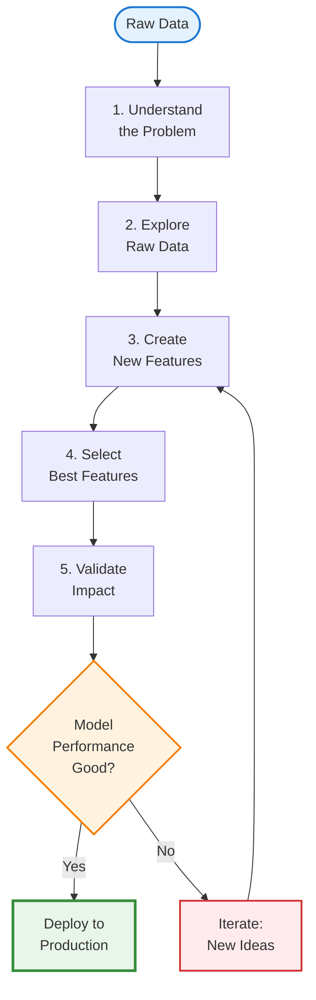
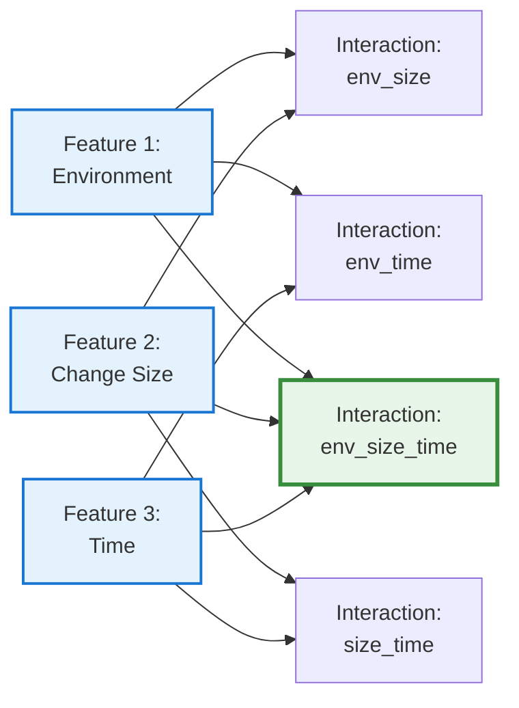
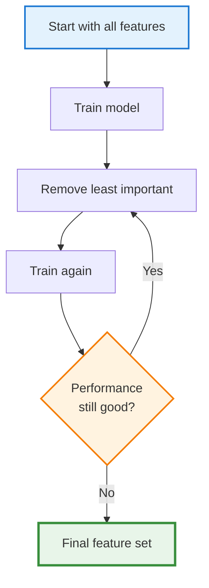

---
## The Hidden Truth About Machine Learning

---

> **Key Insight:** 80% of the work in machine learning isn't choosing algorithms or tuning hyperparameters—it's preparing and transforming data into useful features.
{: .prompt-tip }

In automation, we know this intuitively:
- Writing a good Terraform module isn't just about `resource` blocks
- It's about input validation, variable transformation, conditional logic, and computed values
- The infrastructure code is 20%; the variable design and data flow is 80%


> **Feature engineering is the ML equivalent:** transforming raw data into inputs that help the model learn patterns effectively.
{: .prompt-info }

We touched on this in Chapter 2.1, but now we'll dive deeper into the **specific techniques** that make or break real ML projects.

---

## Why Feature Engineering Matters More Than Algorithms

I tested this with our deployment risk model:

**Experiment 1: Simple features + Random Forest**
- Features: `files_changed`, `hour`, `day_of_week`
- Accuracy: 72%

**Experiment 2: Engineered features + Decision Tree**
- Features: `is_large_change`, `is_business_hours`, `recent_failure_rate`, `team_reliability_score`
- Accuracy: 86%


> **The takeaway:** Better features with a simpler algorithm beat weak features with a complex algorithm.
{: .prompt-tip }


> **Automation analogy:**
> - Good input validation + simple bash script > No validation + complex Python
> - Well-structured Terraform variables + standard modules > Messy variables + custom code
{: .prompt-info }

---

## The Feature Engineering Workflow




> **This looks like:**
> - Terraform development: Plan → Apply → Validate → Refactor
> - CI/CD pipeline tuning: Build → Test → Analyze → Optimize
{: .prompt-info }

---

## Technique 1: Encoding Categorical Variables

### The Problem

ML algorithms work with numbers, not categories. But much of our data is categorical:
- Environment: `dev`, `staging`, `prod`
- Team: `Platform`, `API`, `Frontend`
- Deployment type: `hotfix`, `feature`, `rollback`

### Solution: One-Hot Encoding

**Automation analogy:** Converting string variables into boolean flags.

```python
# Terraform-style thinking
variable "environment" {
  type = string
  validation {
    condition = contains(["dev", "staging", "prod"], var.environment)
  }
}

locals {
  is_dev     = var.environment == "dev"
  is_staging = var.environment == "staging"
  is_prod    = var.environment == "prod"
}
```

**ML implementation:**

| Original | →   | is_dev | is_staging | is_prod |
| -------- | --- | ------ | ---------- | ------- |
| dev      | →   | 1      | 0          | 0       |
| staging  | →   | 0      | 1          | 0       |
| prod     | →   | 0      | 0          | 1       |

### When to Use

- **Use one-hot encoding when:**
  - Categories have no inherent order (dev isn't "less than" prod)
  - You have fewer than 10-15 categories
  
- **Alternatives for many categories:**
  - **Target encoding:** Replace category with average outcome
  - **Embedding:** Let the model learn category representations (deep learning)

### Example: Deployment Risk

```text
Raw feature:
- deployment_type: "hotfix"

One-hot encoded:
- is_hotfix: 1
- is_feature: 0
- is_rollback: 0


> **Why this helps:** The model learns: hotfix → higher risk. Without encoding, "hotfix" is just a string (meaningless to the algorithm).
{: .prompt-tip }
```

---

## Technique 2: Feature Scaling and Normalization

### The Problem

Features with different scales can dominate the model:

| Deployment | files_changed | duration_minutes | team_size |
| ---------- | ------------- | ---------------- | --------- |
| 1          | 500           | 15               | 8         |
| 2          | 50            | 120              | 12        |


> **Issue:** `files_changed` (0-1000) dominates `team_size` (5-20)
{: .prompt-warning }

### Solution: Normalize to Similar Scales


> **Automation analogy:** Converting resource counts to percentages of capacity.
{: .prompt-info }

```python
# Like monitoring thresholds
cpu_usage_percent = (current_cpu / max_cpu) * 100
memory_usage_percent = (current_memory / max_memory) * 100

# Both now on 0-100 scale, comparable
```

### Common Scaling Methods

#### 1. Min-Max Scaling (0 to 1)

```text
scaled_value = (value - min) / (max - min)

Example:
files_changed: 500 → (500 - 0) / (1000 - 0) = 0.5
duration: 120 → (120 - 5) / (300 - 5) = 0.39
```

#### 2. Standardization (Z-score)

```text
scaled_value = (value - mean) / standard_deviation

Example:
files_changed: 500 → (500 - 200) / 150 = 2.0
(500 is 2 standard deviations above mean)
```

### When to Use

- **Min-Max:** When you need values in a specific range (0-1, 0-100)
- **Standardization:** When you want to preserve outlier information
- **No scaling:** For tree-based models (Decision Trees, Random Forest) - they don't care about scale

---

## Technique 3: Binning and Discretization

### The Problem

Sometimes continuous numbers are too granular. Grouping them into ranges can reveal patterns.

### Solution: Create Bins (Buckets)

**Automation analogy:** Like alert severity levels.

```python
# Monitoring thresholds
if cpu < 70:
    severity = "normal"
elif cpu < 85:
    severity = "warning"
else:
    severity = "critical"
```

**ML application:**

| files_changed | →   | change_size_category |
| ------------- | --- | -------------------- |
| 5             | →   | small                |
| 50            | →   | medium               |
| 500           | →   | large                |

### Binning Strategies

#### 1. Equal-Width Bins

```text
Small: 0-100 files
Medium: 101-500 files
Large: 501+ files
```

#### 2. Equal-Frequency Bins (Quantiles)

```text
Small: Bottom 33% of values
Medium: Middle 33%
Large: Top 33%
```

#### 3. Domain-Driven Bins

```text
Based on your expertise:
Small: 0-50 (safe deployments)
Medium: 51-200 (review required)
Large: 201+ (high risk)
```

### When to Use

- **Use binning when:**
  - You have domain knowledge about meaningful thresholds
  - The relationship is step-wise, not smooth
  - You want interpretable categories

- **Example:** Deployment hour → `is_business_hours` is more useful than raw hour (14 vs 2)

---

## Technique 4: Creating Interaction Features

### The Problem

Sometimes the combination of features matters more than individual features.

### The Insight

**In automation, we know this:**

```hcl
# Terraform: Risk isn't just one variable
locals {
  high_risk = (
    var.environment == "prod" &&
    var.change_size == "large" &&
    var.time_window == "business_hours"
  )
}
```

**ML equivalent:** Create features that capture these interactions.

### Example: Deployment Risk

**Individual features:**
- `is_prod`: 1
- `is_large_change`: 1
- `is_business_hours`: 1

**Interaction feature:**
- `prod_AND_large_AND_business_hours`: 1


> **Why this helps:** The model learns "this specific combination is risky" more easily.
{: .prompt-tip }

### Common Interactions



### When to Use

- **Use interaction features when:**
  - Domain knowledge suggests combinations matter
  - Individual features alone don't predict well
  - You have tree-based models (they can learn interactions, but explicit features help)

- **Avoid when:**
  - You have too many features (combinatorial explosion)
  - Using neural networks (they learn interactions automatically)

---

## Technique 5: Time-Based Features

### The Problem

Timestamps are hard for models to use directly: `2026-01-07 14:32:15` is just a number.

### Solution: Extract Meaningful Time Components


> **Automation analogy:** Parsing timestamps for scheduling logic.
{: .prompt-info }

```python
# Like cron expressions or monitoring windows
from datetime import datetime

dt = datetime.now()
is_weekend = dt.weekday() >= 5
is_business_hours = 9 <= dt.hour < 17
is_end_of_month = dt.day > 25
```

### Useful Time Features

From timestamp `2026-01-07 14:32:15`:

| Extracted Feature   | Value       | Why It Matters                       |
| ------------------- | ----------- | ------------------------------------ |
| `hour`              | 14          | Deployment time affects risk         |
| `day_of_week`       | 2 (Tuesday) | Weekday patterns                     |
| `is_weekend`        | 0           | Weekend deployments riskier          |
| `is_business_hours` | 1           | Business hours = more users affected |
| `week_of_month`     | 1           | End of month rush?                   |
| `is_end_of_sprint`  | 1           | Sprint deadlines = rushed deploys    |

### Advanced: Lag and Rolling Features


> **Automation analogy:** Like monitoring trends, not just current values.
{: .prompt-info }

```text
Current deployment:
- current_cpu: 75%

Historical features:
- avg_cpu_last_7_days: 65%
- max_cpu_last_24h: 85%
- cpu_trend: increasing

These show context, not just snapshot
```

**ML application:**

| Feature                     | Description        | Example |
| --------------------------- | ------------------ | ------- |
| `deployments_last_7_days`   | Recent activity    | 12      |
| `failure_rate_last_30_days` | Historical success | 0.15    |
| `time_since_last_failure`   | Recency of issues  | 5 days  |
| `avg_duration_last_10`      | Typical duration   | 22 min  |

### When to Use

- **Use time features when:**
  - Temporal patterns exist (time of day, day of week)
  - Historical context matters
  - Trends indicate risk (increasing failures, accelerating changes)

---

## Technique 6: Aggregation and Summary Statistics

### The Problem

Raw lists or sequences are hard to use: `previous_deployments: [15, 22, 18, 30, 12]`

### Solution: Compute Summary Statistics


> **Automation analogy:** Like log aggregation for metrics.
{: .prompt-info }

```python
# Monitoring aggregation
response_times = [120, 135, 118, 450, 125]

metrics = {
    "avg": mean(response_times),      # 189.6
    "p95": percentile(response_times, 95),  # 450
    "max": max(response_times),       # 450
    "std_dev": std(response_times)    # High variance = inconsistent
}
```

**ML application:**

From `[15, 22, 18, 30, 12]` create:
- `deployment_avg_duration`: 19.4
- `deployment_max_duration`: 30
- `deployment_std_dev`: 6.8
- `deployment_trend`: increasing/decreasing

### Common Aggregations

| Metric      | What It Captures                   |
| ----------- | ---------------------------------- |
| **Mean**    | Typical value                      |
| **Median**  | Central value (robust to outliers) |
| **Max/Min** | Extremes                           |
| **Std Dev** | Variability/consistency            |
| **Count**   | Frequency                          |
| **Sum**     | Total                              |

### When to Use

- **Use aggregations when:**
  - You have historical sequences
  - Patterns exist in trends (not just current value)
  - Variability matters (consistent vs erratic behavior)

---

## Feature Selection: Choosing What Matters

After creating features, you often have too many. **Feature selection** removes the noise.

### Why Feature Selection Matters

**Problems with too many features:**
- ❌ Overfitting (model memorizes noise)
- ❌ Slower training
- ❌ Harder to interpret
- ❌ More storage and computation


> **Automation analogy:**
> - Too many Terraform variables = harder to use modules
> - Too many monitoring metrics = alert fatigue
> - Keep what adds value, remove the rest
{: .prompt-info }

### Method 1: Correlation Analysis

**Remove redundant features:**

```text
features_changed: 150
lines_changed: 3000

Correlation: 0.95 (highly correlated)
→ Keep one, drop the other
```

### Method 2: Feature Importance (Tree-Based)

**Let the model tell you what matters:**

```text
Random Forest feature importance:
1. recent_failure_rate: 0.35
2. is_prod: 0.25
3. change_size_category: 0.20
4. is_business_hours: 0.12
5. team_size: 0.08

→ Drop team_size (low importance)
```

### Method 3: Recursive Feature Elimination

**Iteratively remove least important features:**



### Method 4: Domain Knowledge

**Use your expertise:**

```text
Created features:
- deployment_size
- files_changed
- lines_added
- lines_deleted
- commit_message_length ← Probably useless
- author_name_length ← Definitely useless

→ Drop the obviously irrelevant ones
```

---

## Practical Example: Deployment Risk (End-to-End)

### Step 1: Start with Raw Data

```text
deployment_id: 12345
timestamp: 2026-01-07 14:30:00
environment: prod
files_changed: 150
team: Platform
previous_deployments: [Success, Success, Failed, Success]
```

### Step 2: Engineer Features

```python
# Categorical encoding
is_prod = 1
is_staging = 0
is_dev = 0

# Binning
change_size = "large"  # (>100 files)

# Time features
hour = 14
is_business_hours = 1
day_of_week = 2
is_weekend = 0

# Historical aggregation
recent_failure_rate = 0.25  # (1/4 recent failures)
deployments_last_7_days = 8

# Interaction
prod_AND_large = 1  # (is_prod AND change_size=="large")
```

### Step 3: Select Features

```text
Feature importance ranking:
1. recent_failure_rate: 0.35
2. prod_AND_large: 0.28
3. is_business_hours: 0.18
4. deployments_last_7_days: 0.12
5. day_of_week: 0.07 ← Drop (low importance)

Final features: Top 4
```

### Step 4: Result

**Before feature engineering:**
- Raw features: timestamp, environment, files_changed
- Accuracy: 72%

**After feature engineering:**
- Engineered features: recent_failure_rate, prod_AND_large, is_business_hours, deployments_last_7_days
- Accuracy: 88%

---

## Feature Engineering Best Practices

### 1. Start Simple, Iterate

- ✅ Begin with obvious features
- ✅ Add complexity based on results
- ❌ Don't create 100 features on day one


> **Automation analogy:** Start with basic Terraform, refine based on needs.
{: .prompt-info }

---

### 2. Use Domain Knowledge


> **Your automation expertise is your superpower:**
{: .prompt-tip }

- You know peak hours matter → Create `is_business_hours`
- You know team reliability varies → Create `team_success_rate`
- You know change size indicates risk → Create `change_size_category`


> **This beats blindly trying transformations.**
{: .prompt-tip }

---

### 3. Validate Feature Impact


> **Test each feature:**
{: .prompt-tip }

```text
Baseline (no feature): 75% accuracy

Add recent_failure_rate: 82% accuracy ✅ Keep it
Add commit_message_length: 75% accuracy ❌ Drop it
Add prod_AND_large: 85% accuracy ✅ Keep it
```

---

### 4. Avoid Data Leakage

**Data leakage = Using information that won't be available at prediction time**

**Bad example:**

```python
# Feature: deployment_duration
# Label: deployment_success

Problem: You don't know duration until AFTER deployment completes
→ Can't use this feature to predict success before deploying
```


> **Automation analogy:** Can't use the result to predict the result.
{: .prompt-warning }

---

### 5. Document Your Features


> **Future you (and your team) will thank you:**
{: .prompt-tip }

```yaml
features:
  recent_failure_rate:
    description: "Ratio of failed deployments in last 30 days"
    calculation: "failures / total_deployments (last 30 days)"
    range: "0.0 to 1.0"
    
  prod_AND_large:
    description: "High risk indicator: production + large change"
    calculation: "is_prod AND change_size=='large'"
    values: "0 or 1"
```

---

## My Feature Engineering Checklist

Before building a model, I now ask:

1. **What domain knowledge can I encode?**
   - Time patterns, business rules, known thresholds

2. **Are categorical variables encoded?**
   - One-hot encoding, target encoding, or embeddings

3. **Are scales normalized?**
   - If using distance-based algorithms (KNN, SVM)

4. **Have I created interaction features?**
   - Combinations that matter based on expertise

5. **Have I extracted time components?**
   - Hour, day, business hours, trends

6. **Have I aggregated historical data?**
   - Means, trends, failure rates

7. **Have I tested feature importance?**
   - Drop low-value features

8. **Am I avoiding data leakage?**
   - Only use information available at prediction time

---

## Key Takeaways


> **Key Takeaways:**
> - Feature engineering is 80% of ML work: Good features + simple algorithm > Bad features + complex algorithm
> - Your domain expertise is your biggest advantage
> - **Common techniques:**
>   - One-hot encoding: Convert categories to numbers
>   - Scaling: Normalize feature ranges
>   - Binning: Group continuous values into categories
>   - Interactions: Combine features that matter together
>   - Time features: Extract meaningful time components
>   - Aggregations: Summarize historical patterns
> - Feature selection matters: Remove redundant features, use feature importance rankings, keep what adds value, drop the rest
> - Think like an automation engineer: Feature engineering = data transformation pipelines (like Terraform locals, Ansible filters, data preprocessing). Apply the same rigor you apply to infrastructure code.
{: .prompt-tip }

---


## What's Next?

➡ **Series 4 – Deep Learning**

In the next series, we’ll explore:

- Why deep learning exists
- How neural networks work (without the math)
- When to use deep learning vs traditional ML
- The connection to LLMs and generative AI

> **Architectural Question:** How does deep learning change the role of feature engineering, and when should you trust a neural network to learn features for you?
{: .prompt-info }

_The key insight: Deep learning automates feature engineering—the network learns features from raw data instead of you manually creating them._

---
