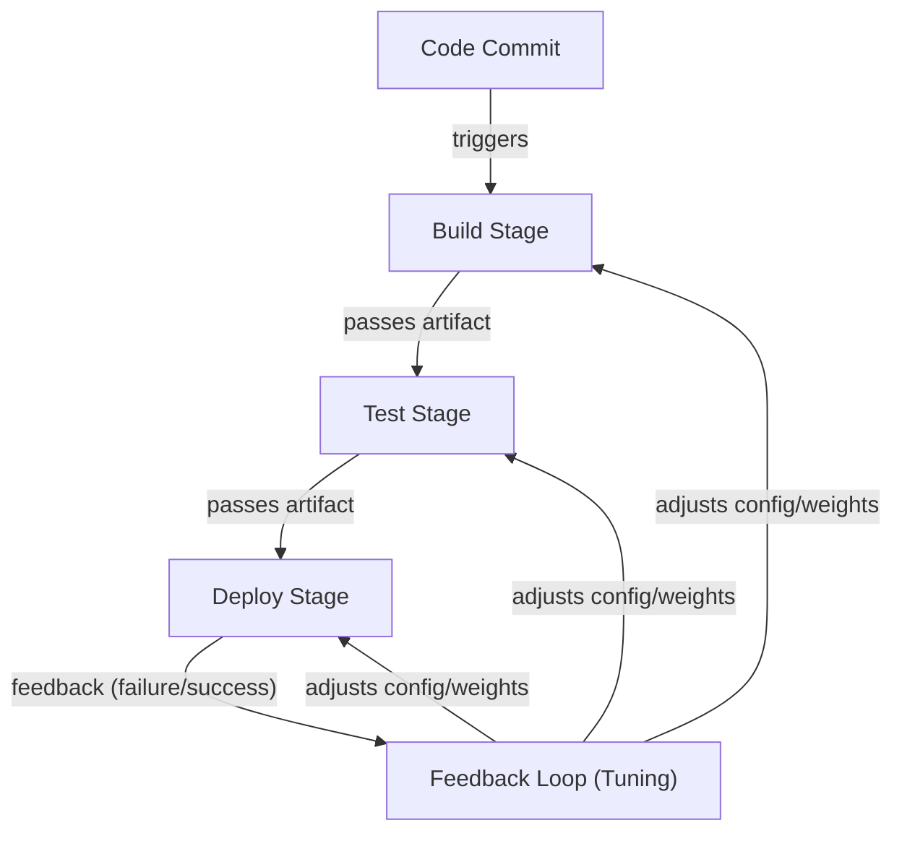
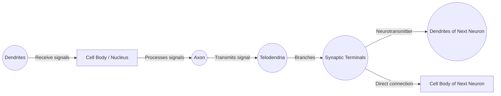
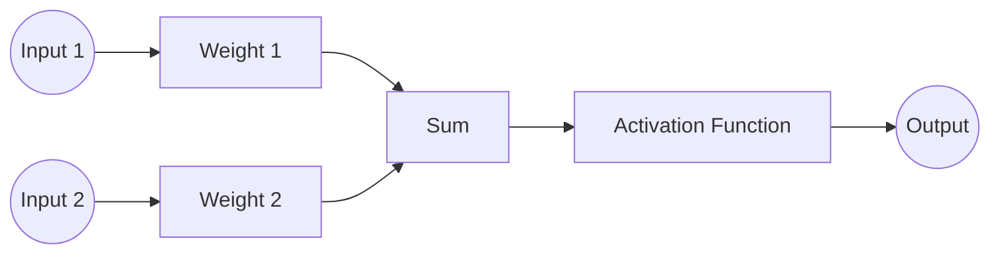
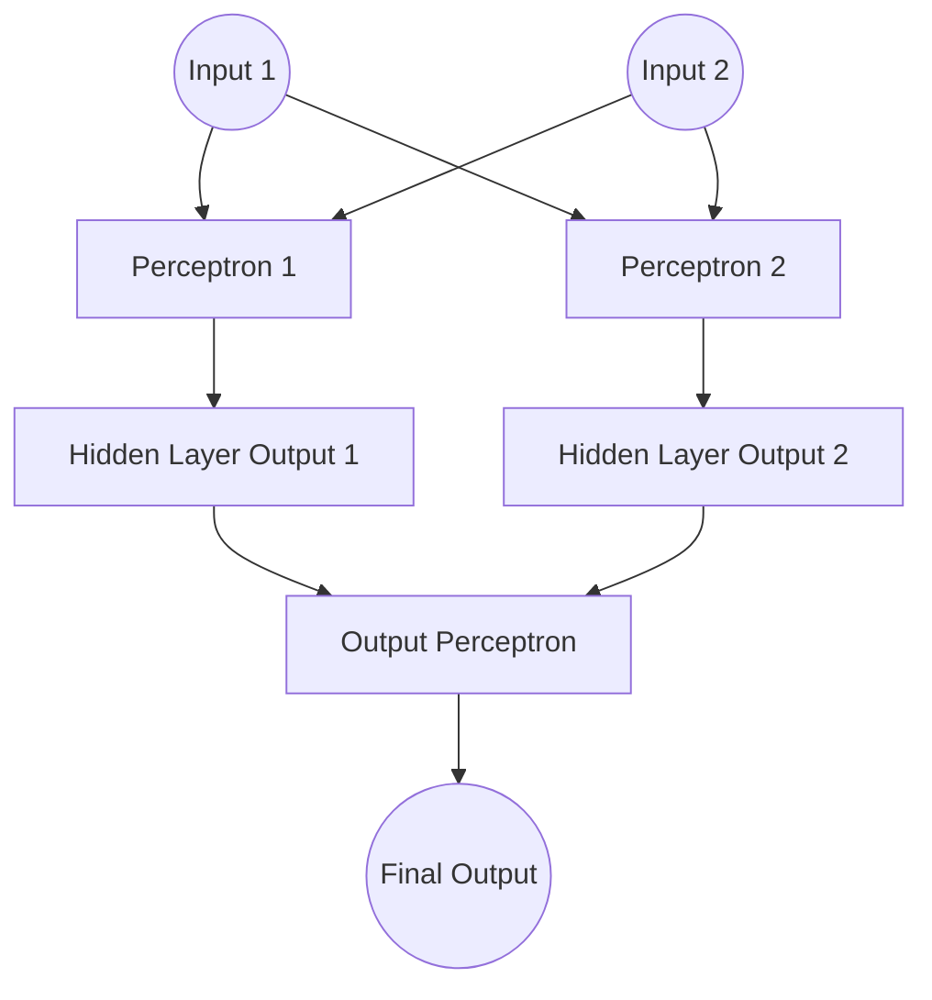
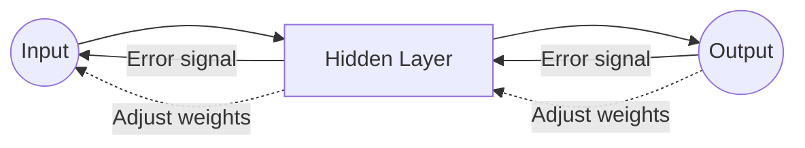
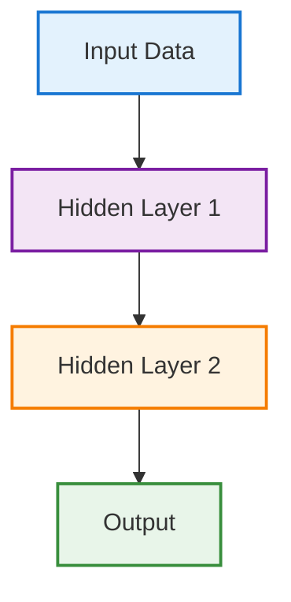
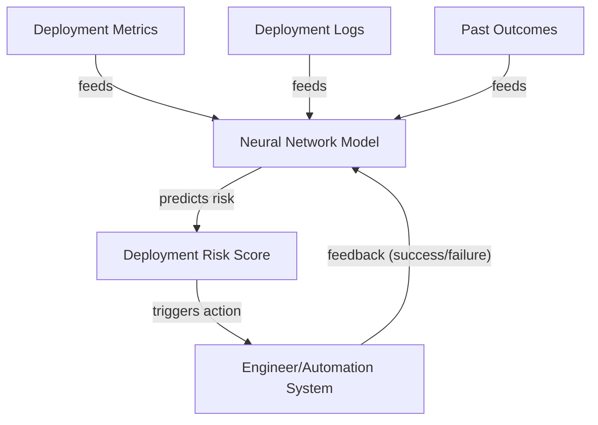

---

# Neural Networks Explained Like Infrastructure

---
# TL;DR

> **TL;DR:**
> - Neural networks are inspired by biology and work like automated pipelines—each layer processes and passes information forward.
> - Simple units (neurons) combine to solve complex problems, just like steps in a CI/CD pipeline.
> - Perceptrons are the first learning neurons; stacking them creates powerful networks.
> - Backpropagation is the feedback loop that lets networks learn from mistakes.
> - These concepts map directly to automation and infrastructure, making neural networks intuitive for engineers.
{: .prompt-info }

This chapter builds on the motivation from 4.1 and dives into the mechanics of neural networks, using infrastructure and automation analogies to make the concepts clear for engineers.

> Throughout history, engineers have learned from nature — flight from birds, sonar from bats, and now deep learning from the human brain.
{: .prompt-info }

## Analogy: Neural Networks as Automated Pipelines

Think of a modern CI/CD pipeline in DevOps:

- Each stage((build, test, deploy)) processes input and passes results forward
- Failures trigger feedback loops
- The pipeline improves over time

Neural networks behave the same way:

| DevOps Pipeline     | Neural Network  |
| ------------------- | --------------- |
| Stage               | Layer           |
| Step                | Neuron          |
| Config              | Weight          |
| Gate                | Activation      |
| Postmortem feedback | Backpropagation |

> **DevOps Analogy:** Neural networks are self-improving deployment pipelines — each run makes the system better at catching risks and delivering outcomes.
{: .prompt-tip }

**Analogy visual flow:**

*Figure: Each stage points to the next, with feedback loops pointing back to earlier stages, just like backpropagation in neural networks.*

## Biological Neurons and Logical Computations

- **How I first learned about neurons:**
  - I pictured them as tiny messengers in the brain
  - Each has a cell body (nucleus), dendrites (receive), axon (send), **telodendria (branching ends of axon),** and synapses (connect)
  - What amazed me: when enough signals arrive, the neuron "fires"—and billions of these simple units, networked together, enable us to see, move, and solve problems
  - These networks are organized in layers, passing signals from one group to the next

**Biological Neuron (Detailed Structure):**

*Figure: Structure of a biological neuron showing dendrites, cell body (nucleus), axon, telodendria, and synaptic terminals connecting to the next neuron's dendrites or cell body.*

- **Connecting to engineering:**
   When I drew parallels to computers, I realized scientists created artificial neurons based on this idea
  - The first models were simple: several on/off inputs, one on/off output
  - By connecting these artificial neurons, you can build logic gates (AND, OR, NOT)
  - This was my "aha!" moment—seeing how simple building blocks could scale up to complex reasoning

> "Scientists weren’t copying intelligence — they were copying signal flow".
> Simple units. Simple rules. Massive scale
{: .prompt-info }
## Artificial Neuron and Logic Gates

Early artificial neurons behave like logic gates.

- **Identity Gate:**
  - Output is on if input A is on; off if A is off
  ```mermaid
  flowchart LR
      A((A)) --> N0[Artificial Neuron]
      N0 -- Output: 1 if A is 1 --> Out0((Output))
  ```
- **AND Gate:**
  - Output is on only if both A and B are on
  ```mermaid
  flowchart LR
      A((A)) --> N1[Artificial Neuron]
      B((B)) --> N1
      N1 -- Output: 1 only if both A and B are 1 --> Out1((Output))
  ```
- **OR Gate:**
  - Output is on if either A or B is on
  ```mermaid
  flowchart LR
      A((A)) --> N2[Artificial Neuron]
      B((B)) --> N2
      N2 -- Output: 1 if A or B is 1 --> Out2((Output))
  ```
- **NOT Gate:**
  - Output is on if A is off
  ```mermaid
  flowchart LR
      A((A)) --> N3[Artificial Neuron]
      N3 -- Output: 1 if A is 0 --> Out3((Output))
  ```

By combining these units, we move from simple decisions to complex reasoning — exactly how networks scale.

> - **Key insight:**
>  Both biological and artificial networks build intelligence from simple connected units. That bridge between nature and computation was my first real “aha” moment.
> {: .prompt-tip}

## Perceptrons: The First Learning Neurons

Logic gates compute — but they don’t learn.

That was my next question:

!!! How do systems adapt instead of just following fixed rules?

That’s where the perceptron comes in.

**What’s a perceptron?**
- The earliest practical learning neuron
- Takes multiple inputs
- Multiplies each by a weight
- Sums them
- Passes the result through an activation function

If the result crosses a threshold, the neuron fires.

> 🕰️ **Quick history check:**
> In the late 1950s, psychologist Frank Rosenblatt built the first perceptron after being inspired by Hebb’s neuroscience principle — *“cells that fire together, wire together.”* That simple biological insight became the foundation of how neural networks learn.
{: .prompt-info }

- **Why perceptrons matter:**
  - Unlike logic gates, a perceptron **learns from experience**
  - It adjusts which inputs matter more
  - It changes how strongly they influence decisions
  - This shift—from fixed rules to learned weights—was the first true step toward machine learning

> 💡 The perceptron didn’t just compute — it adapted.
{: .prompt-tip }
> **Engineer’s Insight:** The perceptron is like a self-tuning automation rule. Instead of hardcoding which signals matter, it learns from experience—just like a monitoring alert that gets smarter every time you tweak the thresholds.
{: .prompt-tip }

**Perceptron (Single Neuron Decision):**

*Figure: A perceptron combines weighted inputs, applies an activation function, and produces an output.*

- **But a single perceptron is limited:**
  - It can only learn simple patterns
  - The real power comes from stacking many perceptrons into layers
  - Each layer learns richer representations

**Stacking Perceptrons (Multi-layer Network):**
> Stacking perceptrons into layers is what gives neural networks their power—each layer learns more abstract features, enabling the network to solve complex problems that a single neuron never could.
{: .prompt-tip }

*Figure: Multiple perceptrons stacked in layers form a simple neural network. Each layer learns more complex features from the previous one.*

- **But stacking brings a new challenge:**
  - How does the network know which connections to adjust—and by how much—when it makes a mistake?

This is where backpropagation comes in.

## Backpropagation: How Neural Networks Actually Learn

- **What confused me at first:**
  - Once perceptrons are stacked, learning isn’t local to a single neuron
  - A mistake at the output might be caused by weights deep inside the network
  - How do we know which ones to fix?

- **Backpropagation to the rescue:**
  - Works backward from the error
  - Instead of guessing blindly, the network follows a feedback loop:
    1. Makes a prediction
    2. Compares it with the correct answer
    3. Measures the error
    4. Sends that error backward through the network
    5. Adjusts each weight slightly to reduce future mistakes

> Backpropagation applies calculus (the chain rule) to efficiently compute how much each connection contributed to the final error — allowing large networks to learn without brute-force guessing.
{: .prompt-info }
> **Engineer’s Insight:** Backpropagation is like a feedback loop in automation—after every run, the system traces back what went wrong and tunes each step. It’s the “blame assignment” in a failed deployment, but for neural networks.
{: .prompt-info }

- **Why this feels familiar as an engineer:**
  - It’s just like debugging systems: observe output → trace back the fault → adjust → retry
  - Backpropagation turns neural networks from static calculators into adaptive systems

> 💡 Backpropagation is what lets deep learning models learn from their mistakes and get better over time.
{: .prompt-tip }

**Backpropagation (Learning by Feedback):**

*Figure: Backpropagation sends error signals backward through the network, updating weights to improve learning.*

- **Key takeaway:**
  - Backpropagation is not just correction—it’s **directional learning**
  - Each adjustment nudges the network toward better representations, not random change
  - With enough data and repetition, that feedback loop produces intelligence
  - Once I understood this, deep learning stopped feeling mysterious and started feeling like engineering

---

## Core Building Blocks of Deep Learning

Once you understand perceptrons and backpropagation, deep learning becomes much less mysterious. At its core, every deep learning model is built from just a few simple components:

- **Neurons:** Small computational units that transform inputs into signals.
- **Layers:** Groups of neurons stacked together to learn progressively richer patterns.
- **Weights:** Adjustable connections that control how strongly signals flow.
- **Activations:** Functions that decide whether a neuron fires and how strongly.

Individually, these parts are simple. But when stacked into deep networks and trained with feedback, they can recognize faces, translate languages, and detect anomalies in complex systems.

**Diagram:**


---

## Why This Matters for Engineers

- In traditional automation, we encode rules.
- In machine learning, we encode patterns.
- In deep learning, we encode representations — letting systems discover signals humans can’t easily define.

This is especially powerful in operations environments, where data is:
- High-volume
- Noisy
- Unstructured
- Constantly changing

> **Automation Analogy:** In ops, you’re always hunting for patterns in chaos—like finding the root cause in a sea of logs. Deep learning is your ultimate log parser: it learns to spot the signal in the noise, even when you can’t write the rules yourself.
{: .prompt-tip }


## Running Example: Intelligent Change & Deployment Risk Assessment (DevOps)

Let’s ground this with a real-world DevOps scenario. Imagine you’re responsible for automated deployments. Each deployment can succeed or fail, and failures often have subtle, hard-to-predict causes—configuration drift, resource contention, or a new code path. Traditional automation uses rules ("fail if disk > 90%"). But what if you want the system to *learn* from past incidents and spot risky deployments before they happen?

This is where neural networks shine. By feeding the system historical deployment data (metrics, logs, outcomes), you train a model to recognize patterns that precede failures. The network learns to weigh different signals—just like a seasoned engineer who senses trouble from a combination of small warnings. Over time, the model adapts to new risks, just as your deployment process evolves.

**Running Example Diagram:**

*Figure: Data sources point to the model, which outputs a risk score. Feedback from outcomes points back to the model for learning and adaptation.*

## What I Wish I Knew Earlier

> Key Takeaway:
> - Neural networks are inspired by biology but engineered for computation.
> - Perceptrons and backpropagation are the core learning engines.
> - Layered abstraction and feedback loops make deep learning powerful.
> - Infrastructure and automation analogies help engineers grasp the mechanics.
{: .prompt-info }
---

## What's Next?

➡ **Series 4 – Chapter 4.3: Deep Learning Architectures (CNNs, RNNs) & Practical Examples**

In the next chapter, we’ll explore:

- Core deep learning architectures: CNNs, RNNs, and more
- How these architectures solve real-world problems
- Practical examples for automation and engineering
- Common pitfalls and how to avoid them

> **Architectural Question:** How do different deep learning architectures (like CNNs and RNNs) map to engineering problems, and what are the trade-offs in choosing one over another?
{: .prompt-info }

_With a solid grasp of neural network fundamentals, you’re ready to dive into the architectures that power today’s most advanced AI systems._

---
