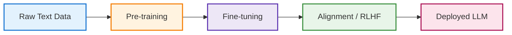
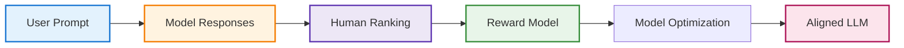

# How Large Language Models Are Trained (High Level)

When I first started using LLMs seriously, I didn’t care how they were trained.

They worked — mostly — and that was enough.

But after a while, patterns started showing up:
- Sometimes they were confident and wrong
- Sometimes they hedged when they didn’t need to
- Sometimes they refused reasonable requests
- Sometimes they hallucinated details that *sounded* real

At first, this felt random.

Later, I realized: this behavior isn’t random — it’s shaped directly by how these models are trained.

Not just *what* data they see, but *how* they’re optimized and *what they’re rewarded for*.

That’s what this chapter is about — not the math, not the academic theory — but the training pipeline that turns raw text into something that feels conversational.

> **Aha! Moment:**  
> The quirks and surprises in LLM behavior aren’t random—they’re a direct result of how these models are trained and rewarded.
{: .prompt-info }

---

## The Big Picture First

At a high level, training an LLM happens in three major stages:

1. **Pre-training** – Learn language patterns from massive text corpora  
2. **Fine-tuning** – Adapt behavior for specific tasks or domains  
3. **Alignment (RLHF)** – Teach the model how to respond helpfully, safely, and usefully

Each stage shapes how the model behaves in production — and skipping any of them makes the system feel very different to use.

> **Engineer’s reflection:** Think of this like base AMI → hardened image → org-specific golden image → production rollout.
{: .prompt-tip }

Let’s walk through each stage in practical terms.

---

## Stage 1 — Pre-training: Learning Language at Scale

Pre-training is where the model learns:

- Grammar
- Sentence structure
- Facts (implicitly)
- How ideas relate across long contexts

The training data usually includes:

- Books
- Websites
- Articles
- Documentation
- Code
- Forums

The objective is simple: ***Predict the next token.***

But doing this across trillions of tokens forces the model to learn surprisingly deep patterns — including reasoning-like behavior, summarization, translation, and explanation — even though none of those tasks were explicitly programmed.

This is where most of the compute and cost lives.

> **Infra analogy:** Like training a base OS image by installing every major library and runtime — heavy, expensive, but reusable everywhere.
{: .prompt-tip }

After pre-training, the model:

- Knows language very well
- Can generate fluent text
- But isn’t particularly helpful yet

It can ramble, contradict itself, ignore instructions, or behave oddly in conversations.

That’s where the next stages matter.

---

## Stage 2 — Fine-tuning: Shaping Task Behavior

Fine-tuning takes the pre-trained model and exposes it to smaller, curated datasets focused on specific behaviors, such as:

- Answering questions
- Writing code
- Following instructions
- Summarizing text
- Maintaining tone

Instead of raw internet-scale data, this stage uses:

- Prompt–response pairs
- Domain-specific examples
- Task-oriented datasets

This doesn’t teach the model new language — it teaches it how to use what it already knows in structured ways.

> **Engineer’s reflection:** Pre-training teaches syntax. Fine-tuning teaches workflows.
{: .prompt-tip }

Without fine-tuning, you’d get a model that speaks well but collaborates poorly.

---

## Stage 3 — Alignment: Teaching the Model How to Behave

Even after fine-tuning, models can:

- Give unsafe advice
- Produce biased outputs
- Be overly verbose
- Ignore user intent
- Sound rude or unhelpful

Alignment training — often using RLHF (Reinforcement Learning from Human Feedback) — tries to correct this.

The rough flow looks like:

This stage doesn’t improve factual knowledge much — but it massively improves:

- Helpfulness
- Tone
- Instruction-following
- Safety
- Refusal behavior

> **Engineer’s warning:** Alignment doesn’t make the model smarter — it makes it nicer and safer to use.
{: .prompt-warning }

---

## Why Training Shapes Model Personality

Once you know this pipeline, a lot of LLM behavior makes sense:

- Hallucinations → gaps in training data + confidence bias from pre-training
- Over-cautious refusals → strong alignment rewards for safety
- Verbosity → reward tuning favors helpfulness and completeness
- Polite tone → alignment data heavily biases toward cooperative style

These aren’t bugs — they’re side effects of optimization goals.

> **Engineer’s reflection:** You don’t get “truth machines.” You get “reward-optimized text generators.”
{: .prompt-tip }

---

## Why Fine-Tuned Models Feel So Different

This also explains why:

- Base models feel raw and weird
- Chat models feel conversational
- Code models feel structured
- Domain models feel specialized

They’re not different architectures — they’re different training trajectories.

Same foundation. Different shaping forces.

> **Infra analogy:** Same Kubernetes cluster, different admission controllers, policies, and workloads — behavior changes without changing the core platform.
{: .prompt-tip }

---

## What This Means for Practitioners

From an engineering perspective, this training setup implies:

- LLMs don’t reason — they optimize reward functions
- They reflect training data distributions, not reality
- Alignment trades off accuracy for safety and usability
- Fine-tuning biases behavior more than people expect
- Prompting is essentially runtime fine-tuning

This explains why:

- Small prompt changes produce large output differences
- Tone matters as much as content
- Constraints improve results
- Examples outperform instructions

> **Engineer’s reflection:** Prompting is configuration, not querying.
{: .prompt-tip }

---

## What I Wish I Knew Earlier

> **Takeaway:**
> - LLM training happens in layers: pre-training → fine-tuning → alignment
> - Pre-training teaches language, not helpfulness
> - Fine-tuning teaches structure and task behavior
> - Alignment teaches tone, safety, and cooperation
> - Most “model personality” comes from alignment, not intelligence
{: .prompt-info }

---

## What’s Next?

➡ **Series 5 – Chapter 5.3: Tokens, Context Windows, and Why Prompts Matter**

In the next chapter, we’ll explore:

- What tokens actually are
- How context windows limit memory
- Why models forget earlier parts of conversations
- How prompt structure impacts output quality

> **Architectural Question:** How can you design prompts and context to get the most reliable, useful output from LLMs—especially as context windows and tokenization limits come into play?
{: .prompt-info }

_You now understand how LLMs are shaped by their training. Next, we’ll learn how to communicate with them effectively._