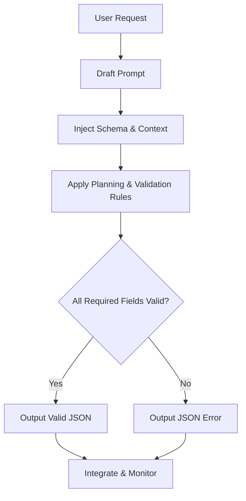

---

# Prompt Engineering in Practice: Workflow & Effective Patterns

---

## From Workflow to Architecture: RFP Response Generator for Automated AWS Landing Zones

In Part 1, we covered the iterative workflow for prompt engineering: Draft, Test, Refine, Automate, Monitor. But in real engineering, the *architecture* of your prompt—how you structure its logic, context, and validation—makes or breaks reliability in production.

> **Key Insight:** The best prompt engineering workflows embed architectural blocks (role, schema, context, rules) directly into the process, making every step deterministic and reliable.
{: .prompt-tip }

---

## Scenario: Responding to an RFP for Fully Automated AWS Multi-Region Landing Zones

**Background (My Experience):**
When I was consulting for a large enterprise, we got an RFP that looked simple at first: "Automate AWS account setup across three regions, with landing zones, VM and storage provisioning, PaaS catalogs, cost controls, and SRE monitoring." But as I dug in, I realized the response needed to be bulletproof—detailed, structured, and ready for both technical and business review. Every field mattered, and missing details could cost us the deal or cause chaos later.

**Goal:**
I needed a prompt that would generate a complete, valid JSON RFP response—covering solution overview, IaC/DevOps/SRE details, cost/resource/timeline estimates, and flagging any missing info before it ever reached the client.

---

### Step 1: Draft the User Request

> "Respond to RFP-2026-42: We need fully automated AWS accounts in three regions, with landing zones, VM and storage provisioning, PaaS service catalogs, automated cost controls, and SRE monitoring. Project should complete in 8 months. Estimate costs, team, and risks."

---

### Step 2: Define the RFP Response Schema Contract

```json
{
  "rfp_id": "string",
  "solution_overview": "string",
  "architecture_summary": "string",
  "iac_tools": ["string"],
  "devops_practices": ["string"],
  "sre_practices": ["string"],
  "estimated_costs": {
    "infrastructure": "number",
    "licenses": "number",
    "labor": "number",
    "total": "number"
  },
  "resource_plan": [
    {"role": "string", "count": "number"}
  ],
  "timeline": {
    "start": "string",
    "end": "string",
    "milestones": ["string"]
  },
  "risk_mitigation": ["string"],
  "assumptions": ["string"],
  "contact_info": {"name": "string", "email": "string"}
}
```

---

### Step 3: Build the Prompt with Architecture Blocks

**Role:**
You are an RFP Response Generator Agent for DevOps/IaC/SRE projects.

**Context:**
- All fields in the schema are required.
- Costs in USD, timeline in months, all estimates must be justified.
- Contact info must be present.

**Planning & Validation Rules:**
- Only use fields from the schema.
- Validate all required fields.
- If any field is missing or ambiguous, return a JSON error object with a helpful message.

**Output Rules:**
- Output only valid JSON (no markdown, no commentary).

---

### Step 4: Test – What Good Looks Like

**Expected Output:**
```json
{
  "rfp_id": "RFP-2026-42",
  "solution_overview": "Automated AWS multi-region landing zones with IaC, cost controls, and SRE monitoring.",
  "architecture_summary": "Three-region AWS setup with landing zones, VMs, storage, and PaaS catalogs, managed via Terraform and integrated with CI/CD.",
  "iac_tools": ["Terraform", "CloudFormation"],
  "devops_practices": ["CI/CD automation", "Policy as Code", "Automated cost reporting"],
  "sre_practices": ["SLO monitoring", "Automated alerting", "Runbook automation"],
  "estimated_costs": {
    "infrastructure": 300000,
    "licenses": 20000,
    "labor": 180000,
    "total": 500000
  },
  "resource_plan": [
    {"role": "Cloud Architect", "count": 1},
    {"role": "DevOps Engineer", "count": 2},
    {"role": "SRE", "count": 1}
  ],
  "timeline": {
    "start": "March 2026",
    "end": "October 2026",
    "milestones": ["Design", "IaC setup", "Landing zone automation", "SRE integration", "Go-live"]
  },
  "risk_mitigation": ["Multi-region failover", "Cost overrun controls", "Automated compliance checks"],
  "assumptions": ["AWS credits available", "Customer provides access"],
  "contact_info": {"name": "TBD", "email": "TBD"}
}
```

---

### Step 5: Test – What Can Go Wrong (and How to Fix)

**Bad Output Example:**
```json
{
  "rfp_id": "RFP-2026-42",
  "solution_overview": "Automated AWS landing zones.",
  "estimated_costs": {"total": 500000},
  "timeline": {"start": "March 2026"}
}
```
**Problem:** Missing architecture, tools, resource plan, milestones, and contact info.

**Fix:** Add validation rules in the prompt and instruct the LLM to return a JSON error if any required field is missing or ambiguous.

**Error Output Example:**
```json
{
  "error": "Missing required fields: architecture_summary, iac_tools, devops_practices, sre_practices, estimated_costs.breakdown, resource_plan, timeline.end, timeline.milestones, risk_mitigation, assumptions, contact_info"
}
```

---

### Step 6: Automate & Monitor

- Integrate the prompt into your RFP response automation pipeline.
- Log all generated responses and error messages.
- Periodically review outputs as requirements or the LLM change.

---

## Visualizing the Flow (Mermaid)



> **Engineer Insight:**
> - Real engineering value comes from combining workflow and architecture, testing for failure, and monitoring in production—not just writing a good prompt once.
{: .prompt-tip }

---


{: .prompt-info }


## What I Wish I Knew Earlier

> **Takeaway:**
> - The best prompt engineering is iterative—expect to refine, not just write once.
> - Schema-driven prompts catch errors before they reach the client.
> - Always test with both ideal and edge-case inputs.
> - Expert review adds real-world value beyond what the LLM can generate.
{: .prompt-info }

---

## What’s Next?

➡ **Series 5 – Chapter 5.5: Tokens, Context Windows, and Why Prompts Matter**

In the next chapter, we’ll explore:

- What tokens actually are
- How context windows limit memory
- Why models forget earlier parts of conversations
- How prompt structure impacts output quality

> **Architectural Question:** How can you design prompts and context to get the most reliable, useful output from LLMs—especially as context windows and tokenization limits come into play?
{: .prompt-info }

_You now have a practical blueprint for robust, production-grade prompt engineering. Next, we’ll dive into the mechanics of how LLMs process your prompts—and why that matters for every engineer._
