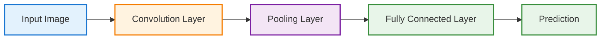
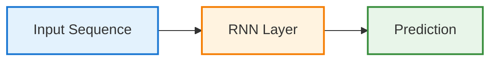

# TL;DR

> **TL;DR:**
> - CNNs are best for images and spatial data; RNNs are best for sequences and time series.
> - The right architecture saves time and headaches—match your tool to your data and problem.
> - Practical engineering analogies make deep learning architectures easier to grasp for automation and DevOps professionals.
> - Avoid using advanced architectures when a simple rule or classic ML model will do.
{: .prompt-info }

---

# Deep Learning Architectures: CNNs, RNNs & Practical Examples

## Introduction

Building on our neural network fundamentals, this chapter explores the most important deep learning architectures—Convolutional Neural Networks (CNNs) and Recurrent Neural Networks (RNNs)—with practical, automation-inspired analogies for engineers.

> **Engineer’s Insight:** Choosing the right architecture is like picking the right automation tool—each is optimized for a specific type of problem.
{: .prompt-tip }

---

## 1. Why Architectures Matter

- Not all neural networks are created equal
- The structure (architecture) determines what problems a network can solve
- Like using Terraform for infra and Ansible for config, you need the right tool for the job

> **Architect’s Question:** What makes one neural network architecture better suited for images, and another for sequences?
{: .prompt-info }

---

## 2. Convolutional Neural Networks (CNNs): The Image Specialists

### Analogy: Automated Quality Control in Manufacturing
- Imagine a conveyor belt with cameras at each stage
- Each camera checks for specific defects (scratches, color, shape)
- The system learns to spot issues by scanning small regions, then combining results for the whole product

CNNs work the same way:
- They scan small patches of an image (convolutions)
- Detect local features (edges, corners, textures)
- Combine these to recognize complex patterns (faces, objects)

**CNN Workflow:**

**Key Use Cases:**
- Image classification (cats vs dogs)
- Object detection (find all cars in a photo)
- Anomaly detection in visual data (manufacturing defects, medical scans)

> **Automation Analogy:** CNNs are like automated visual inspectors—each layer specializes in finding certain features, and together they deliver a final decision.
{: .prompt-tip }

---

## 3. Recurrent Neural Networks (RNNs): The Sequence Experts

### Analogy: Automated Log Analysis
- Imagine a system that reads logs line by line, remembering what happened before
- It can spot patterns that unfold over time (e.g., a failed login followed by a password reset)
- The system’s memory lets it connect events across the sequence

RNNs work the same way:
- They process data one step at a time, passing information forward
- Maintain a hidden state (memory) of what’s happened so far
- Ideal for time series, text, and any sequential data

**RNN Workflow:**

**Key Use Cases:**
- Time series forecasting (resource usage, stock prices)
- Natural language processing (text generation, translation)
- Event sequence prediction (anomaly detection in logs)

> **Automation Analogy:** RNNs are like log analyzers with memory—they connect the dots across time, not just in a single snapshot.
{: .prompt-tip }

---

## 4. Practical Examples for Engineers

### Example 1: Predicting Deployment Failures from Metrics (CNN)
- Input: Heatmap of resource usage over time (visualized as an image)
- CNN scans for patterns that precede failures
- Output: Predicts risk of failure before deployment

### Example 2: Detecting Anomalies in Log Sequences (RNN)
- Input: Sequence of log events from a deployment
- RNN learns normal event patterns
- Output: Flags unusual sequences that may indicate a problem

---

## 5. Common Pitfalls and How to Avoid Them

- **Pitfall 1:** Using CNNs for sequential data (logs, time series)
  - **Fix:** Use RNNs or Transformers for sequences
- **Pitfall 2:** Ignoring data preprocessing (garbage in, garbage out)
  - **Fix:** Clean and normalize your data
- **Pitfall 3:** Overfitting (model memorizes, doesn’t generalize)
  - **Fix:** Use regularization, dropout, and validation sets

> **Warning:** The most advanced architecture can’t fix bad data or the wrong problem framing.
{: .prompt-warning }

---

## 6. What I Wish I Knew Earlier

> **Takeaway:**
> - CNNs are best for images and spatial data
> - RNNs are best for sequences and time series
> - The right architecture saves time and headaches
> - Always match your tool to your data and problem
{: .prompt-info }

---

## What's Next?

➡ **Series 4 – Chapter 4.4: Transformers and Modern Architectures**

In the next chapter, we’ll explore:

- Transformers: the architecture behind modern AI (LLMs, GPT, BERT)
- How transformers differ from CNNs and RNNs
- Why transformers are so powerful for language and sequence tasks
- Practical engineering examples and pitfalls

> **Architectural Question:** What makes transformers so effective for language and sequence data, and how can engineers leverage them in real-world systems?
{: .prompt-info }

_You now have a practical foundation in deep learning architectures. Next, we’ll tackle the models powering today’s AI revolution._

---
