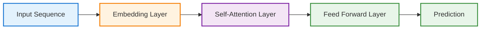

# TL;DR

> **TL;DR:**
> - Transformers have revolutionized deep learning, especially for language and sequence data.
> - They process data in parallel, not step-by-step like RNNs, making them fast and scalable.
> - Attention is the secret sauce—models learn what to "focus on" in the data.
> - Modern AI (LLMs, GPT, BERT) is built on transformers.
{: .prompt-info }

---

# Transformers and Modern Architectures: Thinking Out Loud

## Introduction

When I first heard about transformers, I honestly thought:  
*"Another architecture? Didn’t CNNs and RNNs already solve this?"*

What I didn’t realize yet was that transformers weren’t just another model — they were a **structural shift**, the same way container orchestration changed infrastructure.

Not better scripts.  
Not faster pipelines.  
A different mental model.

Once that clicked, modern AI finally started making sense.

---

## 1. Why Transformers Exist

Before transformers:

- **RNNs** processed sequences step-by-step → slow, forgetful, hard to scale
- **CNNs** worked well for images → awkward for language and long context

The core problem wasn’t accuracy.  
It was **memory and parallelism**.

Transformers solved both:
- They see the entire input at once
- They decide what matters dynamically
- They train efficiently on massive datasets

> **Engineer’s Insight:** Transformers are to deep learning what Kubernetes is to infrastructure—scalable, flexible, and a bit intimidating at first.
{: .prompt-tip }

---

## 2. The Attention Mechanism: The Secret Sauce

The real innovation wasn’t layers or neurons.  
It was **attention**.

Instead of processing tokens sequentially, transformers ask:

> *“Which parts of this input matter most to this prediction — right now?”*

### Analogy: Incident Investigation

Imagine debugging an outage:
- You don’t read logs line-by-line from midnight
- You jump straight to correlated signals
- You focus where the system *feels wrong*

That’s attention.

**Transformer Workflow:**

Every token can reference every other token — instantly.
No memory decay. No scanning. No bottleneck.

**Key Use Cases:**
- Language modeling (GPT, BERT, LLMs)
- Code generation and understanding
- Time series with complex dependencies

> **Automation Analogy:** Attention is like a smart log analyzer that instantly finds the most relevant events, no matter how big the log file is.
{: .prompt-tip }

---

## 3. Transformers vs. CNNs & RNNs

| Architecture | Best At                        | Limitation                      |
| ------------ | ------------------------------ | ------------------------------- |
| CNN          | Images, spatial data           | Not good for sequences          |
| RNN          | Sequences, time series         | Slow, forgets long-term context |
| Transformer  | Language, code, long sequences | Needs lots of data & compute    |

> **What changed everything:**
> - Transformers process everything in parallel
> - Context is global, not local
> - Training scales across massive clusters
>
> **This is why:**
> - LLMs exist
> - Code models exist
> - Chatbots stopped feeling brittle
{: .prompt-info }

---

## 4. Where Transformers Actually Shine (Engineering View)

### Example 1: Intelligent Change & Deployment Risk Assessment (Transformer)
- **Scenario:** Predict the risk of a deployment request (code or infrastructure change) before it happens, using all available context.
- **Input:**
  - Change type (e.g., IaC, config)
  - Environment (prod, staging, dev)
  - Resource count
  - Time (peak/off-hours)
  - Team
  - Historical incidents and outcomes
- **How a Transformer Helps:**
  - Attends to all features and their interactions, not just recent or local context
  - Can weigh the importance of, say, deploying to prod during peak hours with a large change, even if those signals are far apart in the input
  - Learns complex risk patterns from historical data
- **Output:**
  - Risk level (e.g., High, Medium, Low)
  - Confidence score
  - Recommendation (e.g., manual review, auto-approve)

### Example 2: Automated Incident Summarization (Transformer)
- Input: Sequence of log events from a major outage
- Transformer attends to the most critical events
- Output: Concise summary for the engineering team

### Example 3: Code Review Automation (Transformer)
- Input: Entire code diff
- Transformer highlights risky changes, suggests improvements
- Output: Actionable review comments

---

## 5. Common Pitfalls and How to Avoid Them

- **Pitfall 1:** Using transformers for small/simple problems
  - **Fix:** Use simpler models when possible—transformers shine on big, complex data
- **Pitfall 2:** Underestimating compute needs
  - **Fix:** Plan for GPU/TPU resources, or use pre-trained models
- **Pitfall 3:** Ignoring data quality
  - **Fix:** Garbage in, garbage out—clean data is still king

> **Warning:** Transformers are powerful, but not magic. The basics (good data, clear problem definition) still matter most.
{: .prompt-warning }

---

## 6. What I Wish I Knew Earlier

> **Takeaway:**
> - Transformers are the backbone of modern AI
> - Attention lets models focus on what matters
> - Parallel processing = speed and scale
> - Start simple, scale up as needed
{: .prompt-info }

---

## "From Automation to AI – A Practitioner's Journey: Series 4 - Deep Learning (Demystified) Recap

> **Series 4 Recap:**
> - **Chapter 4.1:** Why Deep Learning Exists – Why classic ML hits a wall and deep learning is needed for complex, messy problems.
> - **Chapter 4.2:** Neural Networks Explained Like Infrastructure – How neural nets work, with analogies for engineers and automation pros.
> - **Chapter 4.3:** Deep Learning Architectures: CNNs, RNNs & Practical Examples – When to use CNNs vs RNNs, and how to avoid common pitfalls.
> - **Chapter 4.4:** Transformers and Modern Architectures – The leap to attention, parallelism, and the foundation of modern AI (LLMs, GPT, BERT).
{: .prompt-tip }

---

## What's Next: From Automation to AI – A Practitioner's Journey: Series 5 – Generative AI & LLMs

Understanding how ChatGPT and similar models work.

#### 🚧 Chapter 5.1 – What Is Generative AI (Coming Soon)

- Predicting the next token
- Why ChatGPT works
- Generative vs discriminative models

#### 🚧 Chapter 5.2 – How LLMs Are Trained (High Level) (Coming Soon)

- Pre-training on massive datasets
- Fine-tuning for specific tasks
- RLHF (Reinforcement Learning from Human Feedback)

#### 🚧 Chapter 5.3 – Prompt Engineering for Engineers (Coming Soon)

- Prompts as interfaces
- Deterministic vs probabilistic outputs
- Best practices for working with LLMs

---
