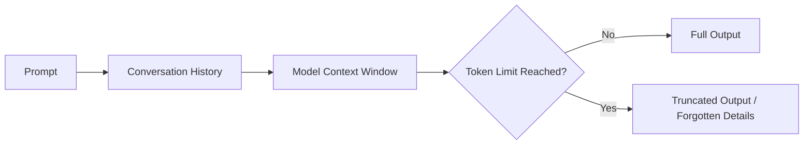

---

# Tokens, Context Windows, and Why Prompts Matter

---

## Introduction

When I first started working with LLMs, I thought prompts were just fancy instructions. But after a few real-world projects, I hit a wall: sometimes the model would forget earlier details, or the output would get weirdly truncated. That’s when I learned about tokens and context windows—the hidden limits that shape every LLM conversation.

> **Engineer’s Insight:** Tokens are the building blocks of LLM memory. Context windows are the boundaries. If you don’t design for them, your prompts will break in unpredictable ways.
{: .prompt-tip }

---

## 1. What Are Tokens?

- Tokens are chunks of text—words, parts of words, or punctuation—that LLMs use to process input and output.
- Every prompt, every response, every bit of context is made of tokens.
- Most models (like GPT-4) have a fixed token limit per request (e.g., 8,000 or 32,000 tokens).

**Example:**
- "Deploy the app to AWS." → Might be 6 tokens: ["Deploy", " the", " app", " to", " AWS", "."]

---

## 2. Context Windows: The Model’s Memory

- The context window is the maximum number of tokens the model can "see" at once.
- If your prompt + conversation + output exceeds this window, the model will forget earlier parts or truncate the response.
- This is why long chats sometimes lose track of details, or why big documents get cut off.

**Engineer’s Analogy:**
- Context windows are like RAM for LLMs—if you overflow, you lose data.
{: .prompt-info }

---

## 3. Why Prompt Structure Matters

- The order and clarity of your prompt affects what the model remembers and prioritizes.
- Put the most important instructions and context up front.
- Use concise, explicit language to save tokens and avoid confusion.
- For long workflows, consider splitting into multiple prompts or chaining outputs.

**Example:**
- Bad: "Here’s a bunch of background, now do X."
- Good: "Task: Do X. Context: [background]. Constraints: [rules]."

---

## 4. Common Pitfalls and How to Avoid Them

- **Pitfall:** Prompt + context + output exceeds token limit.
  - **Fix:** Trim unnecessary details, split tasks, monitor token usage.
- **Pitfall:** Model forgets earlier instructions.
  - **Fix:** Repeat key instructions, use summary prompts, keep context tight.
- **Pitfall:** Output gets cut off or incomplete.
  - **Fix:** Ask for shorter outputs, break up requests, check token count before sending.

> **Warning:** Even the best prompt fails if you ignore token and context limits.
{: .prompt-warning }

---

## Visualizing Context Windows (Mermaid)

---

## What I Wish I Knew Earlier

> **Takeaway:**
> - Token and context limits are the silent killers of LLM reliability.
> - Always design prompts and workflows with these boundaries in mind.
> - Short, clear, and well-structured prompts win every time.
{: .prompt-info }

---

## What’s Next?

➡ **Series 5 – Chapter 5.6: Advanced Prompt Chaining and Orchestration**

In the next chapter, we’ll explore:
- How to chain prompts for complex workflows
- Orchestrate multi-step LLM tasks
- Handle state and memory across multiple requests

> **Architectural Question:** How do you build reliable, multi-step automation pipelines with LLMs—without losing context or control?
{: .prompt-info }

_You now understand the boundaries of LLM memory. Next, we’ll tackle how to build workflows that work within those limits._

---
