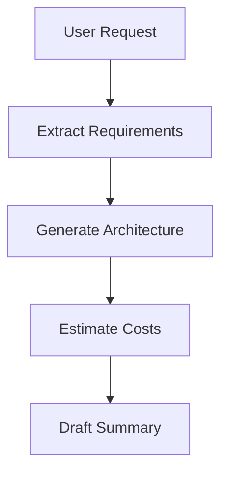
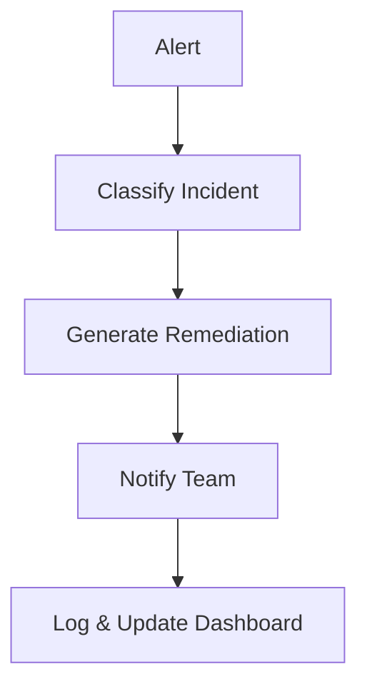

---
# Advanced Prompt Chaining and Orchestration

---

## Introduction

When I first tried to automate multi-step tasks with LLMs, I assumed one big prompt would do the trick. But reality hit: context limits, output drift, and lost details. The real power comes from chaining prompts—breaking complex workflows into reliable, manageable steps.

> **Engineer’s Insight:** Chaining prompts is like building a pipeline—each step does one job, passes clean output, and keeps state under control.
{: .prompt-tip }

---

## 1. What Is Prompt Chaining?

- Prompt chaining means splitting a big task into smaller, sequential prompts.
- This keeps context tight, avoids token overflow, and makes debugging easier.

**Example Workflow:**
1. Extract requirements from a user request.
3. Estimate costs and resources.
4. Draft a summary for business review.

---

## 2. Orchestration: Managing Multi-Step LLM Workflows

- Orchestration is the logic that connects, sequences, and manages prompt chains.
- Orchestration lets you retry failed steps, log outputs, and monitor the whole pipeline.
**Engineer’s Analogy:**
- Orchestration is like CI/CD for LLMs—each job runs in order, with checks and handoffs.

---

## 3. Handling State and Memory Across Requests
- LLMs don’t remember previous runs unless you pass context explicitly.
- Store key outputs (IDs, summaries, decisions) and feed them into the next prompt.
- For long workflows, use structured data (JSON, YAML) to keep state clean.

**Example:**
- Step 1 output: `{ "requirements": [...] }`
- Step 2 prompt: "Given these requirements, generate an architecture summary: ..."

  - **Fix:** Use strict schemas, validate after each step.
- **Pitfall:** Lost context or missing data.
  - **Fix:** Pass all needed info explicitly, log outputs.
{: .prompt-warning }
---

## Visualizing Prompt Chaining (Mermaid)

---

## What I Wish I Knew Earlier

> - Debug each step, validate outputs, and monitor the whole pipeline.

---

## Real-World Automation Patterns with LLMs

---

Now that we’ve covered how to design and orchestrate prompt chains, let’s see how these ideas show up in real engineering work. We’ll walk through a few automation patterns, case studies, and deployment practices for LLM-powered workflows in production.

---

## 1. Pattern: Automated Incident Response

**Scenario:**
- Detect an outage, classify severity, generate a remediation plan, and notify stakeholders.

**Prompt Chain:**
1. Ingest monitoring alert → Classify incident type/severity.
2. Generate remediation steps (based on runbooks).
3. Draft notification for SRE/DevOps team.
4. Log actions and update status dashboard.

**Mermaid Workflow:**

---

## 2. Pattern: IaC Change Review Automation

**Scenario:**
- Review Terraform/CloudFormation PRs for security, cost, and compliance.

**Prompt Chain:**
1. Parse IaC diff → Extract resources and changes.
2. Validate against security/cost/compliance policies.
3. Summarize findings and recommendations.
4. Post review comments to PR.

**Pitfalls & Solutions:**
- **Pitfall:** Missed policy violations.
  - **Solution:** Use strict schemas and cross-check outputs.
- **Pitfall:** Overly verbose or unclear reviews.
  - **Solution:** Enforce concise, actionable summaries.

---

## 3. Pattern: Automated RFP Response Generation

**Scenario:**
- Respond to complex cloud RFPs with tailored architecture, cost, and compliance answers.

**Prompt Chain:**
1. Parse RFP requirements.
2. Generate architecture proposal.
3. Estimate costs and compliance.
4. Draft executive summary.

**Best Practices:**
- Use JSON schemas for each step.
- Validate outputs and handle errors.
- Log all decisions for audit.

---

## 4. Lessons Learned from Production Deployments

- **Validation is critical:** Always check outputs against schemas.
- **Error handling:** Build retries and fallback logic into orchestration.
- **Monitoring:** Track workflow health, failures, and drift.
- **Human-in-the-loop:** For high-risk steps, add expert review checkpoints.

---

## 5. Final Thoughts: Architecting Reliable LLM Automation

> **Summary:**
> - Break complex tasks into chains of prompts.
> - Orchestrate with robust error handling and state management.
> - Validate, monitor, and review outputs.
> - Apply proven patterns for real-world reliability.
{: .prompt-info }

---

## Journey So Far – Series Wrap-Up

With this chapter, you’ve walked with me through the current arc of my "From Automation to AI" journey. From hands-on automation and SRE practices to LLM fundamentals, prompt design, orchestration, and real-world patterns, you now have a practical toolkit for designing, validating, and running production-grade LLM-powered automation workflows in real engineering environments.

**What’s Next?**
- Apply these patterns to one real-world workflow in your team (even a small one) and iterate based on what you learn.
- Share your patterns, failures, and lessons learned with your community or peers.
- Start exploring agentic AI and multi-step orchestration (agents that plan, act, and coordinate on your behalf)—this will be the focus of a future series on agentic AI orchestration in real-world scenarios.
