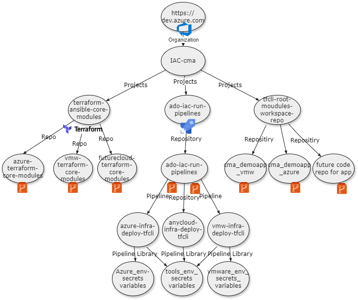
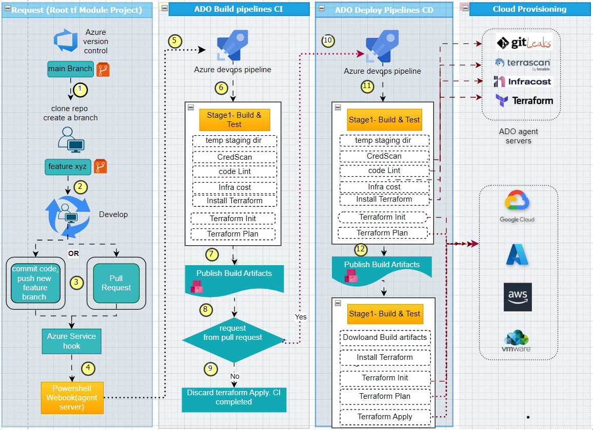

<style>
  .highlight {
    background-color: #f9f9f9;
    border-left: 5px solid #0078d7;
    padding: 10px;
    margin: 10px 0;
    font-style: italic;
  }
  .section-title {
    color: #0078d7;
    font-weight: bold;
    text-transform: uppercase;
    margin-top: 20px;
  }
  .icon-title {
    font-size: 1.5em;
    margin-right: 10px;
  }
</style>

# <span class="icon-title">📘</span> Streamlining Application Infra Deployment with Modern Practices

## <span class="icon-title">📂</span> 1. Introduction
<div class="highlight">
In today's dynamic technological landscape, efficient infrastructure provisioning is paramount for ensuring the agility, scalability, and reliability of modern applications. The deployment process plays a crucial role in maintaining operational excellence, enabling teams to deliver value to end-users rapidly and consistently.
</div>

This handbook delves into the complexities of infrastructure provisioning for modern applications, emphasizing the adoption of contemporary practices such as GitOps, DevOps, and Infrastructure as Code (IaC). By leveraging these methodologies, organizations can streamline deployment processes, enhance collaboration between development and operations teams, and achieve greater automation and control over their infrastructure.

### <span class="icon-title">🔍</span> 1.1 Overview
- **Challenges Addressed:** We'll delve into the challenges faced by organizations in traditional deployment practices and explore how modern approaches can overcome these hurdles.
- **Key Concepts:** You'll gain insights into key concepts such as versioning, immutability, and declarative infrastructure management, essential for understanding the principles underlying GitOps and IaC.
- **Practical Guidance:** From defining requirements to implementing best practices, this guide provides actionable advice and real-world examples to facilitate the adoption of modern deployment practices.

### <span class="icon-title">🛠️</span> 1.2 What to Expect
This handbook provides actionable advice and real-world examples to help you:

- **Understand Requirements:** Explore the functional requirements driving the need for modernizing deployment practices.
- **Implement Design Principles:** Learn foundational principles for successful infrastructure provisioning, from compliance to policy enforcement.
- **Adopt Best Practices:** Discover practical guidance on setting up repositories, integrating DevOps tools, and defining repository structures.
- **Select Tools:** Identify essential tools and technologies for efficient infrastructure provisioning, covering CI/CD pipelines, security scanning, and cost estimation.
- **Navigate Execution Flow:** Follow the detailed execution flow for end-to-end request fulfillment, guiding you from user request to application deployment.
- **Maximize Utility:** Find suggestions for leveraging this guide effectively, tailored to various roles and expertise levels within your organization.
- **Drive Adoption:** Conclude with actionable suggestions for successful adoption of GitOps practices, ensuring a smooth transition to modern deployment methodologies.

By the end of this handbook, you'll be equipped with the knowledge and resources needed to transform your organization's approach to infrastructure provisioning, driving efficiency, reliability, and innovation in your application deployment workflows.

---

## <span class="icon-title">📊</span> 2. Requirement (Use Case Scenario)

### <span class="icon-title">🏢</span> Use Case: Modernizing Application Infra Deployment Practices with GitOps/DevOps and Infrastructure as Code (IaC)

#### <span class="icon-title">📜</span> Background
<div class="highlight">
The Application team within the Cloud Management Platform (CMP) Business unit is struggling to optimize deployment practices for the pivotal `todo_demoapp`. Currently, their infra deployment and configuration deployment processes face several significant challenges, hindering efficiency and scalability.
</div>

These challenges include:

- **Fragmented Collaboration Between Teams:** Siloed communication and collaboration between development, operations, and security teams impede the seamless integration of security and compliance practices into the deployment pipeline.

#### <span class="icon-title">🎯</span> Objective
The Application teams within the Cloud Management Platform (CMP) Business unit need to update deployment practices for their application portfolio. By adopting modern methods like `GitOps/DevOps` and `Infrastructure as Code (IaC)`, they aim to solve various challenges, including inconsistent provisioning, approval delays, security risks, limited code knowledge, lifecycle management issues, manual processes, visibility problems, and teamwork gaps. The goal is to make deployments smoother, scale better, and work more efficiently for the pilot `todo_demoapp` and follow the same practice for future onboarded applications.

<!--  -->


---

## <span class="icon-title">🛠️</span> 3. Design and Implementation Approach

### <span class="icon-title">📐</span> 3.1 Design Principles
#### <span class="icon-title">📜</span> 3.1.1 Infrastructure as Code (IaC) Compliance
Ensure infrastructure configurations are managed as code, allowing for versioning, immutability, and auditability, enhancing overall reliability.

#### <span class="icon-title">🔗</span> 3.1.2 Tool Standardization and Integration
Standardize tools like Azure DevOps Server, Azure Repos, Terraform CLI, CredScan, and Infracost. Integrating these tools into CI/CD pipelines ensures consistency, efficiency, and enhanced security throughout the deployment process.

#### <span class="icon-title">📂</span> 3.1.3 Modular and Scalable Repository Structure
Organize repositories into modular structures, separating core/child modules from root modules or application-specific directories, promoting code reusability, maintainability, and scalability.

#### <span class="icon-title">🔒</span> 3.1.4 Continuous Compliance and Security Scanning
Integrate tools like CredScan and MegeLinter into CI/CD pipelines to continuously scan for security vulnerabilities, credentials leaks, and code quality issues, ensuring compliance with security standards and preventing potential breaches.

#### <span class="icon-title">💰</span> 3.1.5 Cost Estimation and Optimization
Utilize tools like Infracost for estimating and optimizing infrastructure costs. Incorporate cost estimation into the CI/CD pipeline to make informed decisions about resource provisioning and optimization, minimizing unnecessary expenses.

#### <span class="icon-title">🔄</span> 3.1.6 Webhook-Based Automation for GitOps
Implement webhook-based automation for GitOps, enabling automatic triggering of CI/CD pipelines upon Git events such as pushes or pulls. This automation streamlines the deployment process, reducing manual intervention and accelerating time to production.

#### <span class="icon-title">✅</span> 3.1.7 Policy Enforcement and Idempotent Operations
Enforce organizational policies and best practices through code, ensuring consistency and compliance across infrastructure deployments. Design deployment scripts and configurations to be idempotent, guaranteeing consistent outcomes and minimizing deployment risks.

---

### <span class="icon-title">⚙️</span> 3.2 Implementation Approach
#### <span class="icon-title">📂</span> 3.2.1 Setup IaC Repository
- Create a Git repository for managing infrastructure configurations.
- Establish a branching strategy (e.g., feature, development, production).

#### <span class="icon-title">🔗</span> 3.2.2 Integrate DevOps Tools
- Configure Azure DevOps pipelines for CI/CD.
- Integrate Terraform CLI for infrastructure provisioning.
- Integrate Ansible CLI for infrastructure configuration.

#### <span class="icon-title">📜</span> 3.2.3 Define Repository Structure
- Organize the repository into reusable modules/Roles.
- Utilize Terraform modules/Ansible Roles for encapsulating infrastructure components.

#### <span class="icon-title">🔒</span> 3.2.4 Implement Continuous Compliance
- Integrate security scanning tools like CredScan, GitLeaks into CI/CD pipelines.
- Configure automated checks to enforce compliance with security standards.

#### <span class="icon-title">💰</span> 3.2.5 Optimize Costs
- Integrate Infracost into CI/CD pipeline for cost estimation.
- Review and optimize resource provisioning based on cost estimates.

#### <span class="icon-title">🔄</span> 3.2.6 Automate GitOps Workflows
- Configure webhooks to trigger CI/CD pipelines on Git events.
- Define deployment workflows for automated deployments.

#### <span class="icon-title">✅</span> 3.2.7 Enforce Policies
- Define policies as code using tools like Terraform's Sentinel or OPA.
- Enforce policies through automated checks in CI/CD pipelines.

#### <span class="icon-title">📘</span> 3.2.8 Documentation and Training
- Document GitOps workflows, IaC best practices, and deployment procedures.
- Provide training sessions to team members on GitOps principles and tooling.

#### <span class="icon-title">🔄</span> 3.2.9 Iterative Improvement
- Gather feedback from team members and stakeholders.
- Continuously iterate on the implementation based on feedback for improvements.

---

## <span class="icon-title">📊</span> 4. Tool Considerations

### <span class="icon-title">🛠️</span> Recommended Tools
1. **Azure DevOps Server:** Used for CI/CD pipelining.
2. **Azure DevOps Dedicated Build Agent Server:** For pipeline execution and installing dependent services such as Docker, Terraform CLI, and webhook listener service and scripts for GitOps.
3. **Azure Repo or equivalent:** Utilized for Version Control System (VCS).
4. **Terraform and Ansible CLI (Open Source):** This project uses the Azure DevOps extension for Terraform tasks for infrastructure automation. [Azure Pipelines Terraform Extension](https://marketplace.visualstudio.com/items?itemName=JasonBJohnson.azure-pipelines-tasks-terraform)
5. **CredScan:** For scanning and identifying leaks. [CredScan Extension](https://marketplace.visualstudio.com/items?itemName=Foxholenl.Gitleaks)
6. **Megalinter or equivalent SAST tool:** Used for Tfscan and Tflint to ensure Terraform code quality. [Megalinter Installation](https://megalinter.io/latest/install-azure/)
7. **Infracost:** For cost estimation of the infrastructure. [Infracost Extension](https://marketplace.visualstudio.com/items?itemName=Infracost.infracost-tasks)
8. **Azure Subscription Storage Blob or equivalent:** For state management.
9. **Azure Subscription or equivalent:** For deploying the application.

---

## <span class="icon-title">📋</span> 5. Checklist for Foundation Setup
Before diving into the implementation details, it's essential to ensure the foundational setup is in place. This checklist outlines the necessary steps to set up the Azure DevOps (ADO) projects and repositories required for managing infrastructure as code (IaC) and implementing GitOps practices effectively.

### <span class="icon-title">🔹</span> 5.1 Azure DevOps Projects
It is assumed you already have azure devops private or public instance available and an ado organization to host this project.Within the organization create 3 projects specific to the role and service they provide
 
 1.   **Terraform-ansible-core-modules**: host Terraform ansible root modules
 2.   **ado-iac-run-pipelines:** host ADO pipleine templates repo and CICD pipeline yamls
 3.   **tfcli-root-modules-workspace-repo:** host Application specifc code to deploy and provision infra

<!--  -->


### <span class="icon-title">🔹</span> 5.2 Unified Resuable DevOps Pipeline Templates 

#### <span class="icon-title">🔹</span> 5.2.1 Key Objective
The objective is to establish a unified pipeline structure leveraging Azure DevOps YAML templating guidelines. This structure aims to streamline the execution of Infrastructure as Code (IAC) tasks by utilizing predefined templates. Key outcomes include:

1. **Reduced Pipeline Creation Time:** By defining reusable templates for tasks, jobs, stages, and variables, teams can significantly decrease the time required to set up new pipelines. Developers can leverage existing templates rather than recreating pipeline configurations from scratch.

2. **Ease of Maintenance:** Centralizing pipeline configurations into templates facilitates easier maintenance. Updates or changes can be made in one central location, ensuring consistency across all pipelines that utilize the template. This reduces the risk of inconsistencies and makes it simpler to implement changes or improvements.

3. **Enhanced Security:** Establishing a templated approach to pipeline creation provides an extra layer of security by controlling who can create pipelines. By defining access controls and permissions for modifying templates, organizations can ensure that only authorized personnel can make changes to pipeline configurations.

4. **Consistent Deployment Practices:** By adhering to Azure DevOps YAML template standards, teams can ensure that deployments of various infrastructure and cloud services follow a consistent and standardized approach. This promotes best practices, reduces errors, and enhances overall deployment reliability.

#### <span class="icon-title">🔹</span> 5.2.2 Project Structure

1. **Variable Templates:**
   Variable templates provide a structured and reusable way to define variables used across Azure DevOps YAML pipelines. These Templates are used in the project to define org-wide variables that end-user pipelines are not expected to modify.
   
    ```yaml 
    # azure-variables.yml
    variables:
      azureSubscription: 'MyAzureSubscription'
      resourceGroup: 'MyResourceGroup'
      region: 'East US'
    ```

2. **Steps Templates:**
   A task/steps template should encapsulate a single task or a closely related set of tasks that perform a specific action or function. Keeping task templates focused on one task ensures simplicity, maintainability, and reusability.
   
   **Example:** A task template for installing Terraform CLI on an Azure Agent server includes only the Terraform install task.
   
    ```yaml
    parameters:
    - name: terraformVersion
      type: string
      default: '1.5.0'
      
    steps:
      - task: TerraformInstaller@1
        displayName: install terraform
        inputs:
          terraformVersion: ${{ parameters.terraformVersion }}
          allowTelemetryCollection: false     
    ```

3. **Job Templates:**
   When a pipeline requires multiple tasks related to a specific job or stage of the deployment process, consider using job templates. A job template should encapsulate a complete job with multiple tasks, representing a cohesive unit of work within a pipeline.
   
   **Example:** A job template for building and testing an Azure AKS cluster might require testing and linting the TF code dependency on and going through the process of Init, plan, and apply.
   
    ```yaml
    parameters:
    - name: buildSteps
      type: object
      default: []
    - name: applicationName
      type: string
      default: ''

    jobs:
    - job: 'terraform_cli_build_env_job'
      dependsOn: ${{parameters.dependsOn}}
      displayName: 'Build-TFConfig DryRun '
      variables:
      - template: ../variables/terraform_cli_env_config_variables.yml

      steps:
      - ${{ each step in parameters.buildSteps }}:
          - ${{ each pair in step }}:
              ${{ pair.key }}: ${{ pair.value }}  
           
      - template: ../steps/terraform_cli/terraform_install_task.yml
        parameters:
          terraformVersion: ${{ parameters.terraformVersion }}
          
      - template: ../steps/terraform_cli/terraform_init_task.yml
        parameters:
         serviceName: ${{ parameters.serviceName }}
         environmentName: ${{ parameters.environmentName }}

      - template: ../steps/terraform_cli/terraform_validate_task.yml
        parameters:
          serviceName: ${{ parameters.serviceName }}    
          terraformDirectory: ${{ parameters.terraformDirectory }}
    ```

4. **Stage Templates:**
   If a pipeline involves multiple jobs that represent distinct stages or phases of the deployment process, stage templates can be used to organize these jobs. A stage template should define a complete stage within the pipeline, orchestrating the execution of multiple jobs in a sequential or parallel manner.
   
   **Example:** A stage template for a CI/CD pipeline might include jobs for building, testing, and deploying an application ex-AKS, ensuring that each stage is logically structured and executed in the correct sequence.
   
    ```yaml
    stages:
    - stage: ${{ parameters.applicationName }}_${{ parameters.serviceName }}_${{ parameters.environmentName }}_tfBuild
      displayName: ${{ parameters.applicationName }}_${{ parameters.serviceName }}_${{ parameters.environmentName }}_tfBuild
      jobs:
        # job to prepare the terraform files for linting and service build. 
        # This job will copy the terraform files from core repo and service to a temporary directory on ado agent working
        # directory for linting and service build.
        - template: ../jobs/ado_agent_tf_temp_staging_dir_job.yml
          parameters:
            dependsOn: ''
            buildSteps: ${{ parameters.buildSteps }}
            tfFilesTempAdoFolder: $(tfFilesTempAdoFolder)
            tfcoreFilesToLint: $(Build.SourcesDirectory)/${{parameters.centralIacTemplateRepoName}}/tf-modules/${{ parameters.tfCoreModuleName }}
            tfServiceFilesToLint: $(Build.SourcesDirectory)/${{ parameters.triggerRepoName}}/${{ parameters.tfFileDirPathTriggerRepo }}

        #job to run gitleak and credscan on the source repository
        - template: ../jobs/gitleak_credscan_job.yml
          parameters:
            dependsOn: 'ado_agent_tf_temp_staging_dir_job'
            buildSteps: ${{ parameters.buildSteps }}
            gitleakScanFolder:  $(tfFilesTempAdoFolder)
    ```

By adhering to these guidelines, you can ensure that templates are designed to be modular, maintainable, and reusable. Each template represents a distinct unit of work within the pipeline, allowing for granular control over the configuration and orchestration of tasks, jobs, and stages. This approach promotes consistency, simplifies maintenance, and facilitates the creation of robust and scalable CI/CD pipelines.

### <span class="icon-title">🔹</span> 5.2.3 Naming Convention
Naming conventions for YAML templates play a crucial role in organizing and identifying template files within the repository. The suggested format is **technology_verb_scope.yml**. 

1. **Technology:** The first part of the name specifies the technology or tool associated with the template. This helps users quickly identify the context or domain of the template.

2. **Verb:** The verb indicates the action or purpose of the template. It describes what the template does or the activity it facilitates within the specified technology.

3. **Scope:** The scope provides additional context or specificity about the template's usage. It clarifies the intended purpose or scope of the template within the broader context of the project or organization.

    ```yaml
    # Example:
    terraform_cli_build_env_stage
    gitleak_credscan_job
    ado_tf_cli_publish_artifacts_job
    ```

### <span class="icon-title">🔹</span> 5.2.4 How to Leverage These Unified Template in Your CICD Flow
The primary objective of these templates is to empower users to harness the provided templates according to their specific needs. Whether you opt to utilize the existing pipeline YAML files or create your own templates for pipelines, stages, jobs, or tasks, the project facilitates seamless integration. Here's a guide on how to effectively utilize this project:

1. **Understanding Template Composition:**
   Gain familiarity with the structure and purpose of the templates included in the project. Each template serves a distinct function, such as defining variables, orchestrating tasks within jobs, or structuring stages within pipelines.

2. **Identifying Template Reusability:**
   Identify components within the templates that can be reused across different pipelines or stages. These reusable components could include variable definitions, task configurations, or job setups.

3. **Selection of Appropriate Templates:**
   Choose the templates that best align with your pipeline requirements. For instance, if you need to establish a job for building and testing an Azure AKS cluster, consider utilizing the corresponding job template designed for such tasks.

4. **Customization of Templates (if necessary):**
   Customize the selected templates to suit your specific project needs. Adjust variables, parameters, or task configurations within the templates as required by your project's unique requirements.

5. **Adhering to Naming Conventions:**
   Ensure that when creating or modifying templates, you adhere to the naming conventions outlined in the project documentation. Consistent naming conventions facilitate easy identification and utilization of templates across the project.

6. **Integration with Azure DevOps:**
   Integrate the YAML templates into your Azure DevOps pipelines seamlessly. You can directly reference these templates within your pipeline YAML files or import them into your Azure DevOps repository for streamlined usage.

7. **Testing and Validation:**
   Before deploying pipelines for production or crucial tasks, conduct thorough testing and validation of the pipelines. Verify that all templates function correctly and produce the desired outcomes in different scenarios.


## <span class="icon-title">🔹</span> 5.3  Infra as Code Repository Setup 
Organize infrastructure configurations into reusable core modules and root modules. Core modules represent foundational components shared across multiple projects or environments, while root modules encapsulate specific configurations for individual projects or environments.

### <span class="icon-title">🔹</span> 5.3.1  **Core/Child Modules:**
   - Directory for reusable Terraform modules defining specific components or resources.
   - These modules can be called from the root modules for code reusability.
  
      **Prerequisite:**  good to have a dedicated ado project that can host the core modules. this will assure RBAC and only IAC developer can have admin access 
      ```shell
      # Root module Terraform code strucuture    
         **tf-modules**
         └── cloudProviderPrefix-serviceName-type
            ├── readme.md
            ├── main.tf
            ├── provider.tf
            ├── output.tf
            ├── variable.tf
            └── datasource.tf
      
      #cloud name prefix
        
      | Cloud Provider | prefix |
      |----------------|--------------|
      | Azure          | azr          |
      | VMware         | vmw          |
      | AWS            | aws          |
      | Google Cloud   | gcp          |
      
      #cloud service example
      | Cloud servcice | type         |
      |----------------|--------------|
      | Rhel           |VM            |
      | AKS            |cluster       |
      | windows        | vm           |
      | database       | vm,cluster   |
 
      
      # Example strucutre
      **vmw-rhel-vm**
         ├── readme.md
         ├── main.tf
         ├── provider.tf
         ├── output.tf
         ├── variable.tf
         └── datasource.tf
      ```
```shell
# Root module Ansible code strucuture 
├───roles
│   └───rhel (seviceType)
│       ├───postgresql_db (roleName)
│       │   ├───tasks
│       │   ├───vars
│       │   ├───default
│       │   ├───templates
│       │   ├───test
│       │   └───handlers
│       ├───nginx_web
│       │   ├───default
│       │   ├───tasks
│       │   ├───templates
│       │   ├───vars
│       │   ├───test
│       │   └───handlers
│       └───flask_app
│           ├───default
│           ├───tasks
│           ├───templates
│           ├───vars
│           └───test
└───inventory (Dynamic Inventory scripts)
```
### <span class="icon-title">🔹</span> 5.3.2 **Root Module or Application Specific Repo Directory:**
- Application specifc Directory for Terraform/Ansible root modules/Playbooks defining specific components or resources.
- These modules or service template act as a template for application developer, requester to create desire state configuration.
- it is advise to use a pattern based naming for resource files. 
    - Terraform- `ServiceName_resource_main.tf`
      **Example** rhel_resoruces_main.tf
    - Ansible-`hostname_or_ip-ansible_role_tag_name`
      **Example** 10.1.1.147-flask_app_deploy.yml

   ```markdown
   # infra as code Application specifc repo structure.
    applicationName
   ├── iac_configuration_code (to host config code)
   │   ├── group_vars
   │   └── host_vars
   └── iac_provisioning_code (to host provisioning code)
      └── terraform_templates
   ```

   ```markdown
   # **Recommended directory strucutre Terraform**
      application_name/
      ├── environment/
      │   ├── production/
      │   │   ├── service1-p/
      │   │   │   ├── resources_main.tf
      │   │   │   └── provider.tf
      │   │   ├── service2-p/
      │   │   │   ├── resources_main.tf
      │   │   │   └── provider.tf
      │   └── develpement/
      │       ├── service1-d/
      │       │   ├── resources_main.tf
      │       │   └── provider.tf
      │       ├── service2-d/
      │       │   ├── resources_main.tf
      │       │   └── provider.tf
      │       └── service3/
   
      # Example directory strucutre
      azure_demoapp/
      ├── environment/
      │   ├── production/
      │   │   ├── aks-p/ 
      │   │   │   ├── aks_cluster_resources_main.tf
      │   │   │   └── provider.tf
      │   │   ├── rhel-p/
      │   │   │   ├── rhel_resources_main.tf
      │       │   └── provider.tf
      │   └── develpement/
      │   │   ├── aks-d/ 
      │   │   │   ├── aks_cluster_resources_main.tf
      │   │   │   └── provider.tf
      │   │   ├── rhel-d/
      │   │   │   ├── rhel_resources_main.tf
      │       │   └── provider.tf
   ```

```markdown  
# **Recommended directory strucutre Ansible**
vmw_todo_app **(Application name)**
├── iac_configuration_code (Ansible config dir)
    ├── group_vars
    └── host_vars (variable templates for config mgmt)
        ├── config_rhel_dev
        │   ├── 10.1.140.147 (dns or or for host to be manged)
        │   │   ├── 10.1.140.147-nginx_web_deploy.yml(hostname+role for desired state files)
        │   │   ├── 10.1.140.147-postgresql_db_deploy.yml
        │   │   └── 10.1.140.148-flask_app_deploy.yml
        │   └── 10.1.140.148
        │       └── 10.1.140.148-flask_app_deploy.yml
        ├── config_rhel_prod
             ├── 10.1.140.180
                └── 10.1.140.180-flask_app_deploy.yml

```  

#### **Root Module Repo Directory Structure Explain**

**Directory Structure Overview:**

- **vmw_tf_todo_app**: Root directory of the application repository.
- **iac_configuration_code**: Contains the configuration code.
  - **group_vars**: Directory for Ansible group variables.
  - **host_vars**: Directory for Ansible host variables.
    - **config_serviceName_envType**: Example directory for configuring a specific service and environment type.
      - **hostName_Or_ip**: Host-specific directory.
        - **hostName_Or_ip-exact_ansible_role_tag_name.yml**: Host-specific Ansible role configuration file.
- **iac_provisioning_code**: Holds the provisioning code.
  - **terraform_templates**: Directory for Terraform templates.
    - **config_serviceName_envType**: Example directory for configuring a specific service and environment type.
      - **provider.tf**: Terraform provider configuration file.
      - **serviceName_resources_main.tf**: Main Terraform configuration file for service resources.

#### **File Naming Convention**
Adopt a consistent file naming convention for Terraform configurations, Ansible playbooks, and other files within the repository. Use descriptive names that reflect the purpose and contents of each file, enhancing readability and comprehension.

- Each application or root module resource for terraform file must be named ending with `main.tf`, for example, `rhel_resources_main.tf`.
- This naming convention is crucial for the webhook to correctly identify triggers for the repository.
- Each application or ansible host_var or group_var file must be named as per following format
   hostName_Or_ip-exact_ansible_role_tag_name.yml
   this format helps to identfiy the what role to be applied on which host.


#### **Required Variables in main.tf or playbook.yml**
Define required variables in the `main.tf` or `playbook.yml` file, providing default values or prompting users for input when necessary. Clearly document variable usage, descriptions, and accepted values to guide users effectively.

To use Ansible playbook.yml templates as part of this project there is not additional rules except following the correct dir hirarchy within your root/application repo. however for succesful terraform runs asssure-

- Each application `main.tf` template must define the following variables in order for the Git webhook trigger to be successful:
    ```hcl
    source              = "./azr-rhel-vm"
    application_name    = "azr_demoapp"
    environment         = "prod"
    ```

#### **Example Terraform Module Template for RHEL VM Provisioning**
Here's an example of how to structure the `main.tf` file for provisioning a RHEL VM:
```hcl
module "az_rhel_demoapp_crq123" {
    source                        = "./azr-rhel-vm"
    application_name              = "azr_demoapp"
    environment                   = "prod"
    service_name                  = "rhel"
    location                      = "eastus2"
    resource_group_name           = "demo-lab-ado-tfe-services"
    linux_virtual_machine_name    = "tfazrdemoapp-rhelVM21"
    linux_virtual_machine_size    = "Standard_B2s"
    os_version                    = "dryice-rhel8-8-image-eastus2"
    subnet_name                   = "PublicSubnet1"
    admin_username                = "adminuser"
    admin_password                = "adminpassword"
    diag_storage_account_name     = "tfedemodiagstoage"
    resource_group_storagediag    = "demo-lab-ado-tfe-services"
}
```

#### **Example Ansible hostvar Template for RHEL VM configuration**

```yml
    # var for flask_app role
    app_server_name: "10.1.1.147"
    app_directory: '/home/ansible/flask_app'
    app_name: 'todo_app'
    azure_pat: ""
    organization: "iac-automation"
    project: "tfcli-root-modules-workspace-repo"
    build_id: "1689"
```
Please ensure that each application or Terraform root module and ansible host_var repository adheres to these guidelines to maintain consistency and ensure successful webhook triggers.

---

## <span class="icon-title">🔷</span> 6. Configure ADO Project Service Hook
To enable gitops functionality and auto trigger build and deploy pipeline based on git push or git pull a webhook service is used. ADO by default do not provide the webhook listner mechanism so a custom script is created to overcome this shorcoming.

To enable gitops on Application/root module project
 configure [Azure Devops Service Hook](https://learn.microsoft.com/en-us/azure/devops/service-hooks/services/webhooks?view=azure-devops) &
a custom webhook listener and execution script (written in powershell) placed in webhook folder as part of pipeline template repo.

This setup ensures seamless integration between Git repositories and ADO pipelines, enabling automated deployments and ensuring consistency and reliability in the deployment process.                                        

---

## <span class="icon-title">🔷</span> 7. Enable Azure DevOps Extension
The Azure DevOps extension mentioned in the project is designed to facilitate the integration of various tools and services within Azure DevOps pipelines, enhancing automation and streamlining the CI/CD process.

- **Infracost Estimation:** [Infracost Extension](https://marketplace.visualstudio.com/items?itemName=Infracost.infracost-tasks)
- **Credscan:** [Credscan Extension](https://marketplace.visualstudio.com/items?itemName=Foxholenl.Gitleaks)
- **Publish Credscan Report:** [Credscan Report Extension](https://marketplace.visualstudio.com/items?itemName=sariftools.scans)
- **Terraform Commands:** [Terraform Extension](https://marketplace.visualstudio.com/items?itemName=JasonBJohnson.azure-pipelines-tasks-terraform)
- **Terraform Output:** [Terraform output](https://marketplace.visualstudio.com/items?itemName=JaydenMaalouf.terraform-output)
Temporarily used as there is an issue with the Terraform plugin to display the output as part of the build output.

---

## <span class="icon-title">🔷</span> 8. Execution Flow for E2E Request Fullfilment 
The end to end deployment request should look something like this when you fulfill all the requiment and complete the tools configuration as directed.

<!--  -->


### 1. User requests
  - ***Main branch clone Repo:*** user requests to clone the main branch repository where the application's infra source code resides.

### 2. Development Workflow:
- ***Clone Repo:*** Clone the repository onto local machine.
-  ***New Feature:*** Create a new feature branch from the main branch.
-  ***Fill Template:*** Fill in .tf or .yml templates for infrastructure.

### 3. Push or Pull Request:
- Push changes to feature branch or create a pull request to merge into main.

### 4. CI/CD Pipeline:
- ***Service Hook:*** Trigger PowerShell webhook upon push or pull request creation.
- ***ADO Build Pipeline:*** Initiate Azure DevOps build pipeline.
- ***CI Build Stage***: Perform tasks:
   - Credential scan
   - Linting
   - Terraform init plan
   - Infrastructure cost estimation
   - Publish artifacts

### 5. Handling Push Request:
- Publish Terraform plan or execute Ansible tests
- Complete the build stage
- No Apply only dryRun for code and infra state


### 6. Handling Pull Request:
- ***Run Build Stage:*** Perform build tasks.
- ***Perform Tasks:*** Similar tasks as in CI build stage.
- ***Update Pull Request Comment:*** Provide build result.
- ***Approve or Reject Build:*** Based on build result.

### On Approval:
- ***Service Hook Trigger:*** Initiate webhook pipeline.
- ***Run Build and Apply Stage:*** Deploy changes to infrastructure.


---

## <span class="icon-title">🔷</span> 9. How to Use this Repository/Project

1. **Clone Repository:**
   - Clone the repository to your local machine using the following command:
     ```markdown
     git clone `https:tfs_serverName.com/tfs/IaC-CMA/ado-iac-run-pipelines/_git/ado-iac-run-pipelines` 
     ```

2. **Configure Azure DevOps:**
   - Set up Azure DevOps Server and configure CI/CD pipelines according to the provided YAML files in the `ado-iac-run-pipelines` directory.

3. **Install Required Tools:**
   - Set up Azure DevOps Dedicated Build Agent Server and install Docker, Terraform CLI, and other necessary tools mentioned in the tool considerations.

4. **Customize Terraform Configurations:**
   - Modify the Terraform configurations in the `root_modules` directory according to your infrastructure requirements and as per child or core module readme instruction on how to use the module.

5. **Set Up Git Feature Branch Workflow:**
   - Create a feature branch from the main branch for making changes:
     ```markdown
     git checkout -b feature-branch-name
     ```
   - Make necessary changes to the Terraform configurations or other project files.
   - Commit your changes:
     ```markdown
     git add .
     git commit -m "Your commit message"
     ```
   - Push your changes to the remote repository:
     ```markdown
     git push origin feature-branch-name
     ```
   - This will trigger the webhook-based pipeline execution based on the git push event.

6. **Review and Approve Changes:**
   - After the CI pipeline successfully completes, review the changes made in the feature branch.
   - If the changes are satisfactory, merge the feature branch into the main branch via a pull request.
   - Upon merging the pull request, the changes will be deployed automatically if configured in the CI/CD pipeline.

7. **Monitor and Maintain:**
   - Monitor the pipeline execution and infrastructure deployment.
   - Maintain the Terraform configurations and update them as per changes in infrastructure requirements.

---

## <span class="icon-title">🔷</span> 10. Suggestions for Successful Adoption of GitOps Practice

### <span class="icon-title">🔹</span> 10.1 Branching Strategies
Implementing a clear branching strategy is essential for managing the GitOps workflow effectively. A common branching strategy used in GitOps is the Git Flow model, which consists of a main branch (often called `main` or `master`) and supporting branches for feature development, bug fixes, releases, and hotfixes.

- **Main Branch:**
This is the mainline of development and should always reflect the production-ready state of the codebase.

- **Feature Branches**
These branches are used for developing new features. They are created off the main branch and merged back into it via pull requests after completion.

- **Release Branches**
These branches are used to prepare for a new release. They are created from the main branch and contain code that is destined for the next release.

- **Hotfix Branches**
These branches are used to address critical issues in production. They are created from the main branch, contain only the necessary changes to fix the issue, and are merged back into both the main branch and any active release branches.

### <span class="icon-title">🔹</span> 10.2 Avoid Mixed Environments
Mixed environments, where application and infrastructure code coexist in the same repository, can lead to dependencies and conflicts between the two. Instead, separate your application and infrastructure code into distinct repositories or directories within the same repository.

By separating these concerns, you can manage changes independently and reduce the risk of unintended consequences. It also promotes modularity and reusability, as infrastructure components can be shared across multiple projects without coupling them to specific applications.

### <span class="icon-title">🔹</span> 10.3 Promote Merge Request Discussions

Merge requests (or pull requests) serve as a platform for collaborative code review and discussion. Encourage team members to provide feedback, ask questions, and suggest improvements during the review process.

Prioritize thorough code reviews to ensure code quality and adherence to best practices. Discussing proposed changes helps spread knowledge and foster a culture of continuous improvement within the team.

### <span class="icon-title">🔹</span> 10.4 Policy as Code
Incorporating policy as code allows you to define and enforce organizational standards, security measures, and compliance requirements in a consistent and automated manner.

Define policies using a configuration management tool or a dedicated policy language (such as HashiCorp Sentinel or Open Policy Agent). Store policy definitions alongside your application and infrastructure code in version control.

Automate policy enforcement through continuous integration pipelines to ensure consistent application across environments. This approach promotes transparency, traceability, and repeatability in managing your infrastructure and applications.

### <span class="icon-title">🔹</span> 10.5 Ensure Idempotency
Idempotency is the property of an operation where applying it multiple times has the same effect as applying it once. In the context of GitOps, this means that applying the same configuration multiple times should result in the same desired state, regardless of the current state.

Design your deployment scripts and infrastructure configurations to be idempotent to prevent unintended changes or conflicts. Use tools like Terraform, Kubernetes, or configuration management systems that support idempotent operations.

Regularly test your deployment processes to ensure they maintain idempotency, especially when scaling up or down, rolling out updates, or recovering from failures. This helps maintain system reliability and consistency over time.

