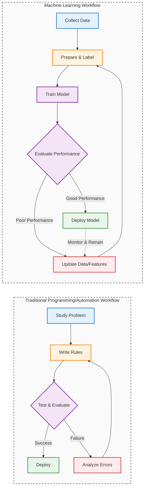

## What Is AI (Really?)
← [Previous: Chapter 0.2 - Background and Learning Strategy](/codifyme/series/journey-automation-to-ai/chapter-0-2-background-and-learning-strategy/) | [Series Index](/codifyme/series/journey-automation-to-ai/) | [Next: Chapter 1.2 - How Machines Learn](/codifyme/series/journey-automation-to-ai/chapter-1-2-how-machines-learn/) →

---

Here's an embarrassing confession: I spent months calling everything "AI" in architecture discussions.

- Complex approval logic? AI.
- Predictive scaling? AI.
- Simple if-then rules? Also AI, apparently.

Then someone asked: "Which kind of AI?" I had no answer.

Before we go deeper into ML, deep learning, or LLMs, let's fix this:

> **What do we actually mean when we say "AI"?**

Precision matters in architecture. Vague terms lead to bad decisions.

---

## 1. AI Is Not a Single Thing

AI is **not one technology**, tool, or model.

At a high level, AI refers to:

> **Systems that perform tasks which normally require human intelligence.**

Examples include:
- Recognizing patterns
- Making predictions
- Understanding language
- Adapting behavior based on experience

This definition is intentionally broad—and that’s where confusion starts.

---

## 2. AI vs Automation – Clearing the Confusion

A common misconception is:

> “If a system makes decisions, it must be AI.”

That is not true.

### Automation

- Follows explicitly defined rules
- Behaves the same way every time
- Does not learn or adapt

Example:

```text
IF request_type == "production"
THEN approval_required = true
```

This is decision logic, not intelligence.

### Artificial Intelligence

- Learns patterns from data
- Makes probabilistic decisions
- Improves behavior based on experience

Example:

```text
Based on:
- Past approval outcomes
- Change success rates
- Risk patterns

Predict whether approval is required
```

### Key Difference

```text
Automation → Executes known logic
AI          → Learns unknown patterns
```

**Automation is deterministic. AI is adaptive.**

Visually, the workflows look like this:



**Key differences:**
- **Programming/Automation:** You write the logic (rules)
- **ML:** The system learns the logic (from data)
- **Programming:** Fix bugs by changing code
- **ML:** Fix issues by improving data or retraining
- **ML only:** Continuous monitoring and retraining cycle


---

## 3. Common Myths About AI

Before going further, let’s explicitly bust some common myths.

### Myth 1: AI Is Just Advanced Automation

❌ **False**

- Automation follows predefined rules
- AI adapts based on data

AI may use automation—but they are not the same thing.

### Myth 2: AI Always Means Machine Learning

❌ **False**

Not all AI systems learn. Some use:

- Rules
- Heuristics
- Search and optimization techniques

Machine Learning is a subset of AI, not a requirement.

### Myth 3: AI Always Needs Huge Data Sets

❌ **False**

- Some ML models work with limited data
- Others rely on transfer learning
- Sometimes automation is still the better choice

More data helps—but it’s not mandatory.

### Myth 4: AI Replaces Engineers

❌ **False**

AI shifts where intelligence lives:

- From code → models
- From rules → data

Engineers are still responsible for:

- Architecture
- Guardrails
- Governance
- Accountability

---

## 4. Breaking AI into Practical Layers

Think of AI as a hierarchy:

```text
Artificial Intelligence
    |
    ├── Machine Learning (learns from data)
    |       |
    |       └── Deep Learning (neural networks)
    |
    └── Non-learning AI (rules, search, heuristics)
```

**Key insight:** Not everything called "AI" actually learns.

---

## 5. Machine Learning → Deep Learning → Generative AI

### Machine Learning

ML learns patterns from data instead of following hardcoded rules.

**Traditional Programming:**
```text
Rules + Data → Output
```

**Machine Learning:**
```text
Data + Output → Model → Prediction
```

This inversion is fundamental.

### Deep Learning

A subset of ML using neural networks with multiple layers. Excels at:
- Images and video
- Speech and audio
- Natural language
- Complex pattern recognition

You need it only when complexity demands it.

### Generative AI

Not a new category—it's deep learning applied to content generation.

Examples: LLMs (text), DALL-E (images), code generators.

Powerful, but easy to misuse if you don't understand what's underneath.

---

## 6. A Familiar Architecture Analogy

Let’s map these concepts to something familiar.

Automation / IaC:
You define the rules
System executes exactly as written

Machine Learning:
You define the goal
System learns the rules from data

---

## 7. Why This Matters for Architects

When I started mixing up these terms, I made bad decisions:
- Proposing ML for problems that needed simple rules
- Avoiding AI where it could actually help
- Trusting AI outputs where determinism was required

Clear definitions = better architecture choices.

The simplest effective solution usually wins.

---

## 7. Key Takeaways

- AI is an umbrella term, not one technology
- Automation ≠ AI (different fundamentals)
- ML is a subset of AI; DL is a subset of ML
- Generative AI builds on deep learning
- Precise definitions lead to better designs

---

## What's Next?

**→ Series 1 – Chapter 1.2: How Machines Learn**

Next up:
- What "learning" actually means
- How it differs from programming
- Why data is central to everything

---

**Previous:** [Chapter 0.2 – My Background & Learning Strategy](/codifyme/series/journey-automation-to-ai/chapter-0-2-background-and-learning-strategy/) | **Next:** [Chapter 1.2 – How Machines Learn](/codifyme/series/journey-automation-to-ai/chapter-1-2-how-machines-learn/) | [Series Index](/codifyme/series/journey-automation-to-ai/)
