← [Previous: Chapter 2.2 - Features, Labels, and Models](/codifyme/series/journey-automation-to-ai/chapter-2-2-features-labels-and-models) | [Series Index](/codifyme/series/journey-automation-to-ai/) | [Next: Chapter 3.0 – The ML Project Workflow](/codifyme/series/journey-automation-to-ai/chapter-3-0-ml-project-workflow/) →

---

## 1. The Two Distinct Phases (and Why I Confused Them)

In automation, I'm used to thinking about "build time" vs "runtime":

- **Build time:** When I write, test, and deploy Terraform configs, Ansible playbooks, or CI/CD pipelines
- **Runtime:** When those configs actually execute and provision infrastructure

ML has a similar split, but the terminology threw me off initially:

- **Training:** When the model learns patterns from data (build time)
- **Inference:** When the trained model makes predictions on new data (runtime)

**Why this matters:** I kept reading about ML projects that "worked in training but failed in production." That confused me until I realized: **these are two completely different activities** with different inputs, outputs, and resource requirements.

Once I mapped training/inference to build/runtime, it clicked.

```mermaid
flowchart LR
    subgraph Training["🔨 TRAINING PHASE (Build Time)"]
        direction TB
        T1["Historical Data<br/>(Features + Labels)"]
        T2["Learn Patterns"]
        T3["Trained Model<br/>(Artifact)"]
        T1 --> T2 --> T3
    end
    
    subgraph Inference["⚡ INFERENCE PHASE (Runtime)"]
        direction TB
        I1["New Data<br/>(Features Only)"]
        I2["Apply Patterns"]
        I3["Prediction<br/>(Label)"]
        I1 --> I2 --> I3
    end
    
    Training --> |"Deploy Model"| Inference
    
    style Training fill:#e1f5ff,stroke:#0066cc,stroke-width:2px
    style Inference fill:#ffe1f5,stroke:#cc0066,stroke-width:2px
```



---

## 2. Training: The Build Phase

### What Training Does

Training is when the model adjusts its internal parameters (weights) to minimize prediction errors on the training data.


Think of it like this:

**Your first Terraform config attempt:**

```hcl
# First draft (untrained model)
resource "aws_instance" "web" {
  instance_type = "t2.micro"  # Too small for prod
}
```

**After testing and feedback (training iterations):**

```hcl
# Refined config (trained model)
resource "aws_instance" "web" {
  instance_type = var.environment == "prod" ? "t3.large" : "t3.small"
  
  root_block_device {
    volume_size = var.environment == "prod" ? 100 : 20
  }
}
```

You learned from experience (historical deployments) what works and what doesn't. The model does the same thing, except it uses mathematical optimization instead of human judgment.

### Training Steps

```text
1. Load training data
   ├─ Features: files_changed, environment, team, etc.
   └─ Labels: actual_risk_level

2. Initialize model with random weights
   ├─ Model makes terrible predictions at first
   └─ Like your first Terraform config attempt

3. Make predictions on training data

4. Compare predictions to actual labels
   ├─ Calculate error (loss)
   └─ "How wrong was I?"

5. Adjust weights to reduce error
   ├─ Optimization algorithm (gradient descent)
   └─ Like refining your config based on test results

6. Repeat steps 3-5 many times
   ├─ Until error is acceptably low
   └─ Or until diminishing returns

7. Save trained model as artifact
   ├─ model.pkl (Python)
   ├─ model.h5 (TensorFlow)
   └─ Like saving your final Terraform config
```

### Training Inputs

- **Training data:** Features + labels (historical examples)
- **Validation data:** Separate dataset to check if model generalizes (like testing on staging before prod)
- **Hyperparameters:** Settings that control how the model learns (learning rate, number of layers, etc.)

**Automation analogy:**

```text
Training data     = Your documented requirements and past incidents
Validation data   = Testing in staging environment
Hyperparameters   = Your coding standards and best practices
```

### Training Outputs

- **Trained model file:** Contains learned weights and patterns
- **Training metrics:** Accuracy, loss, validation scores (like test results)
- **Model metadata:** Version, training date, data used, hyperparameters (like your Git commit history)

### Hyperparameter Tuning and Model Selection

Here's a problem you'll run into: How do you choose the right model and its settings?

**The scenario:**

You're trying to build the deployment risk model. You have several choices:

1. Decision Tree
2. Random Forest
3. Linear Regression
4. Neural Network

Each algorithm has settings (hyperparameters) like:
- Decision tree depth
- Number of trees in a forest
- Learning rate
- Regularization strength

How do you decide?

**The wrong approach:**

```text
❌ Train 10 different models with different settings
❌ Test all of them on your test set
❌ Pick the one with best accuracy on test set
❌ Deploy to production
❌ Watch it fail with worse accuracy than expected
```

**What went wrong?** You "overfit" to your test set. By testing 10 models and picking the best performer, you've essentially tuned your model to that specific test set. It won't generalize to new data.

**The right approach: Use three datasets, not two**

```mermaid
graph TB
    subgraph DataSplit["Data Split Strategy"]
        All["All Data<br/>10,000 deployments"]
        Train["Training Set<br/>70% (7,000)<br/>🔨 Build & Iterate"]
        Val["Validation Set<br/>15% (1,500)<br/>🧪 Test Candidates"]
        Test["Test Set<br/>15% (1,500)<br/>✅ Final Verification"]
    end
    
    All --> Train
    All --> Val
    All --> Test
    
    Train -.->|"Train multiple<br/>models"| Models["Model Candidates"]
    Models -.->|"Evaluate &<br/>Select Best"| Val
    Val -.->|"Final<br/>Check"| Test
    
    style All fill:#f0f0f0,stroke:#333,stroke-width:2px
    style Train fill:#e1f5ff,stroke:#0066cc,stroke-width:2px
    style Val fill:#fff3e1,stroke:#cc8800,stroke-width:2px
    style Test fill:#e1ffe1,stroke:#00cc00,stroke-width:2px
```



**Automation analogy:**

```text
Training set   = Development environment (build and iterate)
Validation set = Staging environment (test candidates before prod)
Test set       = Production (final verification, use only once)
```

**The workflow:**

```text
1. Split your data:
   ├─ Training: 70% (7,000 deployments)
   ├─ Validation: 15% (1,500 deployments)
   └─ Test: 15% (1,500 deployments)

2. Train multiple models on training set:
   ├─ Decision Tree (depth=5)
   ├─ Decision Tree (depth=10)
   ├─ Random Forest (100 trees)
   ├─ Random Forest (500 trees)
   └─ Linear Regression

3. Evaluate all models on validation set:
   ├─ Decision Tree (depth=5): 82% accuracy
   ├─ Decision Tree (depth=10): 89% accuracy ← Best
   ├─ Random Forest (100 trees): 85% accuracy
   ├─ Random Forest (500 trees): 86% accuracy
   └─ Linear Regression: 78% accuracy

4. Pick the best: Decision Tree (depth=10)

5. Retrain the winner on training + validation (full dataset)

6. Test ONCE on test set:
   └─ Accuracy: 88% ✅ (close to validation, good sign)

7. Deploy to production
```

**Key insight:** Validation set is your "staging environment" for model selection. Test set is your "production smoke test" used only once.

**Terraform analogy:**

```text
You don't test your config directly in production.
You test in staging first, refine it, THEN deploy to prod.

Same with ML:
You don't test your model on the final test set repeatedly.
You test on validation set, refine it, THEN test once on test set.
```

**Cross-validation: Testing in multiple environments**

Sometimes your validation set is small, and you're not confident in the results. Cross-validation solves this.

```mermaid
flowchart TD
    Data["Training Data<br/>Split into 5 Folds"]
    
    subgraph Iteration1["Iteration 1"]
        T1["Train: Folds 2,3,4,5"]
        V1["Validate: Fold 1<br/>Score: 87%"]
        T1 --> V1
    end
    
    subgraph Iteration2["Iteration 2"]
        T2["Train: Folds 1,3,4,5"]
        V2["Validate: Fold 2<br/>Score: 89%"]
        T2 --> V2
    end
    
    subgraph Iteration3["Iteration 3"]
        T3["Train: Folds 1,2,4,5"]
        V3["Validate: Fold 3<br/>Score: 85%"]
        T3 --> V3
    end
    
    subgraph Iteration4["Iteration 4"]
        T4["Train: Folds 1,2,3,5"]
        V4["Validate: Fold 4<br/>Score: 88%"]
        T4 --> V4
    end
    
    subgraph Iteration5["Iteration 5"]
        T5["Train: Folds 1,2,3,4"]
        V5["Validate: Fold 5<br/>Score: 86%"]
        T5 --> V5
    end
    
    Avg["Average Score<br/>87% ✅<br/>More Reliable!"]
    
    Data --> Iteration1 & Iteration2 & Iteration3 & Iteration4 & Iteration5
    V1 & V2 & V3 & V4 & V5 --> Avg
    
    style Data fill:#f0f0f0,stroke:#333,stroke-width:2px
    style Avg fill:#90EE90,stroke:#006400,stroke-width:2px
```



**How it works:**

```text
Instead of one validation set, create 5 folds:

Fold 1: Train on folds 2,3,4,5 → Validate on fold 1
Fold 2: Train on folds 1,3,4,5 → Validate on fold 2
Fold 3: Train on folds 1,2,4,5 → Validate on fold 3
Fold 4: Train on folds 1,2,3,5 → Validate on fold 4
Fold 5: Train on folds 1,2,3,4 → Validate on fold 5

Average the 5 validation scores → More reliable estimate
```

**Automation analogy:**

```text
Instead of testing in one staging environment:
├─ Test in staging-us-east
├─ Test in staging-us-west
├─ Test in staging-eu
├─ Test in staging-ap
└─ If it works in all 4, you're more confident

Same with cross-validation: Test on 5 different subsets.
```

**Trade-off:** Cross-validation is more accurate but takes 5x longer (you're training 5 models instead of 1).

**When to use it:**
- Small datasets (more reliable estimates)
- Critical applications (worth the extra time)
- Initial model selection (figure out which algorithm works best)

>**No free lunch: There's no universal best model**

Here's a fundamental truth that took me a while to accept:

**There is no one model that works best for all problems.**

- For some datasets, Decision Trees work best
- For others, Neural Networks are better
- For simple patterns, Linear Regression is enough

You can't know in advance which will work best. The only way is to try several and compare on validation data.

**Automation analogy:**

```text
There's no one IaC tool that's best for everything:
├─ Terraform: Great for cloud infrastructure
├─ Ansible: Great for configuration management
├─ Kubernetes: Great for container orchestration
└─ CloudFormation: Great if you're AWS-only

Same with ML: Different algorithms for different problems.
```

**Practical approach:**

1. Start simple (Decision Tree, Linear Regression)
2. If performance is poor, try more complex models (Random Forest, Neural Networks)
3. Use validation set to compare fairly
4. Pick the simplest model that meets your accuracy requirements

**Rule of thumb:** Simpler models are easier to understand, debug, and maintain. Only go complex if you need to.

---

## 4. Inference: The Execution Phase

### What Inference Does

Inference is when you use the trained model to make predictions on new, unseen data.


**Terraform analogy:**

```bash
# Training = Writing this config
resource "aws_instance" "web" {
  instance_type = var.instance_type
}

# Inference = Running it with new values
terraform apply -var="instance_type=t3.large"
terraform apply -var="instance_type=t3.small"
terraform apply -var="instance_type=t3.medium"
```

Each `apply` is like an inference call—same logic, different inputs.

### Inference Steps

```text
1. Load trained model from artifact
   ├─ Read model.pkl
   └─ Load learned weights into memory

2. Receive new input (features only)
   ├─ files_changed: 150
   ├─ environment: "prod"
   ├─ team: "Platform"
   └─ No label (you're trying to predict it)

3. Apply learned logic to features
   ├─ Model uses trained weights
   └─ Computes prediction

4. Return prediction
   ├─ risk_level: "High"
   ├─ confidence: 92%
   └─ Fast (milliseconds)
```

### Inference Inputs

- **Trained model:** The artifact from training
- **New data:** Features only (no labels)

### Inference Outputs

- **Prediction:** The predicted label ("High", "Medium", "Low")
- **Confidence score:** How confident the model is (optional)
- **Metadata:** Model version used, timestamp (for auditing)

---

## 5. One-Time vs Continuous Learning

### One-Time Training (Batch)

Most ML systems train once (or periodically) and then serve predictions continuously.

**Example workflow:**

```text
Monday:     Train model on 6 months of historical data
            └─ Takes 2 hours, produces model_v1.pkl

Tuesday-Sunday: Use model_v1.pkl for all predictions
                └─ Each prediction takes 50ms

Next Monday: Retrain on updated data (new week added)
             └─ Produces model_v2.pkl
```

**Automation analogy:**

You write your Terraform config once, then use it repeatedly:

```bash
# Write config once (training)
vim main.tf

# Apply many times (inference)
terraform apply -var="env=dev"
terraform apply -var="env=staging"
terraform apply -var="env=prod"
```

### Continuous Learning (Online Learning)

Some systems retrain continuously as new data arrives. This is less common and more complex.

**Example:**

```text
Every hour:
├─ Collect new deployment data
├─ Add to training dataset
├─ Retrain model
└─ Deploy updated model
```

**Use cases:**

- Fraud detection (patterns change rapidly)
- Real-time recommendation engines
- Stock price prediction

**Automation analogy:**

Like GitOps where every commit triggers a new deployment:

```text
Code change → CI/CD pipeline → Auto-deploy
New data    → Retrain model  → Auto-deploy new model
```

Most systems start with batch training and only move to continuous learning if needed.

---

## 6. When Models Need Retraining

Your Terraform config doesn't change unless requirements change. Models are similar—but with a catch.


### Reasons to Retrain
#### 1. Data Drift

**What it is:** The real-world data distribution changes over time.

**Example:**

```text
Original training data (2024):
├─ Average files_changed: 50
├─ Most deployments: 9am-5pm
└─ Teams: Platform, App, Data

New reality (2026):
├─ Average files_changed: 200 (microservices explosion)
├─ Most deployments: 24/7 (automation increased)
└─ Teams: Platform, App, Data, ML, Security, Compliance
```

The model was trained on old patterns. It won't predict well on new patterns.

**Automation analogy:** Requirements changed, so you update your Terraform config.

#### 2. Concept Drift

**What it is:** The relationship between features and labels changes.

**Example:**

```text
2024: Deployments to prod at night = High risk
      (Only emergencies happened at night)

2026: Deployments to prod at night = Low risk
      (Automated deployments now happen at 2am during low traffic)
```

The meaning of "night deployment" changed. The model needs to relearn.

**Automation analogy:** Business logic changed, so you rewrite your validation rules.

#### 3. New Features Available

**What it is:** You have new data sources that could improve predictions.

**Example:**

```text
Old features:
├─ files_changed
├─ environment
└─ team

New features available:
├─ code_review_approval_count
├─ test_coverage_percentage
├─ security_scan_results
└─ infrastructure_cost_impact
```

Retraining with these new features might improve accuracy.

**Automation analogy:** New monitoring tools available, so you add health checks to your config.

#### 4. Poor Performance in Production

**What it is:** Model accuracy degrades below acceptable thresholds.

**Monitoring metrics:**

```text
Week 1: Accuracy 95% ✅
Week 4: Accuracy 92% ✅
Week 8: Accuracy 85% ⚠️
Week 12: Accuracy 78% ❌ Time to retrain
```

**Automation analogy:** Your pipeline success rate drops, so you investigate and fix issues.

### Retraining Schedule

| Approach | When to Use | Example |
|----------|-------------|---------|
| **Time-based** | Regular cadence | Retrain every Monday |
| **Performance-based** | When metrics degrade | Retrain if accuracy < 85% |
| **Data-based** | When enough new data collected | Retrain after 1000 new examples |
| **Event-based** | On significant changes | Retrain after major platform update |

**Recommendation:** Start with time-based (weekly or monthly) and add performance monitoring.

---

## 7. Terraform Analogy Summary

| ML Concept | Terraform Equivalent | Description |
|------------|---------------------|-------------|
| **Training data** | Requirements docs + past incidents | What you learn from |
| **Training** | Writing and testing config | Build phase |
| **Trained model** | `main.tf` (final config) | Artifact with logic |
| **Model artifact** | `terraform.tfstate` | Versioned file |
| **Inference** | `terraform apply` | Execution phase |
| **Features** | Input variables | What you provide |
| **Prediction** | Outputs | What you get back |
| **Retraining** | Updating config for new requirements | Keeping logic current |
| **Data drift** | Requirements changed | Need to update config |
| **Batch inference** | `terraform apply` once | One prediction at a time |
| **Real-time inference** | GitOps auto-apply on commit | Continuous predictions |

---

## 8. Running Example: Deployment Risk Assessment

Let's trace our running example through both phases.

### Training Phase (One-Time or Periodic)

```text
Step 1: Collect historical deployment data
        ├─ 10,000 past deployments
        ├─ Features: files_changed, environment, team, time_of_day, previous_failures
        └─ Labels: actual_risk_level (Low/Medium/High) based on what happened

Step 2: Split data
        ├─ Training set: 7,000 deployments (70%)
        ├─ Validation set: 1,500 deployments (15%)
        └─ Test set: 1,500 deployments (15%)

Step 3: Train model
        ├─ Algorithm: Decision Tree (we'll cover this in Series 3)
        ├─ Model learns patterns like:
        │   "IF files_changed > 100 AND environment == 'prod' THEN High Risk"
        └─ Takes 5 minutes

Step 4: Validate model
        ├─ Test on validation set
        ├─ Accuracy: 89%
        └─ Good enough for v1

Step 5: Save trained model
        └─ deployment_risk_model_v1.pkl (artifact)
```

### Inference Phase (Every Deployment)

```text
Step 1: New deployment request arrives
        ├─ files_changed: 200
        ├─ environment: "prod"
        ├─ time_of_day: 14
        ├─ team: "Platform"
        └─ previous_failures: 0

Step 2: Load trained model
        └─ Read deployment_risk_model_v1.pkl

Step 3: Make prediction
        ├─ Model applies learned patterns
        └─ Takes 20ms

Step 4: Return prediction
        ├─ risk_level: "High"
        ├─ confidence: 91%
        └─ recommendation: "Require approval from senior engineer"

Step 5: Decision system uses prediction
        └─ Deployment paused, approval required
```

### Retraining Trigger (After 1 Month)

```text
Monitoring detects:
├─ Accuracy dropped to 82% (was 89%)
├─ 2,000 new deployments collected
└─ Data drift detected (more microservices deployments now)

Action:
├─ Retrain model on updated dataset (12,000 deployments now)
├─ New accuracy: 90%
└─ Deploy deployment_risk_model_v2.pkl
```

---

## 9. Practical Implications

### For Production Systems

**Training:**
- Happens offline (doesn't block production)
- Resource-intensive (use dedicated compute)
- Versioned and tracked (like code releases)
- Requires validation before deployment

**Inference:**
- Happens in real-time (latency matters)
- Lightweight (optimized for speed)
- Uses production infrastructure
- Needs monitoring and fallback logic

### Resource Planning

**Training environment:**
```text
├─ High-end GPU/CPU instances (intermittent use)
├─ Large storage for training data
├─ Batch processing framework (Spark, Airflow)
└─ Experiment tracking (MLflow, Weights & Biases)
```

**Inference environment:**
```text
├─ Lower-spec instances (always-on)
├─ Model registry for versioned artifacts
├─ API gateway for predictions
└─ Monitoring and alerting
```

**Automation analogy:**

```text
Training = CI/CD build agents (bursty, powerful)
Inference = Production application servers (steady, efficient)
```

---

## 10. Common Misconceptions

### ❌ "Models learn continuously in production"

**Reality:** Most models are trained offline and then deployed for inference. They don't learn from production data automatically.

**Why it matters:** You need a retraining pipeline, not just an inference API.

### ❌ "Training happens once"

**Reality:** Models need periodic retraining as data and patterns change.

**Why it matters:** Plan for MLOps, not just initial deployment.

### ❌ "Inference is expensive"

**Reality:** Inference is usually cheap and fast. Training is the expensive part.

**Why it matters:** You can serve millions of predictions from a single trained model.

### ❌ "More data always requires retraining immediately"

**Reality:** Only retrain when performance degrades or patterns change significantly.

**Why it matters:** Avoid unnecessary retraining costs. Monitor metrics first.

---

## 11. Key Takeaways

1. **Training ≠ Inference**  
   Training learns patterns from historical data. Inference applies learned patterns to new data.

2. **Training is build time, inference is runtime**  
   Like writing Terraform config vs running `terraform apply`

3. **Training is expensive, inference is cheap**  
   Train once (or periodically), predict millions of times

4. **Models are artifacts**  
   Trained models are files that need versioning, deployment, and monitoring

5. **Retraining is necessary**  
   Data drift, concept drift, and new features require periodic retraining

6. **Monitor model performance in production**  
   Track accuracy, latency, and prediction distribution to know when to retrain

7. **Batch vs online learning**  
   Most systems use batch (periodic) training. Online learning is complex and rarely needed.

---

## Connecting to Automation

| Question | Automation | Machine Learning |
|----------|-----------|------------------|
| **When do you define logic?** | Build time (write config) | Training (learn from data) |
| **When do you execute logic?** | Runtime (apply config) | Inference (make predictions) |
| **What triggers updates?** | Requirements change | Data/performance drift |
| **How often do you update?** | When needed | Scheduled or performance-based |
| **What do you version?** | Config files | Model artifacts |
| **What do you monitor?** | Resource state, pipeline success | Model accuracy, latency |

---

## What's Next

In **Chapter 3.0**, we'll explore:
- The complete ML project workflow from problem to production
- The seven phases of ML projects
- How all the concepts we've learned fit together
- End-to-end example mapping to automation workflows

We've covered the fundamentals—data, features, labels, training, and inference. Now we'll see how to orchestrate these pieces into a real ML project.

---

**Previous:** [Chapter 2.2 – Features, Labels, and Models](/codifyme/series/journey-automation-to-ai/chapter-2-2-features-labels-and-models) | **Next:** [Chapter 3.0 – The ML Project Workflow](/codifyme/series/journey-automation-to-ai/chapter-3-0-ml-project-workflow) | [Series Index](/codifyme/series/journey-automation-to-ai/)
