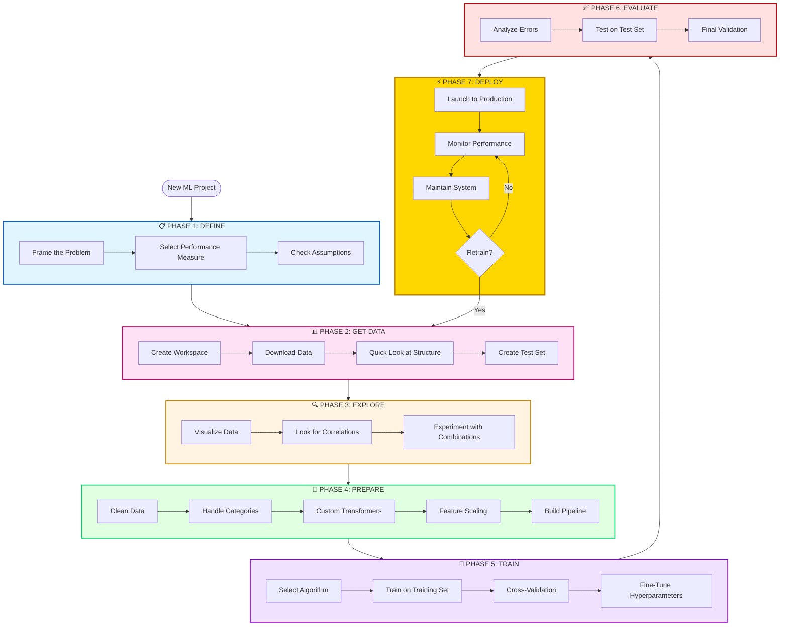

← [Previous: Chapter 2.3 – Model Training vs Execution](/codifyme/series/journey-automation-to-ai/chapter-2-3-training-vs-inference) | [Series Index](/codifyme/series/journey-automation-to-ai/) | Next: Chapter 3.1 – Common ML Algorithms (Coming Soon) →

---

## Putting It All Together

After spending weeks learning AI fundamentals, I kept asking: **"Okay, but how do I actually BUILD something?"**

In Series 0-2, I learned individual concepts:
- **Series 0:** Why this matters for automation engineers ([Chapter 0.1](chapter-0-1-why-automation-engineers-should-learn-ai))
- **Series 1:** What AI is ([1.1](chapter-1-1-what-is-ai-really)), how machines learn ([1.2](chapter-1-2-how-machines-learn)), ML types ([1.3](chapter-1-3-types-of-machine-learning))
- **Series 2:** Data quality ([2.1](chapter-2-1-data-quality-and-preparation)), features/labels ([2.2](chapter-2-2-features-labels-and-models)), training vs inference ([2.3](chapter-2-3-training-vs-inference))

But those chapters felt like **learning individual Terraform resources**—important, but scattered. I needed to see **the complete workflow** from problem → production.

This chapter is that workflow. It's my attempt to document the **end-to-end ML journey** I wish I had when starting. Each phase maps back to what we already learned, so you can see WHY we covered those topics.

**Automation analogy:**

```text
Series 0-2 = Learning what aws_instance, aws_vpc, variables, state files mean
Chapter 3.0 = Your first complete project: VPC → Subnet → EC2 → Deploy → Monitor
Series 3+ = Advanced patterns, modules, remote state, team workflows
```

**Confidence check:** The phase mappings below connect to previous chapters. If something doesn't make sense, it means either (a) I'm still learning that part, or (b) the reference is wrong—let me know!

---

## 1. The Seven Phases

Every ML journey follows this pattern:



**Automation analogy:** It's like your IaC workflow: Requirements → Design → Code → Test → Deploy → Monitor → Maintain.

---

## 2. The Detailed Steps

Here's the complete checklist. Keep this handy when starting your ML journey.

### Phase 1: Define the Problem

**Why this connects:** Remember [Chapter 1.1](chapter-1-1-what-is-ai-really) where we learned ML = pattern recognition in data? And [Chapter 1.3](chapter-1-3-types-of-machine-learning) where we saw supervised vs unsupervised learning? **This is where you decide which approach fits your problem.**

| Step | What | Why |
|------|------|-----|
| **1. Frame the problem** | Define what you're predicting and why ML helps | Is this supervised (predicting labels) or unsupervised (finding patterns)? See [1.3](chapter-1-3-types-of-machine-learning) |
| **2. Select metrics** | Decide how to measure success (accuracy, precision, recall) | Like defining SLAs for your platform (Will cover in Chapter 3.3) |
| **3. Check assumptions** | Verify you have data, features are available, problem is solvable | Do you have enough training examples? See [1.2](chapter-1-2-how-machines-learn) on learning from data |

**Example:** *Deployment Risk Prediction*
- Predict: High/Medium/Low risk before deployment
- Metrics: 90% precision (don't block safe deployments), 85% recall (catch risky ones)
- Assumptions: ✅ 10K past deployments, ✅ Features available pre-deployment

---

### Phase 2: Get the Data

**Why this connects:** [Chapter 2.1](chapter-2-1-data-quality-and-preparation) taught us **garbage in = garbage out**. Data quality matters MORE than fancy algorithms. **Here's where you apply that.**

| Step | What | Why |
|------|------|-----|
| **4. Create workspace** | Set up project structure (data/, models/, notebooks/) | Like organizing Terraform modules and environments |
| **5. Download data** | Pull from databases, APIs, logs | Like exporting current state |
| **6. Quick look** | Check size, types, missing values, balance | Apply [2.1](chapter-2-1-data-quality-and-preparation): completeness, accuracy, consistency |
| **7. Create test set** | Set aside 20% for final evaluation, LOCK IT AWAY | Simulates future data—see [2.3](chapter-2-3-training-vs-inference) on validation vs test sets |

**Critical:** Never touch the test set until the very end. It simulates future production data.

---

### Phase 3: Explore the Data

**Why this connects:** [Chapter 2.2](chapter-2-2-features-labels-and-models) explained **features = the inputs ML uses to learn**. Good features → better predictions. **This phase finds those good features.**

| Step | What | Why |
|------|------|-----|
| **8. Visualize** | Histograms, scatter plots, time series | Spot patterns and outliers |
| **9. Correlations** | Which features relate to the outcome? | Find predictive signals—remember [2.2](chapter-2-2-features-labels-and-models) on feature importance |
| **10. Feature combinations** | Create new features by combining existing ones | Feature engineering from [2.2](chapter-2-2-features-labels-and-models): `risk_score = failures × changes` |

**Findings shape preparation:** If `previous_failures` correlates 0.78 with risk, keep it. If `team` correlates 0.12, maybe drop it.

---

### Phase 4: Prepare the Data

**Foundation:** [Chapter 2.1 (Data Quality)](chapter-2-1-data-quality-and-preparation), [Chapter 2.2 (Features & Labels)](chapter-2-2-features-labels-and-models)

| Step | What | Why |
|------|------|-----|
| **11. Clean data** | Handle missing values (fill, drop, or indicate) | ML algorithms need complete data ([Chapter 2.1](chapter-2-1-data-quality-and-preparation)) |
| **12. Encode categories** | Convert text to numbers (one-hot, label encoding) | ML needs numeric inputs ([Chapter 2.2](chapter-2-2-features-labels-and-models)) |
| **13. Custom transformers** | Build reusable transformation components | Ensure same logic in training and production ([Chapter 2.3](chapter-2-3-training-vs-inference)) |
| **14. Feature scaling** | Normalize ranges (0-1 or mean=0, std=1) | Prevent large values from dominating |
| **15. Build pipeline** | Chain all transformations together | Reproducible and production-ready |

**Pipeline example:**
```python
pipeline = Pipeline([
    ('imputer', SimpleImputer()),      # Fill missing values
    ('scaler', StandardScaler()),      # Normalize
    ('encoder', OneHotEncoder())       # Encode categories
])
```

**Automation analogy:** Like a CI/CD pipeline—same steps, same order, every time.

---

### Phase 5: Train the Model

**Why this connects:** [Chapter 1.2](chapter-1-2-how-machines-learn) showed us **machines learn by adjusting parameters to minimize errors**. [Chapter 2.3](chapter-2-3-training-vs-inference) explained **training = build time**. **Now we actually train.**

| Step | What | Why |
|------|------|-----|
| **16. Select algorithm** | Decision Tree, Random Forest, etc. | Different algorithms for different problems (Will cover in Chapter 3.1) |
| **17. Train** | Fit model on training data | The "learning" from [1.2](chapter-1-2-how-machines-learn)—adjust weights to minimize error |
| **18. Cross-validate** | Test on 5 different splits | The validation strategy from [2.3](chapter-2-3-training-vs-inference)—prevents overfitting |
| **19. Fine-tune** | Grid/random search for best hyperparameters | Hyperparameter tuning from [2.3](chapter-2-3-training-vs-inference)—optimize learning |

**Quick start:** Begin with Decision Tree or Random Forest. They work well out-of-the-box.

---

### Phase 6: Evaluate

**Foundation:** [Chapter 2.3 (Training vs Inference)](chapter-2-3-training-vs-inference)

| Step | What | Why |
|------|------|-----|
| **20. Analyze errors** | Where does the model fail? | Identify improvement opportunities (Will cover in Chapter 3.2) |
| **21. Test set evaluation** | NOW test on locked-away test set (once!) | Honest estimate of production performance ([Chapter 2.3](chapter-2-3-training-vs-inference)) |

**Expected:** Test score should be within 2-3% of cross-validation score. If much worse, you overfit.

---

### Phase 7: Deploy and Monitor

**Foundation:** [Chapter 2.3 (Inference & Retraining)](chapter-2-3-training-vs-inference)

| Step | What | Why |
|------|------|-----|
| **22. Launch** | Save model, version it, deploy to production | Make predictions available ([Chapter 2.3](chapter-2-3-training-vs-inference)) |
| **23. Monitor** | Track accuracy, latency, prediction distribution | Catch degradation early ([Chapter 2.3](chapter-2-3-training-vs-inference)) |
| **24. Maintain** | Retrain when accuracy drops or data drifts | Keep model relevant ([Chapter 2.3](chapter-2-3-training-vs-inference)) |

**Monitoring triggers:**
- Accuracy < 85%? Retrain.
- 30 days since last train? Retrain.
- Data patterns changed? Retrain.

**Automation analogy:** Like GitOps—deploy, monitor CloudWatch/Datadog, update based on metrics.

---

## 3. Quick Reference Checklist

Print this and check off as you go:

**Define**
- [ ] Frame problem
- [ ] Select metrics  
- [ ] Verify assumptions

**Get Data**
- [ ] Create workspace
- [ ] Download data
- [ ] Quick structure review
- [ ] Create & lock test set

**Explore**
- [ ] Visualize distributions
- [ ] Calculate correlations
- [ ] Engineer feature combinations

**Prepare**
- [ ] Clean (missing values)
- [ ] Encode categories
- [ ] Scale features
- [ ] Build pipeline

**Train**
- [ ] Select algorithm
- [ ] Train on training set
- [ ] Cross-validate
- [ ] Fine-tune hyperparameters

**Evaluate**
- [ ] Analyze errors
- [ ] Test on test set (once!)

**Deploy**
- [ ] Launch to production
- [ ] Set up monitoring
- [ ] Schedule retraining

---

## 4. What's Next

The chapters ahead dive into specific steps:

- **Chapter 3.1:** Common algorithms (when to use Decision Trees vs Random Forest vs others)
- **Chapter 3.2:** Overfitting/underfitting (why models fail in prod)
- **Chapter 3.3:** Evaluation metrics (accuracy, precision, recall explained)

This workflow is your map. The upcoming chapters explore the terrain.

---

**Previous:** [Chapter 2.3 – Model Training vs Execution](/codifyme/series/journey-automation-to-ai/chapter-2-3-training-vs-inference) | **Next:** Chapter 3.1 – Common ML Algorithms (Coming Soon) | [Series Index](/codifyme/series/journey-automation-to-ai/)
