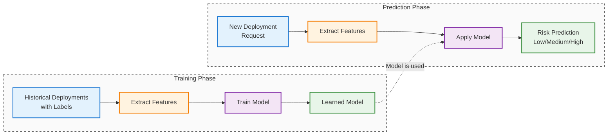
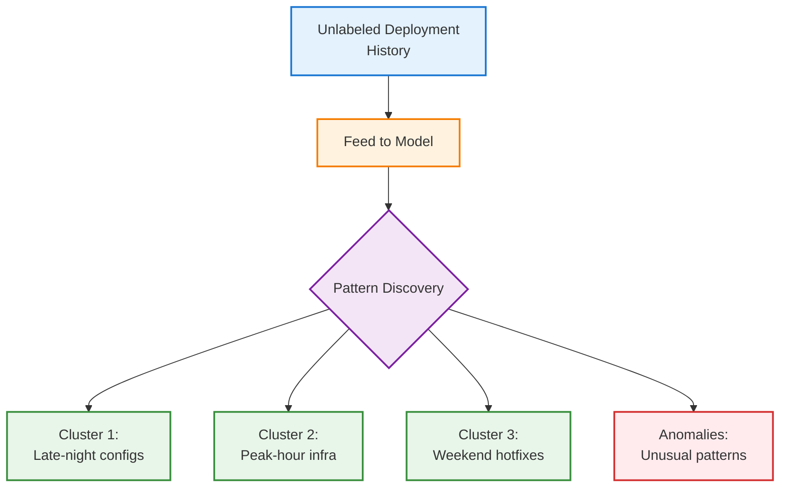
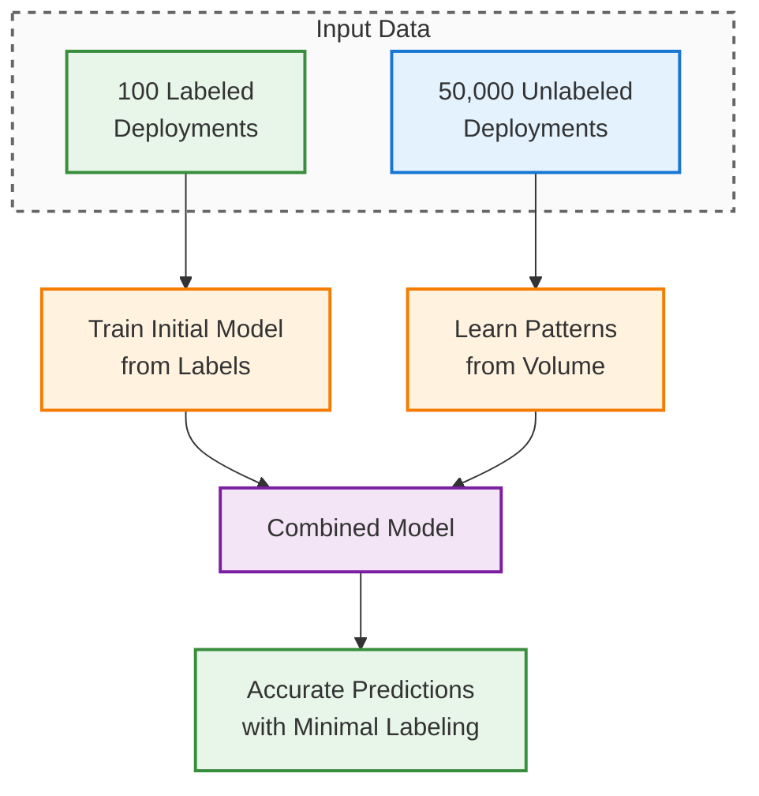
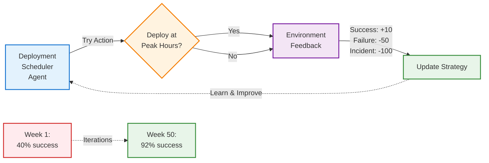

← [Previous: Chapter 1.2 - How Machines Learn](/codifyme/series/journey-automation-to-ai/chapter-1-2-how-machines-learn/) | [Series Index](/codifyme/series/journey-automation-to-ai/) | [Next: Chapter 2.1 - Data Quality and Preparation](/codifyme/series/journey-automation-to-ai/chapter-2-1-data-quality-and-preparation/) →

---

## Picking the Right Tool for Your Data

---

After understanding how machines learn from examples, the next question hit me: **which type of ML would I actually use for different problems?**

I kept seeing terms like supervised, unsupervised, reinforcement learning in every tutorial and article. At first, I thought these were just academic categories to memorize for completeness.

Then I started thinking about my deployment risk assessment example from earlier chapters.

**Do I have labeled data?** (Deployments marked as Success/Failure)
**Or just raw deployment logs?** (No labels, just patterns)

That question changed everything. **The ML type isn't about preference—it's determined by what data you have available.**

It reminded me of learning automation tools:
- Terraform for infrastructure? Makes sense.
- Terraform to restart a service? Technically possible, completely wrong tool.

**Same with ML types—pick based on your data and problem, not what sounds interesting.**

---

## 1. The Main Types (and Why They Confused Me)

When I started, I thought ML was just "ML." Turns out there are fundamentally different approaches based on **how they learn**:

1. **Supervised Learning** – You provide labeled examples (input + correct output)
2. **Unsupervised Learning** – System finds patterns in unlabeled data
3. **Semi-Supervised Learning** – Combines small labeled set with large unlabeled set
4. **Reinforcement Learning** – System learns through trial, error, and rewards

Let me walk through what each one actually means in practice.

---

## 2. Supervised Learning: When You Know the Right Answers

### How I Understood It

This was the easiest type for me to grasp because it maps directly to Terraform/Ansible thinking:

**Terraform/Ansible:**
- You define the **desired state** (what you want)
- System compares current vs desired
- Takes action to match

**Supervised Learning:**
- You provide **labeled examples** (inputs with correct answers)
- Model learns the pattern
- Applies that pattern to new data

Basically: **If you have historical data with known outcomes, supervised learning is your starting point.**

### How It Works

```text
Training Phase:
Input: Email text → Label: "Spam" or "Not Spam"
Input: Server metrics → Label: "Normal" or "Failing"

Prediction Phase:
New email → Model predicts: "Spam" or "Not Spam"
New metrics → Model predicts: "Normal" or "Failing"
```

**Conceptual workflow:**



### Common Supervised Learning Tasks

**Classification:**
- Predict a category or class
- Examples: Spam/not spam, incident severity (P1/P2/P3), normal/anomaly

**Regression:**
- Predict a numeric value
- Examples: Cost prediction, resource usage forecasting, time-to-failure estimation

### Real Use Cases

**Our Running Example: Deployment Risk Assessment**

**Supervised learning in action:**
- **Training data:** Historical deployments labeled by outcome (Success/Failure/Incident)
- **Features:** Change type, resource count, deployment time, files modified, environment
- **Labels:** Risk category (Low/Medium/High) or Success/Failure
- **Prediction:** New deployment request → Model predicts risk level

```text
Training Phase:
Deployment A: {infra, prod, 10 resources, peak hours} → High Risk (Failed)
Deployment B: {config, dev, 2 resources, off-hours} → Low Risk (Success)

Prediction Phase:
New deployment: {infra, prod, 8 resources, peak hours} → Predicted: High Risk (85% confidence)
```

**Other examples:**
- Email spam filtering (text → spam/not spam)
- Incident classification (metrics → P1/P2/P3 severity)

### When to Use It

Use supervised learning when:
- You have labeled historical data
- You know the correct answers for past examples
- You want to predict specific outcomes

**Automation parallel:** Like defining infrastructure as code—you know the desired end state.

---

## 4. Unsupervised Learning: When You Don't Have Labels

### What Clicked for Me

When I first read about unsupervised learning, I thought: **"Why would I use this? It doesn't even predict things."**

Then I thought about log analysis tools that automatically cluster errors:
- You don't tell them what error types exist
- They discover patterns and group similar logs
- Reveal issues **you didn't know to look for**

**That's when it clicked:** Sometimes the most valuable insights come from patterns you didn't know existed.

If I'm exploring deployment data and don't know what "risky patterns" look like yet, unsupervised learning could discover them for me.

### How It Works

```text
Input: Unlabeled data (no correct answers provided)
Process: Model finds patterns, groups, or anomalies
Output: Discovered structure or insights
```

**Conceptual workflow:**



### Common Unsupervised Learning Tasks

**Clustering:**
- Group similar data points together
- Examples: User segmentation, log event grouping, resource usage patterns

**Anomaly Detection and Novelty Detection:**
- Find unusual or rare data points
- Examples: Detecting system failures, security threats, unusual traffic patterns

**Visualization and Dimensionality Reduction:**
- Simplify complex data for visualization or processing
- Examples: Reducing hundreds of metrics to key indicators, visualizing high-dimensional data

**Association Rule Learning:**
- Discover relationships between data
- Examples: "Users who deploy microservices also use Kubernetes," resource co-occurrence patterns

### Real Use Cases

**Our Running Example: Deployment Risk Assessment**

**Unsupervised learning in action:**
- **Clustering:** Group deployments by natural patterns (not pre-labeled)
  - Discovers: "Late-night config changes," "Peak-hour infrastructure updates," "Weekend hotfixes"
  - Use: Identify risky deployment patterns you didn't know existed

- **Anomaly detection:** Feed normal deployment behavior (unlabeled)
  - Model learns what "normal" looks like
  - Flags: Unusual deployments that don't match any known pattern
  - Example: Deployment with resource count 10x higher than typical

**Other examples:**
- Log clustering (group similar error patterns without pre-defining categories)
- User behavior segmentation (discover "power users" vs "occasional users")

### When to Use It

Use unsupervised learning when:
- You don't have labeled data
- You want to discover hidden patterns
- You're exploring data for insights

**Automation parallel:** Like monitoring tools that auto-discover patterns vs. ones where you predefine all alerts.

---

## 5. Semi-Supervised Learning: The Practical Compromise

### The Scenario That Made This Click

When learning about this, I thought through a realistic scenario: **What if I had 50,000 deployment records and needed to classify them?**

**Option 1:** Label all 50,000 manually → Would take weeks
**Option 2:** Use unsupervised → Wouldn't give me specific risk predictions
**Option 3:** Semi-supervised → Label 100, let ML learn from all 50,000

Semi-supervised suddenly made perfect sense. It's like infrastructure discovery tools where:
- You label a few key resources manually
- System learns from your labels
- Auto-labels the rest based on patterns
- You correct mistakes as needed

**Translation: Get supervised learning predictions without the labeling nightmare.**

### How It Works

```text
Input: Small amount of labeled data + Large amount of unlabeled data
Process: Model learns from labeled examples, applies to unlabeled data
Output: Predictions leveraging both labeled patterns and unlabeled volume
```

**Conceptual workflow:**



### Why It Matters

Labeling data is expensive and time-consuming:
- Manually classifying thousands of incidents? Weeks of work.
- Labeling 100 examples? A few hours.

Semi-supervised learning lets you:
- Label a small subset manually
- Train on millions of unlabeled examples
- Get accuracy close to fully supervised approaches

### Real Use Cases

**Our Running Example: Deployment Risk Assessment**

**Semi-supervised learning in action:**
- **Small labeled set:** Manually review and label 100 critical deployments (High/Medium/Low risk)
- **Large unlabeled set:** 50,000+ historical deployment records (unlabeled)
- **Model learns from both:** Patterns from labeled examples + volume from unlabeled data
- **Result:** Accurate risk predictions without labeling 50,000 deployments manually

```text
Labeled: 100 deployments (manual review)
Unlabeled: 50,000 deployments (raw data)
→ Model achieves 85% accuracy vs 90% if all 50,100 were labeled
```

**Savings:** Weeks of manual labeling → Few hours

**Other examples:**
- Incident categorization (label 50 incidents, learn from 10,000)
- Security threat detection (label known attacks, learn from massive traffic volume)

### When to Use It

Use semi-supervised learning when:
- Labeling all data is too expensive or slow
- You have some labeled examples
- You have lots of unlabeled data available

**Automation parallel:** Like tagging resources—manually tag a few, auto-tag the rest based on patterns.

---

## 6. Reinforcement Learning: Still Wrapping My Head Around This

### Why This One Is Different

Full transparency: This is the one I understand least. It's more complex and the use cases feel more specialized.

The concept makes sense when I think of auto-scaling:
- System tries scaling up/down
- Observes impact (latency, costs)
- Learns optimal strategy over time

Reinforcement learning works through **trial, error, and feedback**—the system experiments to find what works.

**My understanding so far:** This is for dynamic optimization problems where the system can safely experiment. Not where I'd start learning.

### How It Works

```text
1. Agent takes action in environment
2. Receives reward (positive) or penalty (negative)
3. Learns which actions lead to better outcomes
4. Adjusts strategy over time
```

**Conceptual workflow:**



### Real Use Cases

**Our Running Example: Deployment Risk Assessment**

**Reinforcement learning in action:**
- **Agent:** Automated deployment scheduler
- **Actions:** Choose deployment time, approval routing, resource allocation strategy
- **Feedback (Reward/Penalty):**
  - Success → +10 points
  - Failure → -50 points
  - Rollback → -30 points
  - Peak hours incident → -100 points
- **Learning:** Over thousands of deployments, system learns optimal strategies
  - When to auto-approve vs require review
  - Best deployment windows for different change types
  - Resource allocation patterns that minimize failures

```text
Week 1: Random decisions → 40% success rate
Week 10: Learned patterns → 75% success rate
Week 50: Optimized strategy → 92% success rate
```

**Other examples:**
- Auto-scaling optimization (try strategies, measure cost+performance)
- Traffic routing (experiment with routes, minimize latency)

### When to Use It

Use reinforcement learning when:
- Decisions happen sequentially over time
- There's clear feedback (reward/penalty)
- The system can learn from experimentation

**Automation parallel:** Like chaos engineering—system learns resilience through controlled failure.

---

## 7. Comparison: Supervised vs Unsupervised vs Semi-Supervised vs Reinforcement

| Aspect | Supervised | Unsupervised | Semi-Supervised | Reinforcement |
|--------|-----------|-------------|-----------------|---------------|
| **Training Data** | All labeled | All unlabeled | Small labeled + Large unlabeled | Environment feedback |
| **Goal** | Predict specific output | Discover patterns | Predict with limited labels | Maximize reward |
| **Deployment Example** | Predict risk from labeled history | Cluster deployment patterns | Label 100, learn from 50k | Learn optimal deployment strategy |
| **Automation Analogy** | IaC (known state) | Discovery tools | Auto-tagging resources | Self-tuning systems |

---

## 7. Other Ways to Categorize ML

Beyond supervision type, ML systems are also categorized by:

### Online vs Batch Learning

**Batch Learning:**
- Train on full dataset at once
- Model is fixed until next retraining
- Like rebuilding infrastructure from scratch

**Online Learning:**
- Learns incrementally as new data arrives
- Model updates continuously
- Like applying incremental updates to infrastructure

### Instance-Based vs Model-Based

**Instance-Based:**
- Compares new data to stored examples
- No real "model" built
- Like pattern matching in logs

**Model-Based:**
- Builds a generalized model from training data
- Applies model to new data
- Like creating predictive rules

---

## 9. How I Think About Choosing Now

**For deployment risk assessment, here's how I'd approach the decision:**

**I'd use Supervised Learning when:**
- I have historical deployments with known outcomes (Success/Failure)
- Goal: Predict if a new deployment will be risky
- Requirement: Need labeled historical data

**I'd use Unsupervised Learning when:**
- I'm exploring: What deployment patterns exist that I haven't noticed?
- Goal: Discover hidden risk factors I don't know about yet
- Situation: Have deployment data but no labels

**I'd use Semi-Supervised Learning when:**
- Scenario: Have 50,000 deployments, can only label 100 manually
- Goal: Get accurate predictions without weeks of labeling
- Trade-off: Slightly lower accuracy than fully supervised, but practical

**I'd use Reinforcement Learning when:**
- The system can safely experiment with different strategies
- Clear success/failure feedback exists
- Goal: Optimize over time through learning
- **Reality check:** This seems advanced. Would start with simpler approaches first.

**My current understanding:** Start with supervised if you have labels. Use unsupervised for exploration. Semi-supervised when labeling is expensive. Save RL for later.

---

## 10. Pitfalls I'm Watching Out For

**Pitfall 1: Using ML when a simple rule would work**
- **The trap:** Building a supervised learning model to flag deployments with >100 resources
- **Better approach:** Just write: `if resources > 100: flag = True`
- **Lesson I'm learning:** If you can write a rule, write a rule. Don't overcomplicate.

**Pitfall 2: Expecting unsupervised learning to predict specific outcomes**
- **The confusion:** Thinking clustering will classify incident severity
- **The reality:** Clustering groups similar things, doesn't predict labels
- **What I understand now:** Need supervised learning for classification. Unsupervised discovers patterns.

**Pitfall 3: Starting with reinforcement learning**
- **The temptation:** Jumping straight to RL because it sounds advanced
- **The problem:** Most complex approach, needs experimentation infrastructure
- **My plan:** Master supervised/unsupervised first. RL comes later.

---

## 11. What I Wish I Knew Earlier

- **Supervised:** If you have labeled data, start here. Predict outcomes from examples.
- **Unsupervised:** If you don't have labels, use this. Discover patterns you didn't know existed.
- **Semi-Supervised:** If you have some labels but not enough, this saves massive time.
- **Reinforcement:** Complex, experimental, requires feedback loops. Save for later.
- **The choice isn't about what sounds cool—it's about what data you have.**
- **Don't use ML when a simple rule works.** I learned this the hard way.

---

## What's Next?

We'll demystify what happens during training, how models learn, and what "parameters" and "hyperparameters" actually mean—using automation analogies.

---

**Previous:** [Chapter 1.2 – How Machines Learn](/codifyme/series/journey-automation-to-ai/chapter-1-2-how-machines-learn/) | **Next:** [Chapter 2.1 – Data Quality and Preparation](/codifyme/series/journey-automation-to-ai/chapter-2-1-data-quality-and-preparation/) | [Series Index](/codifyme/series/journey-automation-to-ai/)

