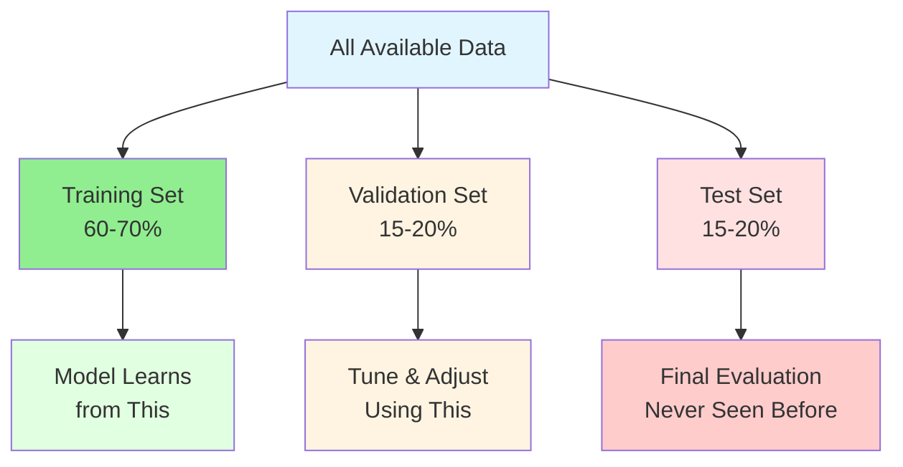

## Chapter 2.1 – Data: The New Configuration File

← [Previous: Chapter 1.3 - Types of Machine Learning](/codifyme/series/journey-automation-to-ai/chapter-1-3-types-of-machine-learning/) | [Series Index](/codifyme/series/journey-automation-to-ai/) | [Next: Chapter 2.2 - Features, Labels, and Models](/codifyme/series/journey-automation-to-ai/chapter-2-2-features-labels-and-models/) →

---

You understand ML types—supervised needs labels, unsupervised finds patterns, and so on.

Now the reality check: **What if the data is bad?**

In automation:
- Bad config = broken infrastructure
- Wrong variables = failed deployments  
- Incomplete state = drift

In ML, the problem is worse. Bad data doesn't just break the system—it teaches the model to make wrong predictions confidently.

In machine learning, the same principle applies:

> **Bad data = bad model**

No matter how sophisticated your algorithm, no matter how powerful your neural network—if your data is garbage, your model will be garbage.

This chapter explores data from a practitioner's perspective: quality, preparation, splits, and features.

---

## 1. Why This Matters

Before you can build any ML model, you need data. But not just any data—you need:

- **Quality data** that accurately represents your problem
- **Sufficient data** to learn meaningful patterns
- **Balanced data** that isn't biased toward one outcome
- **Relevant features** that actually predict what you care about

Think of it this way:

In automation, you can write perfect Terraform code, but if your variable files are wrong, your infrastructure will be wrong.

In ML, you can choose perfect algorithms, but if your training data is wrong, your predictions will be wrong.

**The difference:** Bad Terraform variables fail immediately. Bad ML data succeeds in training but fails silently in production.

That's why understanding data is critical—it's the foundation everything else builds on.

### The Unreasonable Effectiveness of Data

In 2009, Google researchers (including Peter Norvig, Director of Research) published findings showing that **for many complex problems, more data with simpler algorithms often outperforms less data with sophisticated algorithms.**

Their key insight:

> "Choose a representation that can use unsupervised learning on unlabeled data, which is so much more plentiful than labeled data."

**What this means for practitioners:**

Instead of searching for the "perfect algorithm," focus on:
- Getting more quality data
- Cleaning and preparing data properly
- Understanding what your data actually represents

**Automation parallel:**

It's like infrastructure scaling:
- 1,000 well-configured servers > 100 over-optimized servers
- 10,000 quality deployment examples > 1,000 examples with fancy analysis

Data is your leverage. Get it right first.

---

## 2. Data: The New Configuration File

### For Automation Engineers

When you write Terraform or Ansible, you work with:

```hcl
# Terraform variables
variable "instance_type" {
  type    = string
  default = "t3.medium"
}

variable "environment" {
  type    = string
  validation {
    condition     = contains(["dev", "staging", "prod"], var.environment)
    error_message = "Invalid environment"
  }
}
```

These variables **define the inputs** to your automation logic.

### For Machine Learning

In ML, data serves the same purpose:

| Automation Concept | ML Equivalent | Purpose |
|-------------------|---------------|---------|
| Configuration file | Training dataset | Defines what the system should learn |
| Variable validation | Data quality checks | Ensures inputs are valid |
| State file | Model weights | Captures learned patterns |
| Outputs | Predictions | What the system produces |

**Key insight:** Just as you validate Terraform variables, you must validate training data.

---

## 3. The Garbage In, Garbage Out Principle

### Automation Analogy

Imagine running:

```bash
terraform apply -var="instance_type=invalid_type"
```

Result: **Deployment fails**

The failure is immediate and obvious. You fix the variable and try again.

### Machine Learning Reality

Now imagine training an ML model with:
- Mislabeled data
- Missing values
- Biased samples
- Inconsistent formats

Result: **Model succeeds in training** ✓ (no errors)  
But: **Model fails in production** ✗ (wrong predictions)

**The danger:** Bad data doesn't cause training to fail. It causes your model to learn the wrong patterns.

### Real Example: Deployment Risk Assessment

Recall our running example from Chapter 1.2:

**Goal:** Predict deployment risk (High/Medium/Low)

**What if your training data has problems?**

| Data Issue | Impact on Model |
|-----------|-----------------|
| All "High risk" deployments labeled as "Low risk" | Model learns backwards—predicts safe when dangerous |
| Missing "time of day" for night deployments | Model never learns that 3 AM deployments are riskier |
| Only includes successful deployments | Model can't recognize failure patterns |
| Biased toward one team's deployments | Model performs poorly for other teams |

Each of these issues creates a model that **appears to work** but makes **dangerous predictions** in production.

---

## 4. Data Quality: The Checklist

Before training any model, ask these questions (adapted from automation best practices):

### 1. **Completeness**

Is all required data present?

```python
# Automation mindset
required_vars = ["instance_type", "vpc_id", "subnet_id"]
missing = [v for v in required_vars if v not in config]

# ML mindset
required_features = ["deployment_size", "time_of_day", "change_count"]
missing = df[required_features].isnull().sum()
```

**For deployment risk:**
- Do all deployments have timestamp?
- Do all have team information?
- Do all have outcome (success/failure)?

### 2. **Accuracy**

Is the data correct?

**Automation example:**  
Instance type "t3.mediam" (typo) → deployment fails immediately

**ML example:**  
Deployment labeled "High risk" but actually succeeded → model learns wrong pattern

**For deployment risk:**
- Are risk labels verified?
- Are timestamps in correct timezone?
- Are failure reasons accurately recorded?

### 3. **Consistency**

Is the data formatted uniformly?

| Inconsistent Data | Problem |
|------------------|---------|
| Team names: "DevOps", "devops", "Dev-Ops" | Model treats as 3 different teams |
| Timestamps: UTC vs local time | Time-based patterns break |
| Risk levels: "HIGH" vs "high" vs "H" | Labels don't match |

**Solution:** Normalize before training (like normalizing Terraform variable names)

### 4. **Relevance**

Does the data actually predict what you care about?

**Automation example:**  
Checking instance color doesn't tell you if deployment will succeed

**ML example:**  
Developer's favorite coffee ☕ doesn't predict deployment risk

**For deployment risk:**  
Include: deployment size, time, change count, environment  
Exclude: developer name, commit message length, office location

### 5. **Timeliness**

Is the data recent and representative?

**Problem:** Training on 2-year-old deployment data  
**Reality:** Your infrastructure, processes, and teams have changed

**Solution:** Use recent data and retrain periodically (we'll cover this in MLOps series)

### 6. **Representativeness**

Does the training data represent the real-world cases you'll encounter?

**Critical principle:** In order to generalize well, your training data must be representative of the new cases you want to predict.

**Automation example:**  
Testing deployments only during business hours  
**Reality:** Production deployments happen 24/7, including weekends

**ML example:**  
Training deployment risk model only on small deployments (< 50 files)  
**Reality:** Production includes large deployments (500+ files)

**For deployment risk:**

| Training Data | Real World | Problem |
|--------------|------------|---------|
| Only weekday deployments | Weekend deployments happen | Model has never seen weekend patterns |
| Only one cloud region | Multi-region deployments | Different regions have different behaviors |
| Only successful deployments | Need to predict failures | Model can't recognize failure patterns |
| Only Team A's deployments | All teams deploy | Model biased toward Team A's practices |

**Solution:** Ensure training data covers:
- All time periods (weekday, weekend, day, night)
- All environments (dev, staging, prod)
- All teams and regions
- Both successes AND failures
- Full range of deployment sizes

**Warning:** This is different from bias. Representativeness is about **coverage** of real-world scenarios. Even unbiased data can be non-representative if it doesn't cover the variety of cases you'll see in production.

---

## 5. Data Preparation: The Pipeline

Just as you have CI/CD pipelines for code, you need data pipelines for ML.


### Step 1: Cleaning

Remove or fix problematic data:

```python
# Remove duplicates
df = df.drop_duplicates()

# Handle missing values
df['deployment_size'].fillna(df['deployment_size'].median(), inplace=True)

# Remove outliers (deployments > 10,000 files likely errors)
df = df[df['files_changed'] < 10000]
```

**Automation parallel:** Removing invalid configuration entries

### Step 2: Validation

Ensure data meets quality standards:

```python
# Check for required fields
assert df['timestamp'].notnull().all(), "Missing timestamps"

# Validate ranges
assert (df['risk_level'].isin(['High', 'Medium', 'Low'])).all()

# Check distribution (avoid extreme bias)
print(df['risk_level'].value_counts())
```

**Automation parallel:** `terraform validate` before apply

### Step 3: Transformation

Convert data to usable formats:

```python
# Convert timestamps to features
df['hour'] = df['timestamp'].dt.hour
df['day_of_week'] = df['timestamp'].dt.dayofweek
df['is_weekend'] = df['day_of_week'].isin([5, 6])

# Encode categorical variables
df['environment_encoded'] = df['environment'].map({
    'dev': 0, 'staging': 1, 'prod': 2
})
```

**Automation parallel:** Converting YAML to JSON for API consumption

### Step 4: Feature Engineering

Create new features from existing data (we'll dive deeper into this in a moment):

```python
# Create composite features
df['deployment_velocity'] = df['files_changed'] / df['deployment_duration']
df['risk_score'] = df['files_changed'] * df['is_prod'] * df['is_weekend']
```

**Automation parallel:** Creating derived Terraform locals from variables

---

## 6. Feature Engineering: Creating Better Inputs

**Feature engineering** is the process of transforming raw data into features (inputs) that better represent the problem.

### Why It Matters

Going back to our Terraform analogy:

```hcl
# Raw inputs
variable "instance_count" { default = 5 }
variable "instance_type" { default = "t3.medium" }

# Derived values (locals)
locals {
  total_vcpus = var.instance_count * lookup(local.instance_vcpu_map, var.instance_type)
  estimated_cost = local.total_vcpus * var.hourly_rate
}
```

The `estimated_cost` is more useful for decision-making than raw inputs.

### ML Feature Engineering Example

**Raw features:**
- `files_changed`: 150
- `hour`: 14
- `day_of_week`: 2

**Engineered features:**
- `deployment_size_category`: "Large" (if > 100 files)
- `is_business_hours`: True (if 9 AM - 5 PM)
- `is_risky_time`: False (if weekend OR after-hours)

The engineered features make patterns easier for the model to learn.

### For Deployment Risk Assessment

| Raw Data | Engineered Feature | Why It Helps |
|----------|-------------------|--------------|
| `files_changed: 200` | `is_large_deployment: True` | Simplifies threshold learning |
| `timestamp: 2026-01-07 03:00` | `is_late_night: True` | Captures risk pattern directly |
| `previous_failures: [3, 0, 1, 2]` | `failure_rate: 0.25` | Aggregates history |
| `team: "Platform"` | `team_experience_score: 0.9` | Incorporates team reliability |

**Key principle:** Help the model by giving it features that directly relate to the problem.

---

## Data Splits: Training, Validation, and Test

When you develop automation code, you test in multiple environments:

```text
Dev → Staging → Production
```

In ML, you split your data into three sets:

```text
Training → Validation → Test
```

### The Three Splits Explained



### Training Set (60-70%)

**Purpose:** The data the model learns from

**Automation analogy:** Your dev environment where you experiment and iterate

**For deployment risk:**  
Use 70% of historical deployments to train the model on patterns

### Validation Set (15-20%)

**Purpose:** Tune the model and check performance during development

**Automation analogy:** Staging environment where you verify before production

**For deployment risk:**  
Use 15% of deployments to validate the model isn't overfitting (we'll cover this in Chapter 3.2)

**Important:** You can look at validation results and adjust your model based on them

### Test Set (15-20%)

**Purpose:** Final evaluation on completely unseen data

**Automation analogy:** Production deployment—the real test

**For deployment risk:**  
Use 15% of deployments as a final check before deploying the model

**Critical rule:** Never look at test data during development. Only use it once at the very end.

### Why This Matters

**Bad practice:**
```python
# Train on ALL data
model.fit(all_data)

# Test on same data
accuracy = model.score(all_data)  # 99% accurate! 🎉
```

**Problem:** The model memorized the data, not learned patterns  
**Result:** Fails on new deployments

**Good practice:**
```python
# Split data
train, val, test = split_data(all_data, [0.7, 0.15, 0.15])

# Train on training set
model.fit(train)

# Tune using validation set
model.adjust_based_on(val)

# Final test on unseen data
final_accuracy = model.score(test)  # 85% (realistic)
```

---

## Data Bias: The Hidden Danger

Bias in data is like bias in configuration—it leads to inconsistent and unfair outcomes.

### Types of Bias

#### 1. **Sample Bias**

**Definition:** Your training data doesn't represent reality

**Automation example:**  
Testing only on `t3.medium` instances, then deploying to `t3.large`—things break

**ML example:**  
Training deployment risk model only on Platform team's deployments  
**Result:** Model performs poorly for other teams

#### 2. **Historical Bias**

**Definition:** Past decisions were biased, and model learns those biases

**Example:**  
- Historical data: "All deployments by Team X flagged as High Risk"
- Reason: Team X was new and had early failures
- Model learns: "Team X = High Risk" even though team improved

**Solution:** Use recent data, weight recent examples more heavily

#### 3. **Measurement Bias**

**Definition:** How you measure/label data introduces bias

**Example:**  
- "High risk" defined by one person's judgment
- Different people have different risk tolerance
- Model learns inconsistent labels

**Solution:** Standardize labeling process, use objective criteria

### Detecting Bias

Check your data distribution:

```python
# Check distribution across teams
print(df.groupby('team')['risk_level'].value_counts())

# Output might show:
# Team A: 80% Low Risk, 15% Medium, 5% High
# Team B: 30% Low Risk, 30% Medium, 40% High  ← Biased!
```

If one group is disproportionately labeled as risky, investigate why.

---

## Practical Guidelines for Data Preparation

Based on automation engineering principles:

### 1. **Automate Data Validation**

```python
def validate_deployment_data(df):
    """
    Validate deployment data quality
    Like 'terraform validate' but for ML data
    """
    checks = {
        'no_missing_timestamps': df['timestamp'].notnull().all(),
        'valid_risk_levels': df['risk_level'].isin(['High', 'Medium', 'Low']).all(),
        'reasonable_file_counts': (df['files_changed'] > 0).all() & (df['files_changed'] < 10000).all(),
        'recent_data': (df['timestamp'] > '2024-01-01').all()
    }
    
    failed = [k for k, v in checks.items() if not v]
    if failed:
        raise ValueError(f"Data validation failed: {failed}")
    
    return True
```

### 2. **Version Your Data**

Just like you version Terraform state:

```bash
data/
  ├── v1.0/
  │   └── deployment_history.csv
  ├── v1.1/
  │   └── deployment_history.csv  # Added new features
  └── v2.0/
      └── deployment_history.csv  # Changed labeling criteria
```

Track what changed between versions (we'll cover this more in MLOps series)

### 3. **Document Data Provenance**

Create a data README:

```markdown
# Deployment Risk Dataset v2.0

## Source
- Extracted from: JIRA, Jenkins, GitLab
- Date range: 2024-01-01 to 2026-01-07
- Total deployments: 5,432

## Features
- `deployment_id`: Unique identifier
- `timestamp`: Deployment start time (UTC)
- `files_changed`: Number of files modified
- `risk_level`: High/Medium/Low (labeled by SRE team)

## Known Issues
- Missing data for deployments before 2024-01-01
- Team names not standardized until v2.0

## Last Updated
2026-01-07
```

### 4. **Monitor Data Quality Over Time**

```python
def monitor_data_drift(current_data, reference_data):
    """
    Check if new data distribution matches training data
    Like monitoring drift in Terraform state
    """
    metrics = {
        'avg_files_changed': current_data['files_changed'].mean(),
        'risk_distribution': current_data['risk_level'].value_counts(),
        'deployment_frequency': len(current_data) / days_span
    }
    
    # Compare with reference
    # Alert if significant drift detected
```

---

## Key Takeaways

1. **Data is configuration for ML**  
   Bad data = bad model, just like bad variables = broken infrastructure

2. **Quality matters more than quantity**  
   1,000 high-quality labeled deployments > 10,000 messy ones

3. **Data preparation is not optional**  
   It's the foundation—skip it and your model will fail

4. **Use train/validation/test splits**  
   Like dev/staging/prod environments for code

5. **Feature engineering amplifies signal**  
   Help your model by creating meaningful features

6. **Watch for bias**  
   Biased data leads to biased models

7. **Automate and version everything**  
   Treat data pipeline like infrastructure code

---

## Connecting to Automation

| Automation Practice | ML Equivalent |
|---------------------|---------------|
| Variable validation | Data quality checks |
| Terraform locals | Feature engineering |
| State file versioning | Data versioning |
| Dev/Staging/Prod | Train/Val/Test splits |
| Monitoring drift | Data drift detection |
| Configuration as code | Data pipeline as code |

---

## What's Next

In **Chapter 2.2**, we'll explore:
- Features, labels, and models in detail
- How to choose the right features
- The relationship between inputs, logic, and outputs
- Building our first conceptual model for deployment risk

We've prepared the data—now we'll use it to build something that learns.

---

**Previous:** [Chapter 1.3 – Types of Machine Learning](/codifyme/series/journey-automation-to-ai/chapter-1-3-types-of-machine-learning) | **Next:** [Chapter 2.2 – Features, Labels, and Models](/codifyme/series/journey-automation-to-ai/chapter-2-2-features-labels-and-models/) | [Series Index](/codifyme/series/journey-automation-to-ai/)
