# 🕹️ Terraform Import: Bringing Resources Under Control 

In the previous post **<a href="{{ 'series/terraform-import-and-refactoring/2-getting-started-with-import/' | relative_url }}" target="_blank">🔰 Getting Started with Terraform Import</a>**, we explored how ABC Corp tackled the challenges of managing cloud infrastructure by leveraging Terraform Import. We discussed the importance of bringing unmanaged resources under Infrastructure-as-Code (IaC) control and refactoring Terraform configurations for scalability. The post outlined ABC Corp's environment, the challenges they faced (like configuration drift and manual operations), and the prerequisites for getting started with Terraform Import.

We also introduced a systematic workflow for importing resources, integrating automation, and aligning infrastructure with GitOps principles. This sets the stage for this post, where we’ll dive into a **hands-on example** of importing AWS EC2 instances into Terraform. By following this guide, you’ll learn how to transition manually provisioned resources into Terraform-managed infrastructure, enabling better control, scalability, and collaboration.

Before diving into the example, ensure you have reviewed the prerequisites outlined in the previous blog post. If not, refer to for detailed guidance. **<a href="{{ 'series/terraform-import-and-refactoring/2-getting-started-with-import/' | relative_url }}" target="_blank">🔰 Getting Started with Terraform Import</a>**

---

## 🎯 Objective

This guide demonstrates how to transition manually provisioned AWS resources into Terraform-managed infrastructure. It provides a step-by-step process to help you integrate existing resources into Terraform and manage them effectively using Infrastructure as Code (IaC) practices.

---

## 📝 Scenario

Imagine you are managing an application say **codifyme** that was initially deployed with manually provisioned AWS resources. Your infrastructure team has recently adopted DevOps practices and IaC for managing infrastructure. Each application now has a dedicated Terraform workspace, folder, and state file. However, some resources, like your EC2 instance, were created before this transition and are still managed manually.

To align with the new DevOps workflow, you decide to bring these manually managed resources under Terraform's control. This involves importing the resources into Terraform state and converting their configuration into `.tf` files for future management.

---

## 💡 Considerations

1.  **☁️ Cloud Provider**: AWS is the cloud platform used in this example.
2.  **🚀 Terraform Enterprise (TFE)**: A workspace and repository are already set up to manage the imported EC2 resources.
3.  **🖥️ Existing Terraform-Managed VM**: The state of the existing VM is managed by the TFE workspace, with its configuration hosted in an Azure DevOps (ADO) repository. This example mimics a scenario where you already have Terraform-managed resources and want to integrate newly discovered or imported resources into the same state management.

---

## ✅ Expected Outcomes

By following this guide, you will achieve the following:

-   ✅ Import an AWS EC2 instance into Terraform state.
-   ✅ Generate a clean and reusable `.tf` configuration file (`flat.tf`) for the imported instance.
-   ✅ Store the EC2 instance's state in a centralized TFE workspace for better collaboration and management.
-   ✅ Enable lifecycle management of the EC2 instance using Terraform, ensuring it aligns with your organization's IaC practices.

---

## 🛠️ Key Tools and Codebase

1.  **🏷️ Tagging Script**: A custom PowerShell script is used to add tags to existing EC2 instances. These tags help identify and filter the instances to be imported.
2.  **📦 Import Script**: A custom Python script or the Terraformer tool is utilized to import AWS resources into Terraform. This script generates Terraform import blocks, cleans up unnecessary parameters, and ensures the configuration is ready for use.

You can access the codebase and scripts from the following GitHub repository:

**<a href="https://github.com/ravijoshi1810/terraform-import-and-refactor.git" target="_blank">📂 terraform-import-and-refactor</a>**

This setup ensures a streamlined process for importing resources and managing them effectively using Terraform.

---

## 🧑‍💻 Hands-On Process

### 1. 📂 Create a New Folder for the Example EC2 VMs

on your local machine, create a new folder for the example EC2 VM. This folder will contain all the necessary files and scripts for the import process.

```bash
mkdir terraform-import-and-refactor
cd terraform-import-and-refactor
```

### 2.  📂 Clone the Tagging Script Repository
Download or clone the GitHub repository containing the tagging script. This script helps add tags to the instances you want to import.

```bash
git clone https://github.com/ravijoshi1810/terraform-import-and-refactor.git
cd aws_resource_tag.v2
```

### 3. 📝 Add Instance IDs
- 📝 Add the instance IDs to the `ec2_instances_ids.txt` file (input file) and save it.

  ```txt
  # Example file content

  i-00669cc8d4e53cb02  # codifyme-web-1
  i-02b68140b57cbb812  # codifyme-web-2
  ```


  `note:` create the file if not already available.


### 4. 🏷️ Run the Tagging Script

-   🔑 Paste the admin credentials for PowerShell from the AWS Console into the terminal.

-   🚀 Run the following command:

    ```PowerShell
    cd aws_resource_tag.v2

    .\aws_tag_main.ps1 -TagEC2
    ```

-   ✅ Verify that the tags were added by checking the `tagged_instances.csv` (output file).

    ```console
    C:\terraform-import-and-refactor\aws_resource_tag.v2> cat .\tagged_instances.csv
    AWS Account ID,Instance ID,Name,State,Tag
    847066372451,i-00669cc8d4e53cb02,codifyme-web-1,running,IACImported=No
    847066372451,i-02b68140b57cbb812,codifyme-web-2,running,IACImported=No
    ```

    This will assure even if your organization is not managing the required tags, you can still import the resources using the tagging script.

    If you get an error while running the script, make sure you have the required permissions to run the script. You can check the permissions by running the following command:

    ```PowerShell
    # 🔍 This will show you the current execution policy for each scope.
    Get-ExecutionPolicy -List

    ## 🛠️ If the execution policy is set to "Restricted" for the current user or process, you can change it to "Bypass" or "RemoteSigned" temporarily for the current session.
    ## 💡 This will allow you to run scripts in the current session without changing the execution policy permanently.

    Set-ExecutionPolicy -Scope Process -ExecutionPolicy Bypass
    ```

### 5. 🐍 Download the Python Script

⬇️ Download the Python script into the example folder and open it in VS Code.

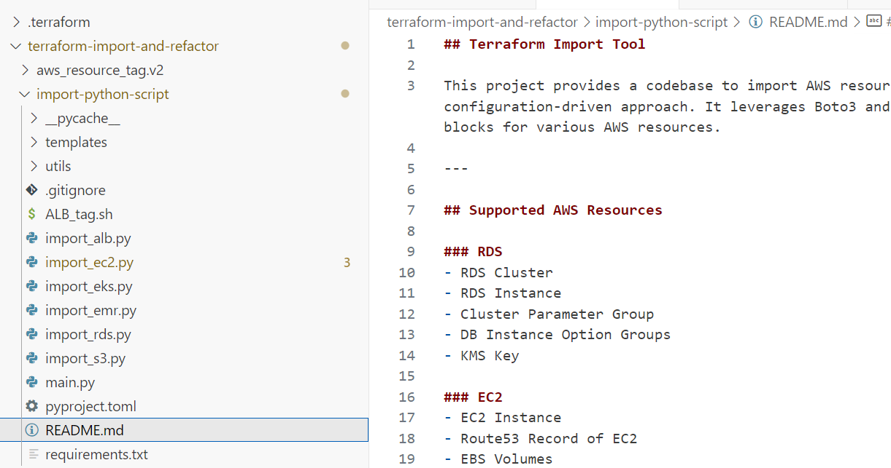

### 6. 🚀 Run the Custom Python Script

🚀 Run the script using the following command:

```bash
python3 main.py --resource ec2 --local-repo-path ../terraform-import-example/imported-ec2 --region us-east-1  --hosted-zone-name 2334356634.eu-west-1.abc.corp --tag IACImported no
```

#### 💡 What Happens Behind the Scenes When You Run the Script?

-   📄 The script generates a file named `import_codifyme-web-1` in the specified directory. This file contains the import blocks for the resources.

    ```hcl
    import {
        to = aws_instance.codifyme-web-1
        id = "i-028015c8ff2e485f1"
    }

    import {
        to = aws_ebs_volume.vol-0765af5e7f98e4ff2
        id = "vol-0765af5e7f98e4ff2"
    }

    import {
         to = aws_instance.codifyme-web-2
         id = "i-0a1b2c3d4e5f6g7h8"
    }

    import {
         to = aws_ebs_volume.vol-1234567890abcdef0
         id = "vol-1234567890abcdef0"
    }
    ```

-   📄 It also generates a file named `generated-plan-import-ec2Name.tf`, which contains the Terraform configuration for the resources.

    ```hcl
    resource "aws_instance" "codifyme-web-1" {
        ami             = "ami-0c55b159cbfafe1f0"
        instance_type = "t2.micro"
        tags = {
            Name = "codifyme-web-1"
        }
    }
    ```

-   🧹 The script cleans up unnecessary resources and parameters from the configuration file.
    -   🧹 Removes global patterns.
    -   🧹 Processes resource-specific blocks.
    -   🧹 Removes multiline patterns.
    -   🧹 Cleans up tags, CPU options, credit specifications, and Kerberos attributes.
    -   🧹 Removes unnecessary blocks like `ebs_block_device`.

-   🚀 It runs `terraform init` and `terraform plan` to initialize the Terraform working directory and generate an execution plan for the import.

After successfully running the script, you will see the following directory structure:

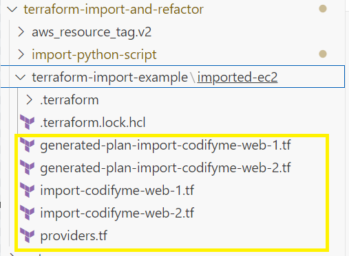

### 7. 🔍 Verify the Plan Output

After running the script, review the Terraform plan output and the generated files in the import directory.

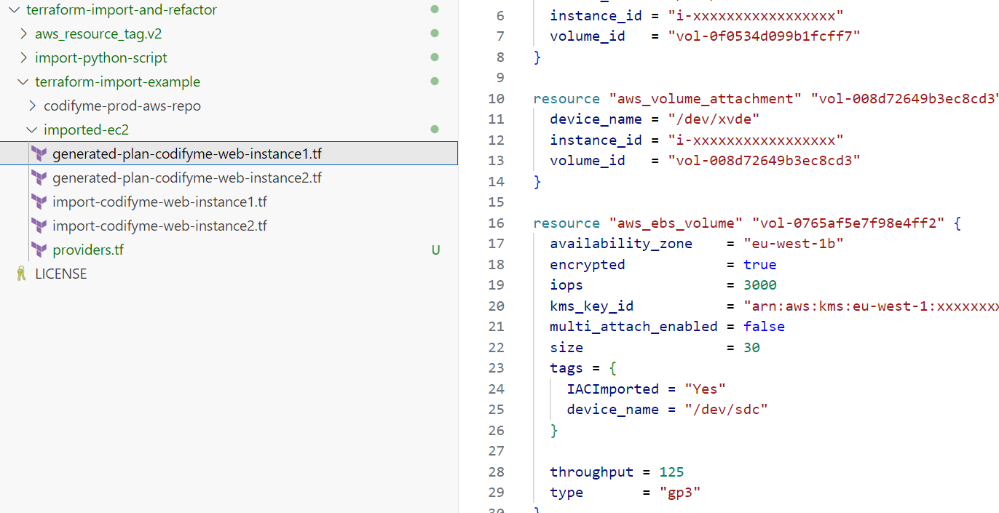

#### ⚠️ Important:

-   ✅ Ensure that only the import count has changed in the plan output and no other changes are present.

    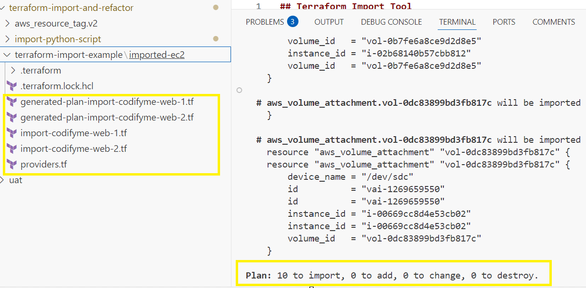

-   🛠️ If there are changes, review and update the Terraform code accordingly before proceeding.

### 8. 🚀 Apply the Terraform Configuration

Once you confirm that only the import count has changed during plan, run the following command to apply the changes:

  ```bash
  terraform apply -auto-approve
  ```
This will import the resources into the Terraform state file locally.

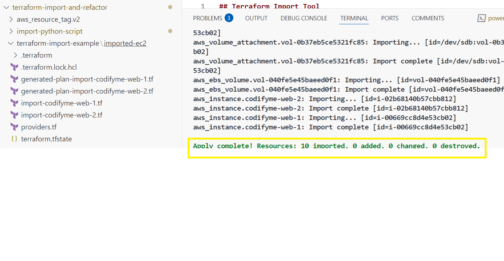

**🎉🏆 Great job done, folks!**  
You have successfully imported the EC2 instances into Terraform. **But the work is not done yet.**

This is the stage where local testing considered as completed and the real state has to be created on TFE workspace or on remote blob state. You can delete the local state file created in above stages.

The main goal is to have the Terraform code in the TFE workspace or in remote state management systme if using opensource cli and manage the state file there.

### 9. 📂 Clone the TFE or Git Repository

🔑 Login to Azure DevOps (ADO) or the Git tool of your choice, and navigate to the TFE or CLI code repository where you plan to import the resources. Clone the repository into VS Code for further modifications.

### 10. 📄 Copy the Generated Files to the Cloned Repository

📄 Copy the `import_codifyme-web-1`, `generated-plan-import-codifyme-web-1` files from the local folder to the cloned repository.

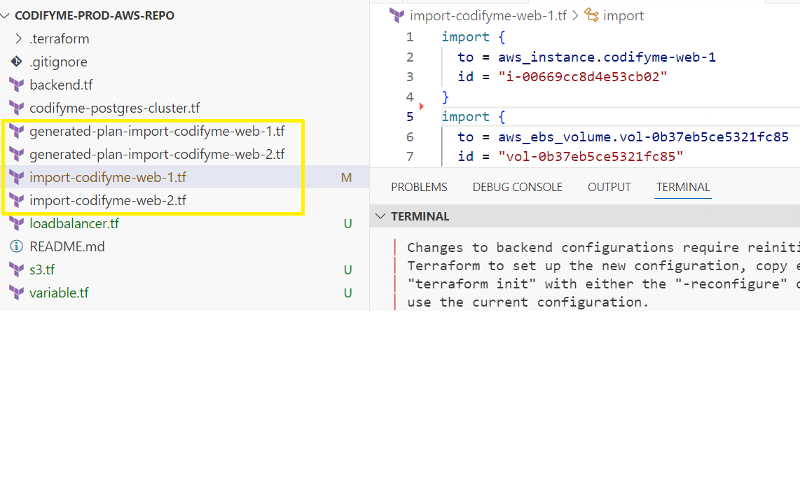

**Note:** ⚠️ Make sure the existing code repository must already have the `provider` block defined in the `backend.tf` file.

-   🏷️ Rename the `generated-plan-import-codifyme-web-1` file to align with your organization's naming standards. For example, rename it to `codifyme-web-1.tf`.
-   ➡️ Move the `import_codifyme-web-1` file to a subfolder named `imported-files`. This step is optional and can be useful when re-importing multiple resources. Alternatively, you can delete this file after a successful import.

Up to this point, if you have VCS integration enabled in TFE or a GitOps-triggered pipeline, the changes will be automatically detected. A plan will be created in the TFE workspace, followed by an apply process, which may require approval.

-   If you are using a CLI-driven workflow, proceed with the following steps.

### 11. ☁️ Terraform Cloud/Enterprise Init, Plan and Apply

- 🔑 Login to TFE by running this command `terraform login yourtfe-url` and provide the token.

  ```hcl
  terraform login https://your-tfe-url -token your-token
  ```
  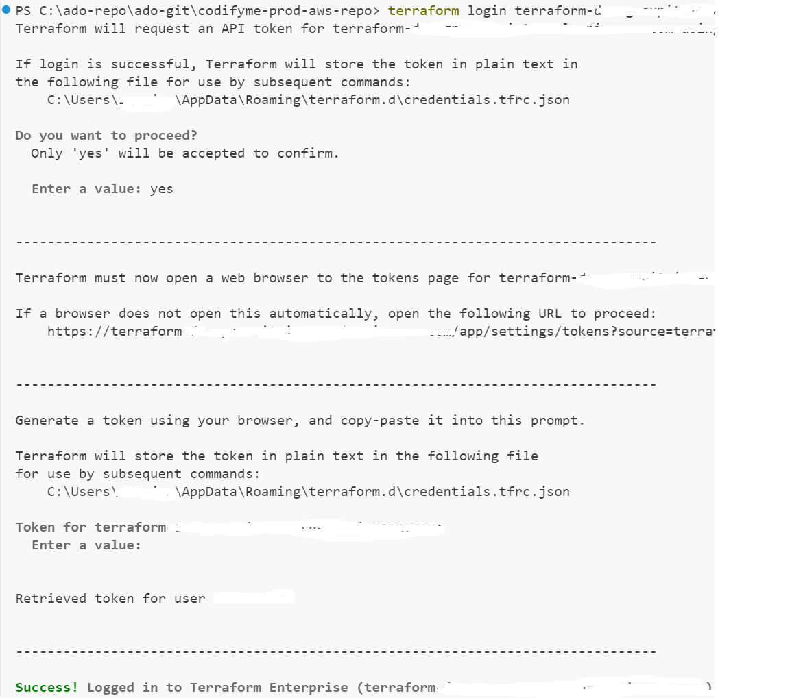

- 🚀 Run the following command to initialize the Terraform working directory:
    ```bash
    terraform init
    ```
  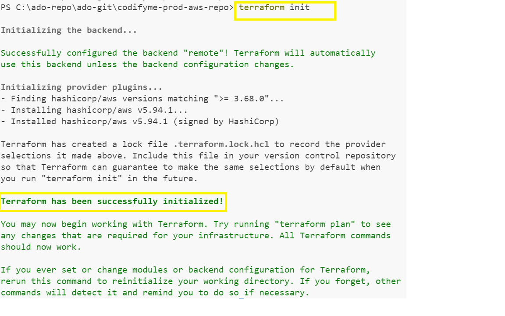

- Run the following command to generate an execution plan:
  ```bash
  terraform plan
  ```
  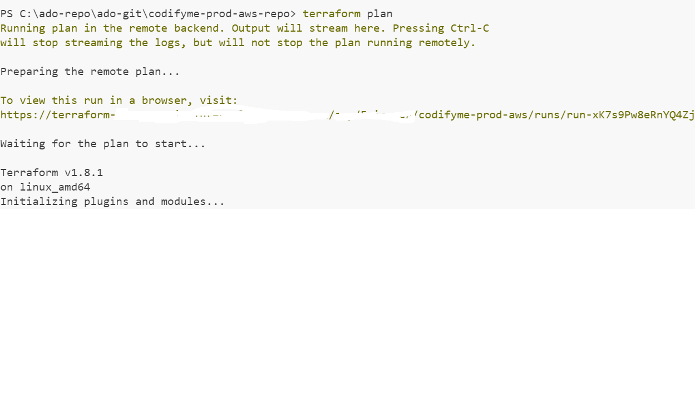

- Review the plan output to ensure that only the import count has changed and no other changes are present.
  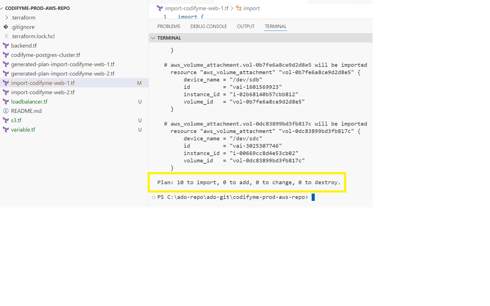
- If everything looks good, run the following command to apply the changes:
  ```bash
  terraform apply -auto-approve
  ```
  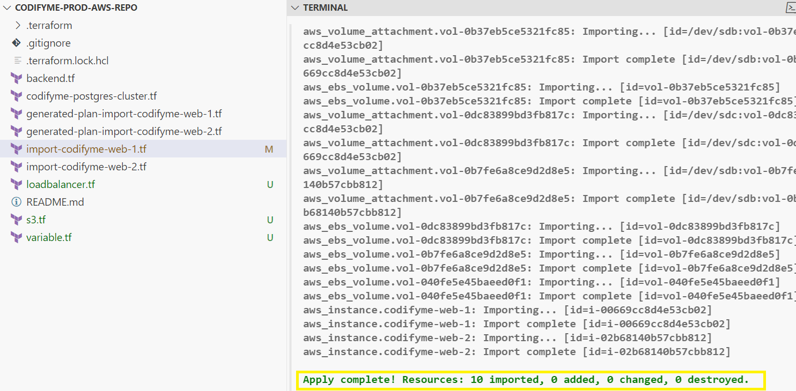

This will import the resources into the Terraform state file in the TFE workspace.
- ✅ Verify the import by checking the TFE workspace for the imported resources.
- ✅ Check the state file in the TFE workspace or cli to ensure that the resources are managed by Terraform.
```bash
terraform state list
# output
aws_db_instance.codifyme-db
aws_ebs_volume.vol-040fe5e45baeed0f1       
aws_ebs_volume.vol-0b37eb5ce5321fc85       
aws_ebs_volume.vol-0b7fe6a8ce9d2d8e5       
aws_ebs_volume.vol-0dc83899bd3fb817c       
aws_instance.codifyme-web-1
aws_instance.codifyme-web-2
aws_volume_attachment.vol-040fe5e45baeed0f1
aws_volume_attachment.vol-0b37eb5ce5321fc85
aws_volume_attachment.vol-0b7fe6a8ce9d2d8e5
aws_volume_attachment.vol-0dc83899bd3fb817c
aws_s3_bucket.example_bucket
aws_s3_bucket_policy.example_bucket_policy
aws_lb.codifyme_lb
aws_lb_listener.codifyme_lb_listener
aws_lb_target_group.codifyme_lb_target_group
```

congratulations! You have successfully imported the AWS EC2 instance into Terraform and managed it using TFE as infra as code.
- ✅ You can now manage the EC2 instance using Terraform, including making changes, scaling, and applying updates as needed.


---
## 💡 Tips and Best Practices
- 🛠️ If there are non-impacting changes in the plan output, use the `lifecycle` block to ignore them.
- 🏷️ Add specific Terraform resource attributes to mitigate unnecessary changes in the plan output.

---
## 📝 Conclusion
In this blog post, we successfully imported an existing AWS EC2 instance into Terraform using a custom Python script and a tagging script. We also discussed the importance of managing the state file in Terraform Enterprise (TFE) and best practices for handling plan outputs.

- ➡️ In the next blog post, we will explore how to refactor the imported Terraform code for better organization and maintainability. Stay tuned for **<a href="{{ 'series/terraform-import-and-refactoring/4-code-refactoring-part1/' | relative_url }}" target="_blank">Refactoring Terraform Code: Why It Matters</a>**.
---

Catch you later, code Ninjas! Happy Codifying! ⚙️💻🚀